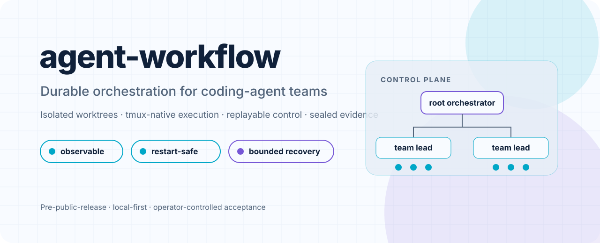
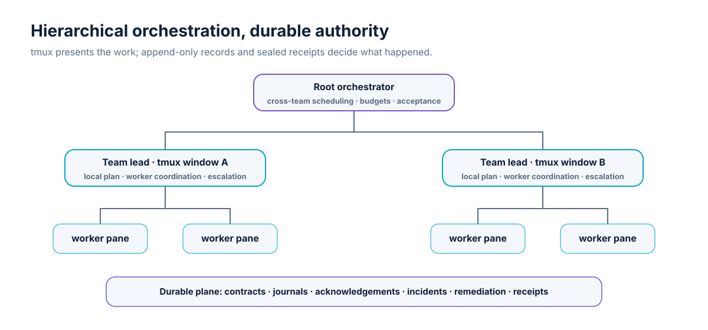
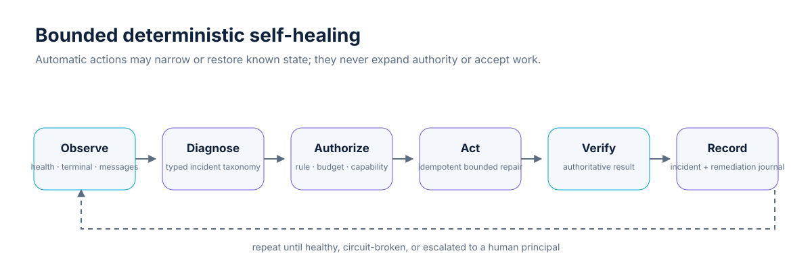
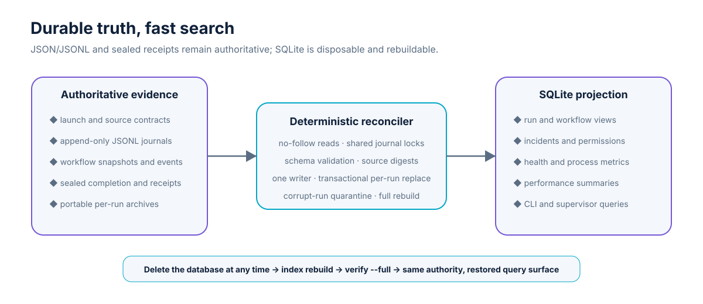

<div align="center">
  <picture>
    <source media="(prefers-color-scheme: dark)" srcset="docs/assets/agent-workflow-hero-dark.svg">
    <source media="(prefers-color-scheme: light)" srcset="docs/assets/agent-workflow-hero-light.svg">
    
  </picture>
</div>

<div align="center">
  <strong>Local-first orchestration for bounded coding-agent work.</strong><br>
  Isolated Git worktrees, tmux-native execution, replayable control, sealed evidence, and policy-bounded recovery.
</div>

<div align="center">
  <a href="docs/INSTALLATION.md">Install</a> ·
  <a href="docs/COMMAND_REFERENCE.md">Commands</a> ·
  <a href="docs/ARCHITECTURE.md">Architecture</a> ·
  <a href="docs/OPERATIONS.md">Operations</a> ·
  <a href="docs/BACKLOG.md">Roadmap</a>
</div>

> **Status:** pre-public-release. The single-host execution, evidence, workflow, messaging, evaluation, trusted plugin host, optional MCP-read, and foreground supervision foundations are implemented. Bounded root-orchestrator → team-lead → worker orchestration is approved as an explicitly enabled feature. Its immutable contracts, append-only journals, deterministic replay, and digest-sealed team/root receipts are implemented and awaiting independent review; tmux topology, team runtime, hierarchy messaging, scheduling, and recovery remain separately gated by [`docs/BACKLOG.md`](docs/BACKLOG.md).

## Why agent-workflow exists

Coding agents are useful, but unattended work becomes difficult to trust when the only record is a terminal pane someone happened to watch. `agent-workflow` turns delegation into a reconstructable process:

- every run starts from immutable launch authority;
- implementation work is isolated in a Git worktree;
- control messages and acknowledgements are durable and replayable;
- process, terminal, permission, incident, and remediation evidence survive the interactive session;
- completion claims are validated against substantive evidence;
- review and acceptance remain explicit human authority.

The application favors **deterministic control code around probabilistic agents**. tmux is the presentation layer; durable records and sealed receipts are the source of truth.

## What works today

| Capability | Current implementation |
|---|---|
| Isolated execution | Ticket worktrees, clean-source checks, bounded executor argv/environment, named tmux sessions and panes |
| Durable run evidence | Launch contract, source baseline, prompt, command, output, provider events, patch, completion handoff, process result, final receipt |
| Two-way control | Append-only steer, progress, acknowledgement, watch, cooperative `control-file-v1` delivery, replay-safe outcomes |
| Workflow scheduling | Restart-safe DAGs, bounded parallelism, approval gates, result bindings, retries, aggregate receipts |
| Unattended diagnosis | Separate runner liveness and semantic progress, interactive terminal snapshots, process/resource samples, permission and incident journals |
| Bounded self-correction | Foreground supervisor, projection repair, one-shot progress probes, opt-in interruption and lineage-preserving restart |
| Searchable evidence | Rebuildable SQLite projection for cross-run, workflow, incident, permission, and performance queries |
| Evaluation | Deterministic templates, provider-neutral usage evidence, cohort comparison, sealed-run assessment and ledgers |
| Optional MCP feature | Bounded read-only local stdio adapter for command and run context; installed with the `mcp` extra |
| Trusted plugin host | Explicit entry-point enablement, atomic top-level command registration, digest-bound installed schema/asset resources, installed provenance, and `--no-plugins` recovery |
| Hierarchy authority layer | Fixed-depth immutable contracts, capability/budget narrowing, append-only journals, deterministic replay, and digest-sealed team/root receipts; runtime topology remains gated |

The application does **not** merge branches, approve permissions, expand filesystem/network authority, accept work automatically, or silently retry without preserved lineage.

## Architecture at a glance

<picture>
  <source media="(prefers-color-scheme: dark)" srcset="docs/assets/architecture-overview-dark.svg">
  <source media="(prefers-color-scheme: light)" srcset="docs/assets/architecture-overview-light.svg">
  
</picture>

The graphic shows the approved target topology. The current runtime implements the worker/run, durable evidence, messaging, workflow, and supervisor foundations. The multi-window team-lead layer is described in [`docs/HIERARCHICAL_MULTI_TEAM_ORCHESTRATION_DESIGN.md`](docs/HIERARCHICAL_MULTI_TEAM_ORCHESTRATION_DESIGN.md) and remains backlog-gated.

### Authority model

```text
Immutable authority                 Recoverable projections
────────────────────────────────    ────────────────────────────────
launch-contract.json                status.json
append-only messages/journals       tmux session/window/pane layout
workflow snapshot + events          terminal capture returned by status
sealed completion and receipts      derived summaries and dashboards
                                    rebuildable SQLite evidence index
```

A projection may be rebuilt. Authority-changing actions—permission grants, policy expansion, acceptance, merge, destructive cleanup—cannot be inferred from a projection or delegated to an unverified agent.

## Quick start

### Requirements

- Python 3.11+
- Git
- tmux
- Bash
- GNU tar and zstd for deterministic archives
- Codex, Claude, or an explicit executor command

### Install from a source checkout

```bash
./install.sh
export PATH="$HOME/.local/bin:$PATH"
agent-workflow doctor
```

The installer creates an editable local installation, links repository skills into supported discovery roots, and writes a starter XDG configuration without replacing unrelated files. Add `--extras mcp` only on hosts that need the optional MCP adapter. Jenkins CI and local server-job files remain in the source repository and are never installed as runtime files. See [`docs/INSTALLATION.md`](docs/INSTALLATION.md).

For a released Linux, WSL2, or macOS wheel, use the immutable-tag bootstrap
documented in [`docs/INSTALLATION.md`](docs/INSTALLATION.md). Native Windows is
out of scope.

### Launch and inspect a run

```bash
agent-workflow worktree create /path/to/repo TICKET-1 HEAD

agent-workflow launch \
  ticket-1 \
  /path/to/worktrees/ticket-1 \
  ./ticket.md \
  --ticket TICKET-1 \
  --executor codex

agent-workflow status ticket-1 --capture 50
agent-workflow attach ticket-1
```

Use an explicit command after `--` when the executor is not configured:

```bash
agent-workflow launch ticket-1 /path/to/worktree ticket.md -- \
  codex exec --sandbox workspace-write --skip-git-repo-check -
```

### Control the run durably

```bash
agent-workflow steer ticket-1 \
  "Run the focused tests before editing." \
  --actor orchestrator

agent-workflow watch ticket-1 --after 0 --timeout 300
agent-workflow progress ticket-1 "Focused tests pass." --actor child
agent-workflow ack ticket-1 MESSAGE_ID "Applied." --actor child
```

The journal commit happens before any tmux wake hint. A request remains pending until durable delivery and acknowledgement evidence records its disposition.

### Run the foreground supervisor

```bash
# One evidence/reconciliation cycle.
agent-workflow supervisor once --json

# Continuous foreground supervision; safe status probes are enabled by default.
agent-workflow supervisor run --interval-seconds 10

# Authority-changing recovery is always explicit.
agent-workflow supervisor run \
  --interrupt-stalled \
  --restart-orphaned \
  --max-remediation-attempts 1
```

<picture>
  <source media="(prefers-color-scheme: dark)" srcset="docs/assets/self-healing-loop-dark.svg">
  <source media="(prefers-color-scheme: light)" srcset="docs/assets/self-healing-loop-light.svg">
  
</picture>

The supervisor is deliberately foregroundable rather than a hidden daemon. It automatically repairs mutable status projections and may send a bounded progress probe. Interrupt and restart rules remain disabled unless the operator authorizes them in configuration or on the command line. Permission grants and acceptance never become automatic.

## Evidence produced by a run

The configured state root normally contains:

```text
~/.local/state/agent-workflow/runs/<session-id>/
├── launch-contract.json          immutable launch authority
├── source-baseline.json          source identity and cleanliness evidence
├── output.log                    normalized non-interactive output
├── executor-events.jsonl         structured provider stream
├── terminal-events.jsonl         bounded change-driven interactive snapshots
├── run-health-samples.jsonl      process, resource, and progress samples
├── permission-events.jsonl       observed permission waits and denials
├── incident-events.jsonl         typed unattended-diagnosis findings
├── remediation-events.jsonl      attempted correction and verification trail
├── process-result.json           exit, signal, timeout, byte, and truncation facts
├── completion.json               validated child handoff
├── patch.diff                    collected implementation delta
└── final-receipt.json            sealed artifact inventory and checksums
```

Worktree `.delegations/` entries are only discoverability links. The XDG state directory remains the evidence authority.

## Search and analyze across runs

JSON/JSONL artifacts and sealed receipts remain the source of truth. A host-local SQLite database provides a disposable, transactionally consistent projection for operational search and analysis:

```bash
agent-workflow index status
agent-workflow index sync
agent-workflow index query runs --state possibly_stalled --limit 25
agent-workflow index query incidents --category permission_wait
agent-workflow index query performance --executor codex --model MODEL
agent-workflow index verify --full

# Delete and reconstruct every indexed row from authoritative evidence.
agent-workflow index rebuild
```

<picture>
  <source media="(prefers-color-scheme: dark)" srcset="docs/assets/evidence-index-dark.svg">
  <source media="(prefers-color-scheme: light)" srcset="docs/assets/evidence-index-light.svg">
  
</picture>

Each query reports whether the projection is `current`, `stale`, or `incomplete` before presenting rows. The index stores normalized searchable fields, source paths, record sequence, and SHA-256 provenance. It deliberately excludes raw prompts, terminal bodies, message bodies, and large logs. One indexer owns writes; reporting surfaces use read-only queries. Database loss or corruption does not lose execution history: `agent-workflow index rebuild` recreates the projection from validated source artifacts. See [`docs/SQLITE_EVIDENCE_INDEX_ARCHITECTURE.md`](docs/SQLITE_EVIDENCE_INDEX_ARCHITECTURE.md) and [`DEC-007`](docs/DECISIONS/DEC-007-REBUILDABLE-SQLITE-PROJECTION.md).

## Workflow graphs

```bash
agent-workflow workflow validate ./workflow.json
agent-workflow workflow start ./workflow-run ./workflow.json
agent-workflow workflow status ./workflow-run ./workflow.json
agent-workflow workflow resume ./workflow-run ./workflow.json
agent-workflow workflow seal ./workflow-run ./workflow.json
agent-workflow workflow verify ./workflow-run ./workflow.json
```

Workflow state is reconstructed from an immutable normalized snapshot and append-only event journal. Child tasks use the same launch and receipt path as direct runs.

Authorized templates include:

```bash
agent-workflow workflow template pipeline ./spec.json --output ./workflow.json
agent-workflow workflow template parallel-review-fan-in ./spec.json --output ./workflow.json
agent-workflow workflow template implementation-independent-review ./spec.json --output ./workflow.json
```

## Prompt packs and evaluation

```bash
agent-workflow pack scaffold ./my-pack --phases 3
agent-workflow pack validate ./my-pack
agent-workflow pack archive ./my-pack ./my-pack.tar.zst

agent-workflow eval template evaluation-plan --output ./evaluation.json
agent-workflow eval validate ./evaluation.json --pack ./my-pack
agent-workflow eval score SESSION
agent-workflow eval report SESSION --format markdown
```

Prompt-pack dependencies form a validated cross-phase DAG. Evaluation evidence keeps provider totals, local estimates, unavailable values, retry lineage, source identity, and cohort comparability distinct. See [`docs/PROMPT_PACKS.md`](docs/PROMPT_PACKS.md) and [`docs/EVIDENCE_AND_EVALUATION.md`](docs/EVIDENCE_AND_EVALUATION.md).

## Security boundaries

`agent-workflow` is local-first, but local does not mean unbounded.

- subprocesses use argv arrays rather than shell strings;
- child environments are allowlisted;
- executor identity and configured permission arguments are recorded;
- launch, scope, model, and budget authority is immutable for the run;
- terminal and journal capture is bounded;
- automatic remediation cannot expand authority;
- review, acceptance, and merge remain human decisions.

The remaining governed-sandbox and authenticated-principal work is tracked under `HARD-003`, `HARD-006`, and `HARD-007` in [`docs/BACKLOG.md`](docs/BACKLOG.md). See [`docs/SECURITY.md`](docs/SECURITY.md) for the complete trust model.

## Project state and roadmap

The searchable evidence projection and bounded supervisor foundations are implemented and in review. The bounded hierarchy durable-authority layer—contracts, journals, replay, and sealed team/root receipts—is also implemented and awaiting HIER-GATE-0; hierarchy runtime remains gated by its ticket-specific prerequisites:

```text
root orchestrator
  ├── team-lead window A
  │     ├── worker pane A1
  │     └── worker pane A2
  └── team-lead window B
        ├── worker pane B1
        └── worker pane B2
```

The root will create and reconcile team windows, while each team lead coordinates worker panes under a narrowed delegation contract. Durable records remain authoritative across tmux loss and restart. The dependency order is explicit in [`docs/BACKLOG.md`](docs/BACKLOG.md); the full design is in [`docs/HIERARCHICAL_MULTI_TEAM_ORCHESTRATION_DESIGN.md`](docs/HIERARCHICAL_MULTI_TEAM_ORCHESTRATION_DESIGN.md).

Public distribution remains blocked on release-governance and security decisions in [`docs/PUBLIC_RELEASE_READINESS.md`](docs/PUBLIC_RELEASE_READINESS.md).

## Paired comparative benchmark

The built-in `priority-picker-v1` benchmark runs the same canonical three-phase task concurrently through isolated `control_raw/v1` and `workflow_full/v1` worktrees. It records phase, arm, pair, and run timing; tokens and truthful billed/estimated/subscription-allocation cost; deterministic machine scores; and blinded human visual review before producing the adopted 70/30 composite.

Subscription-backed Codex or Claude CLI sessions are the default real-executor path. API-key and access-token adapters are optional explicit cohort profiles and never silent fallbacks. A synthetic executor remains available only for development validation.

```bash
agent-workflow benchmark suite-export /tmp/priority-picker-v1
agent-workflow benchmark readiness /tmp/priority-picker-v1/benchmark-spec.json \
  --executor /tmp/priority-picker-v1/executors/codex-subscription.json \
  --policy /tmp/priority-picker-v1/policies/development.json
agent-workflow benchmark fixture-create /tmp/priority-picker-v1/benchmark-spec.json /tmp/priority-picker-fixture
agent-workflow benchmark plan /tmp/priority-picker-v1/benchmark-spec.json \
  --executor /tmp/priority-picker-v1/executors/codex-subscription.json \
  --policy /tmp/priority-picker-v1/policies/development.json \
  --repo /tmp/priority-picker-fixture \
  --run-id priority-picker-smoke
agent-workflow benchmark run priority-picker-smoke
```

The automated pipeline stops for blinded human review, then preserves digest-verified evidence in the coordinator worktree under `benchmarks/runs/<run-id>`. See the [implementation](docs/COMPARATIVE_BENCHMARK_IMPLEMENTATION.md), [operations guide](docs/COMPARATIVE_BENCHMARK_OPERATIONS.md), and [exhaustive task/evaluation/scoring explanation](docs/COMPARATIVE_BENCHMARK_EXPLAINED.md). The current v1 scorer remains authoritative for historical reports; its documented scoring-contract discrepancies and the 0.7.8 correction sequence are tracked in the [correction backlog](docs/COMPARATIVE_BENCHMARK_CORRECTION_BACKLOG.md) and [owned prompt pack](prompt-packs/comparative-benchmark-scoring-corrections/).

## Development

```bash
./scripts/bootstrap-dev.sh
.venv/bin/python -m pytest -q
./scripts/release-check.sh
```

The suite is acceptance-first: build a wheel, install it, and exercise public commands through real filesystem, Git, and process journeys. A compact invariant layer protects replay, security, accounting, evidence, and release boundaries. Live tmux/provider checks remain opt-in. See [`docs/TESTING.md`](docs/TESTING.md).

## Documentation map

| Topic | Document |
|---|---|
| Architecture and authority | [`docs/ARCHITECTURE.md`](docs/ARCHITECTURE.md) |
| Self-healing supervisor design | [`docs/SELF_HEALING_SUPERVISOR_ARCHITECTURE.md`](docs/SELF_HEALING_SUPERVISOR_ARCHITECTURE.md) |
| Searchable SQLite evidence projection | [`docs/SQLITE_EVIDENCE_INDEX_ARCHITECTURE.md`](docs/SQLITE_EVIDENCE_INDEX_ARCHITECTURE.md) |
| SQLite implementation verification | [`docs/SQLITE_EVIDENCE_INDEX_IMPLEMENTATION_VERIFICATION_20260730.md`](docs/SQLITE_EVIDENCE_INDEX_IMPLEMENTATION_VERIFICATION_20260730.md) |
| Hierarchical orchestration | [`docs/HIERARCHICAL_MULTI_TEAM_ORCHESTRATION_DESIGN.md`](docs/HIERARCHICAL_MULTI_TEAM_ORCHESTRATION_DESIGN.md) |
| Commands | [`docs/COMMAND_REFERENCE.md`](docs/COMMAND_REFERENCE.md) |
| Operations and recovery | [`docs/OPERATIONS.md`](docs/OPERATIONS.md) |
| Security | [`docs/SECURITY.md`](docs/SECURITY.md) |
| Evidence and evaluation | [`docs/EVIDENCE_AND_EVALUATION.md`](docs/EVIDENCE_AND_EVALUATION.md) |
| Comparative benchmark design | [`docs/COMPARATIVE_BENCHMARK_SPEC.md`](docs/COMPARATIVE_BENCHMARK_SPEC.md) |
| Comparative benchmark implementation | [`docs/COMPARATIVE_BENCHMARK_IMPLEMENTATION.md`](docs/COMPARATIVE_BENCHMARK_IMPLEMENTATION.md) |
| Comparative benchmark operations | [`docs/COMPARATIVE_BENCHMARK_OPERATIONS.md`](docs/COMPARATIVE_BENCHMARK_OPERATIONS.md) |
| Comparative benchmark task/evals/scoring | [`docs/COMPARATIVE_BENCHMARK_EXPLAINED.md`](docs/COMPARATIVE_BENCHMARK_EXPLAINED.md) |
| Comparative benchmark correction backlog | [`docs/COMPARATIVE_BENCHMARK_CORRECTION_BACKLOG.md`](docs/COMPARATIVE_BENCHMARK_CORRECTION_BACKLOG.md) |
| Comparative benchmark initial verification | [`docs/COMPARATIVE_BENCHMARK_IMPLEMENTATION_VERIFICATION_20260801.md`](docs/COMPARATIVE_BENCHMARK_IMPLEMENTATION_VERIFICATION_20260801.md) |
| Comparative benchmark operating-policy verification | [`docs/COMPARATIVE_BENCHMARK_OPERATING_POLICY_VERIFICATION_20260801.md`](docs/COMPARATIVE_BENCHMARK_OPERATING_POLICY_VERIFICATION_20260801.md) |
| Prompt packs | [`docs/PROMPT_PACKS.md`](docs/PROMPT_PACKS.md) |
| Trusted plugin API | [`docs/PLUGIN_API.md`](docs/PLUGIN_API.md) |
| MCP server | [`docs/MCP_SERVER.md`](docs/MCP_SERVER.md) |
| Testing | [`docs/TESTING.md`](docs/TESTING.md) |
| Canonical backlog | [`docs/BACKLOG.md`](docs/BACKLOG.md) |

## README presentation notes

GitHub Flavored Markdown supports headings, tables, fenced code, images, and a sanitized subset of inline HTML. It does not provide repository authors with arbitrary page CSS or a full-page background. This README therefore uses repository-owned SVG assets and `<picture>` elements for polished light/dark presentation without depending on unsupported styles.

## Contributing and support

The project is not yet accepting a public compatibility promise. Internal contributors should begin with [`docs/CONTRIBUTING.md`](docs/CONTRIBUTING.md), run the release checks, and preserve durable evidence contracts. Support and disclosure guidance is in [`docs/SUPPORT.md`](docs/SUPPORT.md).

## License

`agent-workflow` is licensed under the [Apache License 2.0](LICENSE).
