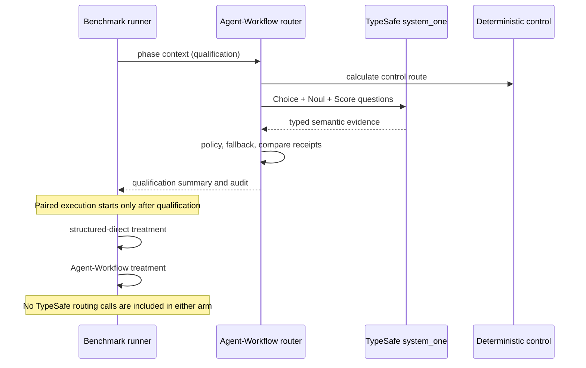

# Built-in benchmark assets

Canonical built-in benchmark definitions are packaged under:

`src/agent_workflow/assets/benchmarks/`

They use shared immutable layers plus thin suite-specific overlays to avoid duplicating Priority Picker fixtures, evaluator support, policies, profiles, and reference solutions across benchmark versions.

The internal layer layout is packaging detail. Materialize a complete self-contained suite through the public CLI:

```bash
agent-workflow benchmark suite-export /tmp/priority-picker-v2 \
  --benchmark-id priority-picker-v2
```

The exported suite is the structure consumed by validation, planning, execution, scoring, review, consolidation, and publication workflows. Layering must not alter benchmark task, scoring, evaluator, or exported-file identity.

See `docs/BENCHMARKS.md` for the human-readable operating and interpretation guide.

## TypeSafe/Jev in benchmark runs

The benchmark scripts run semantic routing qualification before the paired task execution. For each of the three frozen phase prompts, they call Agent-Workflow's optional TypeSafe provider once with the bounded phase context and the registered routing question set: `Choice` for task class, `Noul` for whether interaction is required, and `Score` for semantic risk. The runner stores sanitized qualification evidence and a private request/response audit. Qualification checks that the configured model/provider path and typed decisions execute against realistic task context; its outputs are not fed into either treatment.



This separation is deliberate: the paired study compares execution treatments, so including semantic-routing calls only in one arm would confound lifecycle effects with extra model traffic. The sealed result summaries show three successful qualification calls in each of BM3, BM4, and BM5. BM3's analysis-plan context produced a `documentation` Choice against deterministic `implementation`; the applied value stayed `implementation` under shadow disposition. Its three semantic-risk answers triggered uncertainty fallback. BM4 and BM5 each produced route recommendations matching deterministic control in all three contexts. These small, pre-treatment checks establish runtime behavior and expose disagreements; they do not show that TypeSafe caused any observed task quality, time, or token delta.

The plugin has two other TypeSafe integration points. Its opt-in `code-review` command appends advisory source judgments after required deterministic review, leaving deterministic findings authoritative. Its `typesafe-batch` scoring-bundle probe can ask several anchored `Score` questions in one post-seal request; results are evaluation inputs, not lifecycle decisions. See [Advisory TypeSafe source review](#advisory-typesafe-source-review) and [Universal post-seal scoring bundles](#universal-post-seal-scoring-bundles).

Official background: [Jev/System One announcement](https://typesafe.ai/blog/introducing-system-one-models-and-jev), [System One](https://docs.typesafe.ai/concepts/system-one.md), [state](https://docs.typesafe.ai/concepts/state.md), [Choice](https://docs.typesafe.ai/primitives/choice.md), [Noul](https://docs.typesafe.ai/primitives/noul.md), [Score](https://docs.typesafe.ai/primitives/score.md), and [Python SDK](https://docs.typesafe.ai/sdk/python.md).
