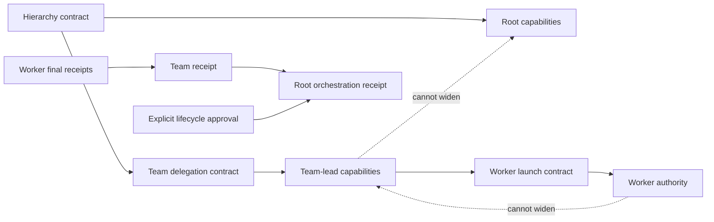
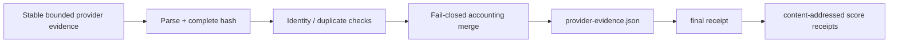
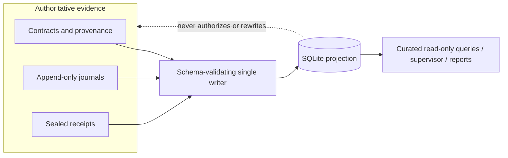

# Architecture

## Product boundary

`agent-workflow` is a host-independent workflow authority. It owns durable workflow identity, execution contracts, evidence, evaluation, review, and acceptance; it does not own interactive workspace, pane, window, or terminal layout.

```text
                 +-----------------------------+
                 |         Workflow            |
                 | DAG / policy / approvals    |
                 +-------------+---------------+
                               |
                               v
                 +-----------------------------+
                 |          Task               |
                 +-------------+---------------+
                               |
                               v
                 +-----------------------------+
                 |        Agent Run            |
                 | immutable execution contract|
                 +-------------+---------------+
                               |
                    +----------+----------+
                    |                     |
                    v                     v
             Headless Worker        External Worker
             AW-owned process       host-owned launch
                    |                     |
                    +----------+----------+
                               v
                  durable messages / evidence
                               |
                    completion -> evaluation
                               |
                       review -> acceptance
```

## Authority layers

### Immutable authority

- Agent Run contract;
- source baseline and worktree provenance;
- delegation contract;
- sealed evidence and receipts;
- workflow definitions and accepted result contracts.

### Append-only authority

- Agent Run execution lifecycle while a run is active;
- steering, progress, acknowledgement, and completion events;
- hierarchy journals;
- incidents and remediation events;
- evaluation and review evidence where defined as journals.

Execution lifecycle has one transition authority. `prepared`, `running`, interruption/termination requests, and unsealed failure transitions are recorded in the Agent Run lifecycle journal. Once terminal evidence is sealed, `final-status.json` plus `final-receipt.json` become the immutable execution outcome; later code may only rebuild mutable projections to agree with that outcome.

### Rebuildable projections

- `status.json`;
- worker liveness observations;
- SQLite index;
- external-host bindings and display metadata.

A projection may be deleted and reconstructed without changing workflow identity. Code that needs to decide whether an Agent Run is active or terminal must consult lifecycle/receipt authority rather than trusting the cached `status` field.

## Agent Run and Worker

An **Agent Run** is one durable execution of a task under a fixed execution/delegation contract. Public identity is `agent_run_id`. A retry or re-execution creates a new Agent Run with lineage to the prior run rather than mutating the old execution identity.

A **Worker** is an execution actor attached to an Agent Run. `worker_id` is independent of operating-system PID and external-host identity.

### Headless worker

Agent-workflow launches a detached process group under a controlled environment, records ownership, observes it, and may interrupt or terminate that group.

### External worker

Agent-workflow prepares immutable run artifacts and a launch plan but does not launch or claim ownership of the external process. Lifecycle operations that require process ownership remain unavailable unless an integration establishes an explicit supported binding.

## Workflow and hierarchy authority

Workflow eligibility, dependency state, approvals, and child Agent Run bindings remain durable Agent-Workflow authority. Delegated capabilities narrow as work moves down a hierarchy and may not be widened by a child.



The scheduler reconstructs workflow state from the normalized snapshot plus append-only events, reconciles running children against durable run evidence, resolves sealed inputs, launches through the canonical Agent Run path, and records state transitions durably. UI state is never part of scheduling authority.

## Messaging

Workflow communication is **persist-first**:

```text
persist steer -> optional delivery -> explicit acknowledgement
```

Live delivery never substitutes for the durable message journal. Replay and correlation work without a live delivery service. Successful delivery is not acknowledgement; a request remains pending until correlated disposition evidence exists.

## Worktrees and source provenance

Agent-workflow owns worktree provenance in the current architecture. The worktree/source baseline is part of execution authority. An external host may open or display a prepared worktree but does not independently redefine its provenance.

## Completion, evaluation, review, and acceptance

These are intentionally separate:

```text
worker exit != completion
completion != evaluation
successful evaluation != review
review != acceptance
```

Acceptance is a lifecycle disposition backed by durable evidence. A query result, UI status, worker exit, or successful process return code does not independently authorize acceptance.

## Evidence and provider accounting

Provider/runtime evidence is bounded, validated, content-addressed, and sealed into terminal evidence. Provider event streams are treated as untrusted inputs until parsing, identity checks, accounting-mode validation, and deterministic merging complete.



Provider-billed cost and locally estimated cost remain distinct fields. Missing cost is unavailable, not zero.

## Supervision

Supervision is process/evidence based:

- worker process-group liveness for AW-owned workers;
- durable progress timestamps;
- executor/provider events;
- output/evidence changes;
- permission and incident journals;
- bounded remediation policy.

Mutable liveness observations and the SQLite projection support diagnosis but do not replace run authority.

## SQLite evidence index

SQLite is a **rebuildable operational projection** over independently durable Agent Run and workflow evidence. The governing rationale is [DEC-007](DECISIONS/DEC-007-REBUILDABLE-SQLITE-PROJECTION.md).



The index lives under the configured Agent-Workflow state root, never inside a delegated repository/worktree. It projects bounded normalized fields from contracts, lifecycle/workflow records, health/permission/incident/remediation journals, process results, execution metrics, ledger rows, score receipts, and final receipts. Raw prompts, terminal/message bodies, output logs, credentials, and unrestricted provider payloads are intentionally excluded.

A deterministic per-run source fingerprint lets incremental synchronization skip unchanged runs. Changed runs are replaced transactionally. One malformed or unverifiable run becomes an isolated index error rather than corrupting healthy projections or causing source evidence to be rewritten.

The projection schema is intentionally disposable rather than migration-authoritative: Agent-Workflow creates the current schema, rejects a non-current owned database, and uses complete rebuild as the supported recovery path. Fixed parameterized query templates and read-only query connections prevent the public CLI from becoming an arbitrary SQL interface.

Operational rebuild, verification, and corruption handling are documented in [Operations](OPERATIONS.md).

## Security boundaries

The core security boundary is durable workflow policy and controlled process/evidence handling, not an interactive UI. Key controls include:

- worktree/source provenance validation;
- path containment, no-follow opens, and safe regular-file reads;
- immutable contract/evidence digests and sealed receipts;
- executor command/environment policy;
- explicit process-group ownership for headless workers;
- secret redaction in command and provider evidence;
- trusted plugin allowlists and manifests;
- append-only journals and explicit lifecycle/approval records;
- bounded, curated projection/query surfaces.

External worker hosts execute outside Agent-Workflow process ownership unless an explicit integration binding says otherwise. The core never infers control authority from a UI or host identifier. Public vulnerability-reporting policy is in the repository-root [SECURITY.md](../SECURITY.md).

## External host and plugin boundary

Interactive hosts such as a future Herdr integration are optional projections around the core, not dependencies of it. Agent-workflow remains authoritative for workflow/task/Agent Run identity, provenance, execution/delegation contracts, durable messages, evidence, evaluation, review, acceptance, scheduling, and receipts.

A host plugin may own presentation and host execution concerns such as workspace layout, launching an external worker from a prepared plan, best-effort live delivery after persistence, focus/navigation, display metadata, and rebuilding host bindings after restart.

Any such integration must preserve these invariants:

1. host IDs are projection data, not Agent Run identity;
2. Agent-Workflow persists an instruction before live delivery is attempted;
3. delivery is not acknowledgement;
4. worker/host runtime state is not acceptance authority;
5. host state is disposable and rebuildable;
6. integrations use stable public CLI/structured contracts rather than private core modules;
7. Agent-Workflow continues to operate headlessly with the plugin absent.

Unfinished external-host work belongs only in [BACKLOG.md](BACKLOG.md).

## MCP boundary

The MCP server is currently a local stdio, bounded read-only adapter over shared application services. It does not become a second workflow engine and does not dynamically convert the CLI catalog into executable tools. See [MCP_SERVER.md](MCP_SERVER.md).

## Benchmarks

Comparative benchmarking retains experiment definition, paired arms, attestations, scoring, blinded review, statistics, and reporting. Benchmark execution is headless in the core. Machine-readable suites and scoring contracts are the durable benchmark authority; see [BENCHMARKS.md](BENCHMARKS.md).
