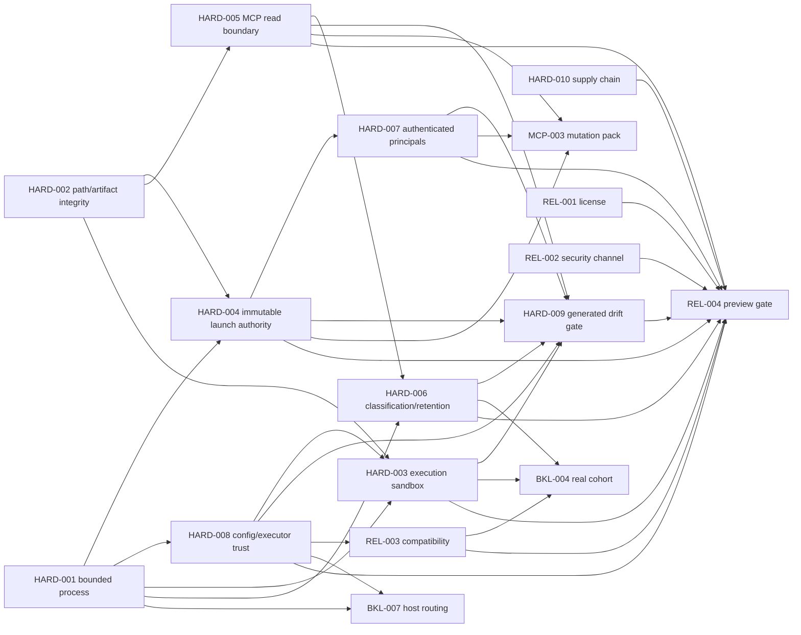
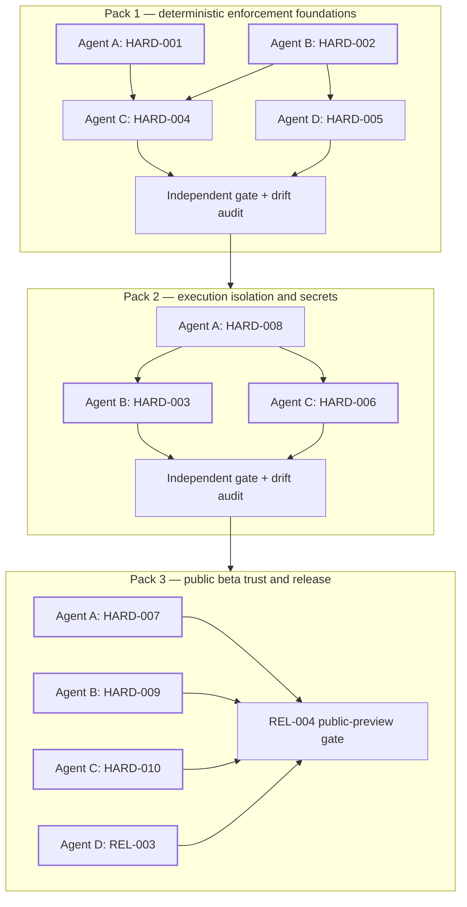

# Determinism and security hardening plan

This document explains the execution plan behind the canonical tasks in [BACKLOG.md](BACKLOG.md). Status lives only in the backlog. Findings and feature classifications come from the [feature determinism and security assessment](FEATURE_DETERMINISM_SECURITY_ASSESSMENT.md).

## Goal

Convert the remaining guidance-only or post-hoc controls into deterministic enforcement without adding another scheduler, agent taxonomy, memory layer, database, or remote service. Nondeterministic agents may propose work and produce artifacts; deterministic code and explicitly authenticated human decisions remain the only authorities.

## Priority scale

| Priority | Meaning | Release effect |
|---|---|---|
| P0 / Critical | A practical local execution, integrity, disclosure, or governance risk that must close before a public preview. | Blocks public preview and any dependent mutation surface. |
| P1 / High | Required for public beta confidence, authenticated review, compatibility, or supply-chain assurance. | May proceed in parallel after its technical prerequisites. |
| P2+ / Deferred | Architecture that should exist only after measured need or an explicit decision. | Retains the existing DEC/ARC/MCP/WF ticket; no new hardening ticket is created. |

## Complete task map

| ID | Priority | Assessment sources | Deterministic outcome | Primary pack |
|---|---|---|---|---|
| HARD-001 | P0 Critical | F04-F06, F18-F20, F71 | One bounded, cancellable, redacting subprocess substrate used by every owned call site. | deterministic-enforcement-foundations |
| HARD-002 | P0 Critical | F11, F34-F38, F87 | Content-complete manifests; no symlink/special-file ambiguity; one authoritative schema resolution path. | deterministic-enforcement-foundations |
| HARD-004 | P0 Critical | F17, F24, F68 | Immutable launch contract and exact verified-receipt digest; no projection selects authority. | deterministic-enforcement-foundations |
| HARD-005 | P0 Critical | F83-F88 | Metadata-minimal, no-follow, bounded MCP reads with stable errors. | deterministic-enforcement-foundations |
| HARD-008 | P1 High | F03-F06, F15, F20 | Config and executor trust policy is validated and recorded, not assumed from PATH or prose. | execution-isolation-and-secrets |
| HARD-003 | P0 Critical | F39-F42, F69-F73 | Preventative write/network/credential/resource sandbox around untrusted execution. | execution-isolation-and-secrets |
| HARD-006 | P1 High | F44-F47, F64, F81-F85 | Data classification, redaction, opt-in disclosure, and retention rules enforced across evidence surfaces. | execution-isolation-and-secrets |
| HARD-007 | P1 Critical | F48-F52, F89 | Authenticated principals and enforceable reviewer independence. | public-beta-trust-and-release |
| HARD-009 | P1 High | F01-F02, F09-F10, F90-F96 | Generated inventories and deterministic drift/collision release gate. | public-beta-trust-and-release |
| HARD-010 | P1 High | F13-F14 | Locked dependencies, SBOM, provenance, reproducibility, and signed attestations. | public-beta-trust-and-release |
| REL-003 | P0 High | F14, F20, F92 | Supported clean-host and executor matrix backed by opt-in live evidence. | public-beta-trust-and-release |
| REL-004 | P1 Critical | F13-F14, F94-F96 | Explicit public-preview go/no-go gate after technical and governance prerequisites. | public-beta-trust-and-release |

Existing `REL-001`, `REL-002`, `BKL-001`, `BKL-002`, `BKL-004`, `BKL-007`, `MCP-003`, `DEC-*`, `ARC-*`, `MCP-004`, and `WF-006` retain their original ownership. The new packs add dependency edges; they do not restate or replace those tickets.

## Dependency and collision map

## Parallel execution design

The packs deliberately expose parallel lanes only where writable scope and authority boundaries are separable.

Every parallel ticket uses a separate worktree and session. Integration occurs only after each ticket's evidence is reviewed. The phase gate reruns shared installed-product journeys after merge because isolated worktree success is not integration proof.

## Prompt-pack ownership rules

1. Every implementation task has a `backlog_id` matching one canonical backlog row.
2. Multiple sub-tickets may map to one backlog item only within one pack. The current MCP pack uses this rule for `MCP-003`.
3. No backlog item may be owned by two active prompt packs.
4. Gate tasks use `task_type: gate` and no `backlog_id`.
5. A blocked pack remains present for planning but its README and handoff must name the exact prerequisites.
6. Completed packs are removed from the public source tree; Git history and release attachments preserve them.
7. `scripts/audit-release-assets.py` fails on duplicate task IDs, unknown backlog ownership, cross-pack ownership, undocumented active packs, or missing drift-skill integration.

## Test requirements

Each implementation ticket starts by adding or refining the installed-product journey that expresses the intended behavior. Low-level tests are allowed only for compact parameterized matrices covering security or replay boundaries that are impractical to exhaust through the public CLI.

Required test classes across the program:

- hung/noisy/secret-bearing subprocess journeys;
- pack archive symlink/special-file and schema-shadowing matrices;
- malicious-child write/network/credential denial journeys;
- projection tamper and immutable launch-contract replay journeys;
- MCP metadata-only and no-follow path journeys;
- synthetic secret redaction and retention/deletion journeys;
- principal spoofing and reviewer-independence journeys;
- generated docs/backlog/prompt-pack drift failure fixtures;
- clean-host live adapter lane;
- reproducible artifact and attestation verification.

Do not restore the removed parser-shape, mock-call, exact-dictionary, prose-wording, or broad snapshot tests.

## Security review focus

The phase reviewers must distinguish:

- **preventative controls** from post-run detection;
- **verified bytes** from a later pathname reopen;
- **authority** from mutable projection or terminal text;
- **authenticated identity** from an actor label;
- **metadata** from sensitive content;
- **checksums** from authenticated publication;
- **isolated ticket success** from integrated release behavior.

## Public-release sequence

1. Accept `deterministic-enforcement-foundations`.
2. Accept `execution-isolation-and-secrets`.
3. Run `public-beta-trust-and-release`; complete `REL-001` and `REL-002` through maintainer decisions.
4. Execute `REL-004` and record a no-go when any prerequisite is absent.
5. Only after `REL-004` passes, describe the result as a public security-hardening preview.
6. Run `MCP-003` only after HARD-004, HARD-005, and HARD-007; MCP mutation is not a prerequisite for the first public CLI preview.

## Downstream two-way messaging implementation

The [`orchestrator-two-way-messaging`](../prompt-packs/orchestrator-two-way-messaging/) pack is intentionally downstream of the deterministic hardening work. It owns the previously unowned `BKL-001` and `BKL-002` items plus `MSG-001` through `MSG-007`; it does not duplicate any `HARD-*` or `MCP-003` item.

Phase 0 has the `DEC-001` service-objective decision recorded, but remains blocked on accepted `HARD-002`/`HARD-004` authority foundations. Later phases additionally depend on bounded process execution, sensitive-content policy, authenticated principals, and configuration/executable trust. This sequencing prevents the messaging supervisor from embedding weak path, identity, process, or disclosure assumptions that would later require a second implementation.

See [Durable two-way messaging](ORCHESTRATOR_TWO_WAY_MESSAGING_DESIGN.md) and its [dependency diagram](diagrams/orchestrator-two-way-messaging-dependencies.mmd).
