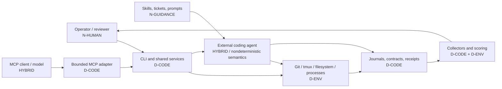

# agent-workflow feature determinism and security assessment

**Repository state analyzed:** `agent-workflow` 0.2.2 reconstructed from baseline `77dc32bd93455994457aa099749be6e97e4edb05` plus the accepted 0.2.2 delta targeting `dbc530b496cb5f0d663181c6130cea71bce983c2`  
**Assessment date:** 2026-07-25  
**Scope:** Python package, CLI, shell tooling, schemas, prompt packs, skills, MCP adapter, evaluation system, release tooling, tests, and current documentation.

## 1. Classification model

This report distinguishes the mechanism that executes a feature from the source of the decision or result.

| Label | Meaning | Typical examples |
|---|---|---|
| **D-CODE** | Deterministic application logic. The same normalized input and state should produce the same decision or artifact. | schema validation, workflow replay, receipt verification |
| **D-ENV** | Deterministic code that invokes environment-dependent tools or observes mutable host state. | Git, tmux, filesystem, installer, shell commands |
| **HYBRID** | Deterministic orchestration around a nondeterministic or externally controlled producer. | launching Codex/Claude, collecting provider events, MCP called by an LLM client |
| **N-GUIDANCE** | Prompt, skill, prose, or procedural guidance whose semantic interpretation is not enforced by code. | ticket instructions, review skills, stop conditions |
| **N-HUMAN** | Human judgment or identity-dependent decision. | review, acceptance, policy authorization |

A feature implemented in Python is not automatically deterministic. Python can deterministically launch an agent, but the agent's semantic output remains nondeterministic. Conversely, a Markdown file can be part of a deterministic process when its bytes are schema-validated and content-addressed, even though the instructions inside it are interpreted nondeterministically.

## 2. Executive conclusions

1. **The control plane is mostly deterministic.** Workflow replay, receipts, schemas, bindings, routing rules, provider normalization, cohort comparison, and pack validation are code-defined and fail closed in many important cases.
2. **The actual coding work is intentionally nondeterministic.** Prompts, external coding agents, human review, and model-generated MCP calls produce semantic outcomes that cannot be made deterministic by adding more orchestration code.
3. **The strongest design choice is the separation of authority from observation.** Append-only journals, normalized snapshots, final receipts, lifecycle receipts, and sealed evidence are stronger authorities than status projections, terminal capture, or agent prose.
4. **Several stated policies are still guidance or post-hoc detection rather than enforcement.** Writable-path policy, scope discipline, secret handling in messages, reviewer identity, and some prompt-pack safety rules rely partly on agent/human compliance.
5. **The largest remaining security risks are local execution risks, not cryptography.** Unbounded subprocess capture, arbitrary evaluation commands, inherited environments, prompt-pack symlink integrity, same-user state mutation, and sensitive content exposure through logs/messages deserve priority before a public preview.
6. **The repository is moving toward a public release rather than merely accumulating prompts, but it is not ready for one yet.** Documentation consolidation and acceptance-first testing are positive. License, monitored vulnerability reporting, supported-host compatibility, dependency/release signing, and the P0 controls below remain necessary.

## 3. Deterministic authority map

The security objective should remain: **nondeterministic producers may propose work and emit artifacts, but only deterministic code and explicitly authenticated human decisions may change authoritative state.**

## 4. Feature and component inventory

### 4.1 Entry points, configuration, host integration, and release tooling

| ID | Feature / part | Current implementation | Class | Suggested changes | Security recommendations |
|---|---|---|---|---|---|
| F01 | Main CLI and command routing | `src/agent_workflow/cli.py`; one `argparse` parser dispatches to shared modules | D-CODE | Split the 900+ line dispatch function into transport-neutral command services and thin rendering adapters. Generate command reference and man-page command lists from the live parser. | Keep argument parsing separate from authorization. Redact sensitive argv values in errors and JSON output. Add a global output-size limit and consistent stable error codes. |
| F02 | Machine-readable CLI output | `--json` with ad hoc dictionaries | D-CODE | Define versioned response envelopes and JSON Schemas for public command results and errors. | Never include raw environment variables, unrestricted paths, terminal capture, or prompt contents by default. |
| F03 | Configuration loading and defaults | `config.py`; TOML plus hard-coded defaults for executors, models, classes, roots, and tmux | D-CODE | Add a versioned config schema, reject unknown keys, and separate shipped examples from compatibility data. Move frequently changing executor/model matrices out of release code or version them explicitly. | Treat config as executable policy. Warn or fail on group/world-writable config. Avoid secrets in config; support environment/file references for credentials. Record executable path, version, and optionally digest in provenance. |
| F04 | Environment diagnostics | `doctor.py`; probes binaries, help, writable roots, and archive support | D-ENV | Add subprocess timeouts, output caps, and explicit compatibility assertions for supported versions. Return remediation guidance per failed check. | Do not trust `PATH` silently in privileged or automated contexts. Report resolved binary paths and ownership/mode. Sanitize probe environments and redact output. |
| F05 | Generic subprocess helper | `process.py`; `subprocess.run(... capture_output=True)` | D-ENV | Replace with one bounded execution substrate supporting timeout, process groups, output caps/spooling, environment allowlists, cancellation, and structured results. Use it everywhere, including doctor and Git helpers. | This is a P0 control. Current unbounded capture can exhaust memory; lack of timeout can hang the orchestrator. Error messages can expose secret argv. |
| F06 | Git snapshot and cleanliness checks | `git.py` | D-ENV | Capture submodule state, sparse-checkout state, worktree lock state, and Git version in source provenance. | Run Git with a sanitized environment and disabled external diff/pager hooks where appropriate. Defend against malicious repository config, aliases, filters, and hooks in high-trust evaluation paths. |
| F07 | Worktree create/list/remove | `worktrees.py`; invokes real Git worktrees | D-ENV | Add an optional configured repository allowlist and a dry-run/plan command for destructive removal. Make branch cleanup a separately authorized action. | Custom destinations currently extend beyond the default root. Reject symlinked repository/destination components in bounded services. Do not expose `--force` or branch deletion through MCP without stronger authorization and idempotency. |
| F08 | Installation and uninstall behavior | `install.sh`, package metadata, skill links, XDG starter config | D-ENV | Replace editable installation as the public default with wheel installation. Maintain an installer-owned file manifest and explicit uninstall command. | Refuse root execution unless explicitly supported. Avoid modifying shell profiles. Verify source ownership, dependency source, and destination permissions. Never overwrite user-owned config or skill paths. |
| F09 | Shell completion | live parser plus `shtab` | D-CODE | Generate completion artifacts during release and test them against the installed CLI. | Completion must not execute repository code or inspect sensitive state merely to enumerate values. |
| F10 | Man pages and command documentation | `docs/man/**`, `docs/COMMAND_REFERENCE.md`, release audit | D-CODE for validation; N-GUIDANCE for prose | Generate command names/options from the parser and keep only semantic explanation handwritten. | Continue failing release checks when docs advertise nonexistent commands. Avoid examples that normalize unsafe flags such as force deletion or unrestricted commands. |
| F11 | JSON Schema publication and validation | `contracts.py`, `schemas/*.json`, `jsonschema` | D-CODE | Add explicit schema deprecation/migration policy and compatibility tests across supported stored versions. | Resolve schemas from packaged immutable assets, not ambient site-packages search paths where an unexpected schema could shadow the intended one. Verify schema IDs are unique. |
| F12 | State migrations | `migrations.py` | D-CODE | Document every supported source/target version, make migrations idempotent, and add fixture-based upgrade journeys for real prior releases. | Never rewrite sealed evidence. Migrations should create a new projection or derived index and record provenance. Back up mutable projections before replacement. |
| F13 | Release asset audit and archive manifest | `scripts/audit-release-assets.py`, `pack.archive`, `release-check.sh` | D-CODE / D-ENV | Produce a complete source distribution manifest, SBOM, dependency lock, and provenance statement. Verify wheel and source archive reproducibility independently. | Add signed release attestations, preferably Sigstore or equivalent. Archive checksums without an authenticated publication channel detect corruption but not malicious replacement. |
| F14 | CI and default test gate | `.github/workflows/ci.yml`, acceptance-first suite | D-ENV | Add a clean-host matrix for supported Python/Linux/tmux versions and a separate opt-in live-provider lane. Measure flake rate and runtime. | Pin actions by commit, minimize workflow token permissions, avoid executing untrusted fork code with secrets, and archive only scrubbed evidence. |

### 4.2 Delegation, sessions, agents, and durable control

| ID | Feature / part | Current implementation | Class | Suggested changes | Security recommendations |
|---|---|---|---|---|---|
| F15 | Executor selection and model policy | `config.py`, `executors.py`, `sessions._resolve_agent_identity` | D-CODE | Version executor adapters separately from core orchestration. Discover capabilities through explicit adapter probes rather than hard-coded model lists alone. | Keep no-go enforcement server-side and fail closed. Require recorded authorization for overrides. Do not let prompt text select an otherwise forbidden model. |
| F16 | Advisory task routing | `routing.py`; metadata maps to agent class/executor/model | D-CODE, input may be N-GUIDANCE | Replace string synonym rules with versioned policy tables and structured task metadata. Preserve explanation codes. | Keep routing advisory. Do not add online learning, vector memory, or model-written policy without review. Treat agent-generated metadata as untrusted. |
| F17 | Prompt launch preparation | `sessions.launch`; copies prompt, creates command/provenance/runtime records | HYBRID | Create one immutable `launch-contract.json` containing every runner input and have the runner consume only that contract. Reduce duplicated fields across mutable status and other records. | Current collectors still obtain some runtime locations and identifiers from mutable `status.json`. Move authority to the immutable launch contract before public release. |
| F18 | Generated shell runner | generated Bash wrapper in `sessions.py` | D-ENV | Replace generated shell where possible with direct Python process execution, or reduce the script to a small fixed package asset with structured arguments. | Shell quoting is currently deliberate, but generated scripts expand attack surface. Use a sanitized environment, fixed umask, no inherited shell functions, and no secrets in command text. |
| F19 | Explicit command launch | CLI `launch ... -- <argv>` and executor plan | D-ENV / HYBRID | Make unrestricted explicit commands opt-in policy, separate from named adapters, and label their evidence as unclassified. | Arbitrary command execution is expected for a local tool but must never be exposed through MCP or remote transport without a strict allowlist. Record argv digest and executable identity; redact secrets. |
| F20 | External Codex/Claude execution | `executors.py`, `runner.py` | HYBRID | Maintain adapter fixtures from real versioned event streams. Define supported CLI version ranges and fail clearly outside them. | Run with least privilege, bounded filesystem scope, controlled network, sanitized environment, and resource limits. The external agent must be treated as potentially malicious or compromised. |
| F21 | Interactive versus detached execution | policy and tmux strategy in `sessions.py` | HYBRID | Make lifecycle semantics independent of terminal mode. Add an executor capability contract for steering, cancellation, structured events, and resumability. | Do not infer completion or delivery from pane liveness or terminal text. Preserve the current evidence-based rule. |
| F22 | tmux server/session/pane management | `tmux.py` | D-ENV | Add version compatibility checks, deterministic pane naming, and a recovery command that reports stale/orphaned panes without mutating them. | Session names and targets must remain validated. Use exact argv, not shell strings. Treat tmux capture as sensitive and non-authoritative. Prevent control-mode output from being interpreted as application data. |
| F23 | Interactive pane capacity | configured grid and `ensure_interactive_capacity` | D-ENV | Move capacity calculation into a pure policy object and expose a dry-run plan. | Never auto-close a pane solely because it appears idle without sealed completion and explicit operator policy. |
| F24 | Run state directory and projections | `state.py`; XDG JSON files and `status.json` | D-CODE / D-ENV | Document which files are authority versus projection in machine-readable metadata. Add a repair/rebuild command that regenerates projections from journals/receipts. | Enforce state-root owner/mode checks. Use component-wise no-symlink opens for authority files. Do not use projection fields to authorize irreversible actions. |
| F25 | Lifecycle event journal | `events.py` | D-CODE | Add explicit file-size/event-count limits and a compaction design that creates a new derived checkpoint without deleting authority. | Continue locking, contiguous sequence validation, and fsync. For any future multi-host mode, add authenticated writer identity and signatures or a trusted broker. |
| F26 | Durable steer/progress/ack messages | `messages.py`; append-only JSONL plus best-effort tmux wakeup | D-CODE around human/agent text | Implement BKL-001 durable consumer cursors and BKL-002 executor-specific late steering. Add message disposition states beyond ack where adapters support them. | Message content can contain secrets and is currently returned by MCP. Add content classification/redaction, maximum total log size, and configurable retention. Actor IDs are labels, not authenticated identities. |
| F27 | Message watch/wakeup | polling plus `tmux wait-for` hint | D-ENV | Add measurable wakeup latency and failure metrics before introducing another notifier. | Preserve replay as authority. Never advance consumer state based only on a wakeup. Avoid busy loops and unbounded waiters. |
| F28 | Status, list, tail, attach, observation | CLI, `sessions.observe`, tmux capture, logs | D-ENV | Separate summary, evidence, and raw-output views. Add explicit pagination/byte limits to all list/tail operations. | Raw logs and terminal capture may contain credentials, source, or model output. Default to minimal summaries and require explicit opt-in for raw content. |
| F29 | Interrupt, terminate, kill | `sessions.py`, tmux/process signals | D-ENV | Make interrupt and graceful termination idempotent service operations. Keep force kill a local-only explicit action. | Record actor, reason, process identity, and outcome durably. Verify PID/process-group ownership before signaling to prevent PID reuse errors. |
| F30 | Restart/retry | `sessions.restart`, retry lineage, workflow attempts | D-ENV / HYBRID | Define exactly which inputs are reused versus refreshed and expose a restart plan before execution. | Verify old run seal and immutable command/prompt digests before relaunch. Never silently inherit changed config, prompt, executable, or worktree revision. |
| F31 | Agent identity and profiles | preferred/generated names and profile policy | D-CODE | Separate display name from stable machine identity. Add an immutable agent-instance ID and adapter session ID. | Names are not identities. Do not use a caller-provided actor/name alone to prove reviewer independence or authorization. |
| F32 | Interactive agent task completion | `agent_context.complete_task` | HYBRID | Require a structured completion contract tied to the current assignment and sealed checkpoint before marking reusable. | Pane liveness plus a child assertion is insufficient for strong completion. Ensure the same session cannot forge completion for a different assignment. |
| F33 | Agent reuse candidate scoring | `agent_context.candidates` | D-CODE using operator/agent metadata | Replace magic scores with versioned policy and expose all eligibility facts. Keep auto-reuse conservative. | Tags and summaries are untrusted self-reports. Do not use them for privilege expansion, secret access, or broader filesystem scope. Revalidate worktree and executor policy on reuse. |
| F34 | Agent reuse request/ack/auto-reuse | `agent_context.py` and durable messages | HYBRID | Add explicit assignment lease, expiry, and conflict resolution. Require provider/session capability proof before automatic reuse. | Correlated acknowledgement should bind assignment ID, prompt digest, and current provider session. Prevent replay of an old reuse acknowledgement. |
| F35 | Completion handoff collection | `runner._collect_completion` | D-CODE consuming N/agent output | Replace status-derived handoff location with the immutable launch contract. Use one descriptor-based copy-and-hash operation followed by schema validation. | Maintain size, regular-file, and no-symlink checks. Fsync the stored copy and parent directory before creating evidence that references it. |
| F36 | Structured task result collection | `runner._collect_task_result`, pack result contract | D-CODE consuming N/agent output | Bind the exact schema digest in launch provenance, not merely the schema path. Add consumer-specific schema version compatibility. | Reject all symlink components for pack/schema/result reads. Prevent sensitive fields from being automatically propagated unless the binding contract marks them safe. |
| F37 | Execution metrics and control events | `metrics.py` | D-CODE over external observations | Publish precise null/zero semantics and derive metrics only from sealed inputs. | Never treat missing usage as zero. Bound control-event count and content. Exclude secret-bearing message bodies from exported telemetry. |
| F38 | Final run receipt and read-only transition | `receipts.py` | D-CODE | Add a single public verification result object containing receipt digest and verified artifact handles/metadata. Consider a receipt format version that binds file mode and creation policy where relevant. | Existing descriptor-based beneath-root reads are strong. Continue rejecting symlinks, writable receipts, substitutions, and duplicate entries. Same-user chmod/replacement remains a local trust limitation; document it explicitly. |
| F39 | Review, acceptance, and rejection | `lifecycle.py`, `approval.py` | N-HUMAN decision with D-CODE evidence checks | Define review policy as machine-readable rules and support authenticated reviewer principals when multi-user operation begins. | Current actor strings do not prove identity or independence. Acceptance must continue to bind exact revision, final receipt, score set, and required independent review. |
| F40 | Ledger rendering | `ledger.py` | D-CODE projection | Make the ledger derive only from verified records and label unverifiable/missing evidence explicitly. | Do not let rendered ledger state become authority. Escape untrusted Markdown/terminal content to prevent misleading output. |

### 4.3 Prompt packs, native jobs, skills, and guidance

| ID | Feature / part | Current implementation | Class | Suggested changes | Security recommendations |
|---|---|---|---|---|---|
| F41 | Prompt-pack scaffold | `pack.scaffold`, packaged assets | D-CODE producing N-GUIDANCE | Keep templates minimal and versioned. Generate machine-readable ticket contracts before prose. | Sanitize pack names used in content and paths. Use atomic creation or refuse partially populated destinations after failure. |
| F42 | Prompt-pack structural validation | `manifests.validate_pack`; phases, tickets, dependencies, contracts | D-CODE | Promote more policy into schemas: writable paths, stop conditions, expected evidence, result sensitivity, and reviewer requirements. | Validation is structural, not semantic. A valid pack may still contain malicious instructions. Treat packs as untrusted input unless signed/approved. |
| F43 | Prompt-pack dependency DAG | task manifests and cycle detection | D-CODE | Reuse the workflow graph validator or a shared graph library to prevent two subtly different dependency semantics. | Bound number of phases/tasks/dependencies to prevent resource exhaustion. Reject duplicate normalized IDs and ambiguous Unicode. |
| F44 | Prompt-pack transfer checksums | `pack checksum`, `pack archive` | D-CODE | Keep source packs editable without a mutable checksum file; generate an optional transfer checksum and canonical archive manifest immediately before transfer/unarchive. | Archive staging must reject symlinks and special files or represent them canonically. A transfer checksum detects corruption but does not authenticate the publisher. |
| F45 | Deterministic pack archive | GNU tar + zstd in `pack.archive` | D-ENV | Add archive extraction verification against a canonical file-type manifest, not only `zstd -t`. Produce reproducibility evidence in CI. | Reject special files, hard links, devices, FIFOs, and all symlinks unless explicitly supported. Prevent output from being created inside the source tree. Add subprocess timeout/cancellation. |
| F46 | Native JSON jobs | `native_jobs.py`, `job-binding.json` | D-CODE contract plus HYBRID execution | Turn native jobs into the preferred machine contract for bounded work. Bind job, prompt, commands, path policy, and review policy by digest. | Current path policy is primarily validated and later compared; it is not an OS-level write barrier. Make that distinction explicit. Reject symlinked job/prompt/schema components. |
| F47 | Writable/forbidden path policy | native job and evaluation scope | D-CODE post-hoc detection; N-GUIDANCE during execution | Add preventative enforcement using sandbox mounts, Landlock, bubblewrap, containers, or executor-native policy. Keep post-run scope comparison as defense in depth. | **P0 finding:** “stay inside writable paths” is currently not guaranteed by Python. A malicious or confused agent can write elsewhere accessible to its process and only be detected afterward. |
| F48 | Acceptance command declarations | evaluation/native job command specs | D-ENV | Require structured executable plus argv, cwd, timeout, expected result format, network policy, and resource limits. | Commands execute repository code under the user's account. Run in an isolated sandbox with no ambient secrets, limited network, CPU/memory/output caps, and controlled environment. |
| F49 | Delegated implementation skill | `skills/delegated-implementation/SKILL.md` | N-GUIDANCE | Convert critical requirements into launch contracts and executable gates; leave only judgment and task strategy in the skill. | Instructions such as “stay in writable paths,” “do not expose secrets,” and “do not broaden scope” are not security controls. Do not rely on model obedience. |
| F50 | Orchestrator skill | `skills/agent-workflow-orchestrator/SKILL.md` | N-GUIDANCE | Generate command snippets from the live CLI and keep decision guidance concise. Add explicit escalation when evidence is incomplete. | The skill must never authorize no-go models, destructive actions, or acceptance by prose alone. Guardrails must remain in code. |
| F51 | Prompt-pack builder skill | `skills/prompt-pack-builder/SKILL.md` | N-GUIDANCE | Make it produce schemas/manifests first, then prose. Add a linter for missing security boundaries and unverifiable criteria. | Prompt-pack generation can reproduce prompt injection or local path leakage from source material. Require review before signing/checksumming. |
| F52 | Phase-gate review skill | `skills/phase-gate-review/SKILL.md` | N-HUMAN / N-GUIDANCE | Pair review prose with a deterministic evidence checklist and independent command reruns. | A second LLM with a different name is not necessarily independent. Record principal, environment, model/executor, and evidence digests; keep final authorization human where required. |
| F53 | MCP mutation prompt pack | `prompt-packs/mcp-server-next/**` | N-GUIDANCE specifying future functionality | Keep it as the only active implementation pack and remove it once completed, preserving history in Git. Convert each proposed tool to a typed contract before implementation. | Do not let the prompt pack itself expand authorization. Every mutation must map to one shared service, idempotency record, root policy, and durable result. |

### 4.4 Workflow orchestration

| ID | Feature / part | Current implementation | Class | Suggested changes | Security recommendations |
|---|---|---|---|---|---|
| F54 | Workflow snapshot validation/normalization | `workflow.normalize_snapshot`, JSON Schema | D-CODE | Version node types and transition semantics. Add explicit graph-size, depth, and total-binding limits. | Reject duplicate/Unicode-confusable IDs, path-bearing fields, unknown node attributes, and unbounded metadata. The normalized stored snapshot must remain immutable authority. |
| F55 | Workflow journal append/replay | `workflow.py` | D-CODE | Add replay benchmarks, checkpoint format, and corruption diagnostics before adding SQLite or a broker. | Preserve contiguous sequence, lock, fsync, and no-symlink checks. Never repair a journal silently; create explicit recovery evidence. |
| F56 | Workflow status projection | `workflow.write_workflow_projection` | D-CODE | Add a `rebuild`/`explain` command showing which events caused each node state. | Projection must never authorize approval, child existence, or terminal sealing. Make it safe to delete and regenerate. |
| F57 | Scheduler eligibility and bounded parallelism | `scheduler.py`, `calculate_eligibility`, `plan_launches` | D-CODE | Separate pure planning from side effects completely and persist a launch intent before performing external launch. | Validate existing running children from sealed provenance, not status or event self-reference. Preserve capacity accounting across restart. |
| F58 | Workflow child launch | scheduler through canonical `sessions.launch` | HYBRID | Add idempotency keys and durable launch-intent/result records shared with future MCP tools. | Never introduce a second workflow-specific executor path. Verify child root, prompt, bindings, and policy before launch. |
| F59 | Retry/recoverable workflow attempts | workflow state machine and scheduler | D-CODE around HYBRID child runs | Define retry classes, maximum attempts, backoff, and whether prompt/config/model changes are permitted. | Prevent retry storms and budget bypass. Bind every attempt to predecessor receipt and immutable input snapshot. |
| F60 | Approval-gate nodes | `approval.py`, scheduler reconciliation | N-HUMAN decision with D-CODE verification | Add explicit approval policy objects and optional quorum/multi-reviewer rules. | Reconstruct only canonical contiguous receipt chains. Authenticate actors before treating “independent” as meaningful. Do not expose approval mutation through read-only MCP. |
| F61 | Result bindings | `bindings.py`; bounded JSON Pointer from sealed ancestor results | D-CODE | Add destination type/schema validation and sensitivity labels. Support explicit transformation functions only from a small deterministic registry. | Keep ancestry checks, size limits, and copied snapshots. Never let children open predecessor directories. Deny binding secret-marked values into prompts/logs by default. |
| F62 | Workflow input snapshot | parent binding record plus child `workflow-inputs.json` | D-CODE | Define one schema for origin, destination, type, digest, sensitivity, and optional/default behavior. | Keep files read-only before launch and bind their digest in child provenance/final receipt. Use descriptor-safe writes/reads. |
| F63 | Workflow templates | `workflow_templates.py`; three authorized shapes | D-CODE | Version each template and move definitions to validated declarative assets if expansion remains simple. Test execution semantics, not exact dictionary order. | Do not allow templates to introduce arbitrary commands, paths, models, or approval bypass. Template expansion must terminate in the same workflow schema. |
| F64 | Workflow aggregate receipt | `workflow_receipt.py` | D-CODE | Include explicit software/schema versions and a verification summary for every child/approval/binding. | Continue verifying exact snapshot, event journal, child receipts, retry lineage, approvals, and bindings under one lock. Reject partial or duplicate evidence. |
| F65 | Workflow CLI/service facade | `workflow_service.py`, CLI workflow commands | D-CODE / D-ENV | Make this the single public service used by CLI and MCP. Add typed request/response contracts and idempotency where mutation occurs. | Constrain workflow run directories to configured roots for MCP/automation. Current local CLI can remain flexible but should warn when authority is outside the state root. |

### 4.5 Evidence, provider accounting, and evaluation

| ID | Feature / part | Current implementation | Class | Suggested changes | Security recommendations |
|---|---|---|---|---|---|
| F66 | Raw executor event capture | `runner.py`, bounded `executor-events.jsonl` | HYBRID | Store adapter version and a per-record digest/index. Add truncation reason and byte/event counts to evidence. | Bound bytes, line length, event count, and parsing time. Treat all event text/JSON as hostile. Never execute or render raw HTML/terminal control sequences. |
| F67 | Provider event parsing | `executors.parse_event` and provider helpers | D-CODE over external payloads | Create versioned adapters per provider/CLI version and preserve unknown fields only in raw evidence. | Fail closed on ambiguous usage semantics. Fuzz parsers with malformed/nested/oversized values. Do not trust provider event IDs alone; bind ID plus payload digest. |
| F68 | Provider usage normalization | `provider_evidence.py` | D-CODE | Publish a compatibility matrix for cached/reasoning token field variants and terminal/delta/cumulative modes. | Continue rejecting non-finite, conflicting, mixed-mode, incomplete-cost, duplicate-conflict, and truncated evidence. Never infer currency or billing cost from prose. |
| F69 | Provider-billed versus estimated cost | evidence schemas and metrics | D-CODE if catalog is pinned | Add a signed/versioned price catalog with effective dates, model IDs, region, and currency. Keep estimates nullable. | Never merge provider-billed and local estimates into one authority field. Require matching currency/catalog for comparisons. |
| F70 | Evaluation plan validation | `evaluation.py`, schema | D-CODE | Add plan versioning, environment contract, random seed policy, cache/network policy, and required repetitions. | Treat evaluation files as code-adjacent untrusted input because they authorize commands and oracle references. Require pack checksum/signature and root containment. |
| F71 | Baseline/post acceptance command collection | `eval.commands` | D-ENV | Run commands through the bounded subprocess substrate and record environment, executable digest/version, duration, stdout/stderr digests, truncation, and timeout. | Sandbox commands. Disable network by default. No ambient tokens, SSH agent, cloud credentials, or user home mounts. |
| F72 | Scope baseline/post inventory | `eval.scope` | D-ENV | Optimize large trees with explicit inclusion rules and Git-native diffs while retaining non-Git inventory for sensitive seams. | Current control is detective. Prevent writes using sandboxing; then compare scope as evidence. Avoid hashing secrets or huge ignored trees into distributable evidence. |
| F73 | Oracle resolution and canary scan | `eval.oracles` | D-CODE / D-ENV | Define a signed oracle bundle format and read-only mounted oracle service for isolated evaluators. | Keep oracle material outside delegated worktrees. Enforce owner/mode, no symlink components, digest verification, and no oracle content in logs or prompts. Canary scanning is useful but not a complete leak detector. |
| F74 | Deterministic scoring | `eval.scoring`, score receipts | D-CODE | Version scorer algorithms and make every score traceable to sealed inputs, command receipts, scope, and oracle digest. | Use descriptor-safe reads and content-addressed scorer receipts. Reject missing/duplicate scorer evidence and non-finite values. |
| F75 | JUnit parsing/comparison | `eval.junit` | D-CODE | Handle schema variants explicitly and cap XML size/depth. Preserve skipped/error semantics. | Parse with a hardened XML library or disable external entities explicitly. Treat test names/output as untrusted text. |
| F76 | Trial extraction and immutable trial evidence | `eval.trials` | D-CODE | Add complete provenance for software versions, hardware/environment class, retry/re-steer/human assistance, and exclusion reasons. | Verify final receipt and score-set receipts before extraction. Never accept mutable score summaries or missing provider evidence as complete. |
| F77 | Baseline/candidate cohort comparison | `eval.compare` | D-CODE; experimental validity depends on human design | Add preregistered policies, minimum sample size, confidence intervals/effect sizes, paired-run identity, and sensitivity analysis. | Reject mismatched tasks, currencies, catalogs, models, environments, or intervention rules. Do not overclaim small samples; retain descriptive status. |
| F78 | Evaluation reports | `eval.reporting` | D-CODE projection | Generate reports solely from verified trial evidence and include an explicit limitations section. | Escape untrusted text, avoid embedding raw logs, and label null/missing/incomplete values clearly. Reports are not authority. |
| F79 | Inspect evaluation adapter | `inspect_adapter.py` and optional dependency | HYBRID / highly nondeterministic | Keep isolated from core scoring. Pin Inspect version, model, Docker image digest, fonts, browser assets, and evaluator prompt. | Run in a locked container with no secrets and controlled network. Record all model/tool calls. Do not treat model-based judging as deterministic ground truth. |
| F80 | SWE-bench prediction export | `integrations/swebench.py` | D-CODE | Validate patch size/encoding and include source/final receipt digests in sidecar metadata. | Export only verified sealed patches. Prevent path confusion and accidental inclusion of secrets or unrelated diffs. |
| F81 | MLflow integration | `integrations/mlflow.py` | D-ENV / external service | Make telemetry export opt-in with explicit field allowlists and offline buffering. | Never upload prompts, source, message content, terminal logs, or secrets by default. Validate TLS endpoint and credentials source. |
| F82 | OpenTelemetry integration | `integrations/otel.py` | D-ENV / external service | Define stable span/event semantic conventions and sampling policy. | Apply strict redaction and size limits. Do not place ticket text, prompts, argv, file paths, or user content in attributes without opt-in. |

### 4.6 MCP adapter

| ID | Feature / part | Current implementation | Class | Suggested changes | Security recommendations |
|---|---|---|---|---|---|
| F83 | MCP server transport | optional `FastMCP`, local stdio only | HYBRID: deterministic server called by potentially nondeterministic client | Keep stdio only until authenticated authorization and deployment threat model exist. Add protocol/conformance tests against pinned SDK versions. | Do not add HTTP by configuration accident. Stdio still inherits caller environment and filesystem permissions; launch it with a sanitized environment. |
| F84 | MCP run listing/status | `WorkflowReadService.list_runs/get_status` with allowlisted fields | D-CODE projection | Add explicit schema/version and pagination arguments to tools/resources. Consider a verified-evidence summary separate from status projection. | Current allowlist is good. Do not expose workdir, prompt, argv, capture, or arbitrary artifact paths. Validate state-root ownership/mode. |
| F85 | MCP message listing | `list_messages` returns complete durable message records | D-CODE exposing N/user content | Default to metadata-only messages and add a separately authorized/redacted content resource. | **P0 privacy finding:** steer/progress/ack content can contain source, instructions, credentials, or sensitive operational context. Full content should not be exposed to every MCP client by default. |
| F86 | MCP receipt listing | scans receipt directory and hashes files | D-ENV | Use the same stable descriptor/no-symlink receipt reader as lifecycle verification and return typed receipt summaries. | Avoid check-then-open races. Reject writable, irregular, duplicate, or noncontiguous receipt entries rather than silently skipping them when presenting authoritative summaries. |
| F87 | MCP pack validation | `pack_validate` under configured repository root | D-CODE | Return bounded structured errors and manifest digest. Map all domain exceptions to stable non-secret errors. | `contained_path` resolves before the later `is_symlink()` check, making the final symlink test ineffective for a symlink that resolves inside the root. Use component-wise no-follow traversal or retain the unresolved path for validation. |
| F88 | MCP error boundary | `_service_result` catches `ServiceError` | D-CODE | Convert all expected `WorkflowError` cases to stable categories and catch unexpected failures at the transport boundary with an opaque correlation ID. | Do not leak local paths, stack traces, or raw exception messages to clients. Log locally with redaction. |
| F89 | Planned MCP mutations | MCP-003 prompt pack; not implemented | N-GUIDANCE future design | Implement only through shared typed services with durable idempotency keys and parity tests. Start with validation/status before launch or steer. | No raw shell, arbitrary paths, tmux controls, terminal capture, force kill, direct state mutation, or alternate scheduler. Add authorization before any lifecycle mutation. |

### 4.7 Testing, documentation, and governance

| ID | Feature / part | Current implementation | Class | Suggested changes | Security recommendations |
|---|---|---|---|---|---|
| F90 | Installed-product acceptance journeys | `tests/acceptance/**`; wheel, subprocess, Git/filesystem journeys | D-ENV | Keep these as the primary release authority. Add missing journeys for cursor recovery, preventive path enforcement, MCP privacy, and config trust. | Acceptance fixtures must use synthetic secrets and assert redaction. Run in isolated HOME/XDG directories with no real credentials. |
| F91 | Security/state invariant matrices | `tests/invariants/**` | D-CODE | Add property/fuzz tests for IDs, paths, receipts, event streams, JSON Pointer, manifests, and provider usage. | Retain low-level tests only for security/accounting invariants that cannot be exhaustively demonstrated through end-to-end journeys. |
| F92 | Live adapter tests | `tests/live/**`, opt-in | HYBRID / D-ENV | Establish a supported compatibility matrix and run on clean disposable hosts before releases that change adapters. | Use read-only smoke tasks, no proprietary repositories, no secrets, bounded spend, and explicit deletion/retention policy for provider logs. |
| F93 | Strict future TDD tests | `tests/future/**`, expected failure | D-CODE specification for future HYBRID behavior | Require every future test to reference one backlog ID and promote it to acceptance when implemented. Remove obsolete future specs. | Ensure expected failures cannot mask unexpected exceptions or security regressions. An xfail should match a narrow reason and failure mode. |
| F94 | Architecture and chart pack | `docs/ARCHITECTURE.md`, `docs/diagrams/**` | N-GUIDANCE, partially release-validated | Generate module/command/schema inventories automatically and keep diagrams focused on authority and data flow. | Diagrams should mark trust boundaries, secret-bearing channels, arbitrary-code execution, and projection versus authority. Avoid exposing user-local paths. |
| F95 | Backlog and release readiness | `BACKLOG.md`, `docs/PUBLIC_RELEASE_READINESS.md` | N-HUMAN governance | Keep one backlog, stable IDs, and observable exit evidence. Add owners and target release gates once governance exists. | License, vulnerability reporting, support matrix, and release ownership are security prerequisites, not paperwork. Do not publish a security contact that is not monitored. |
| F96 | Security documentation | `SECURITY.md`, architecture/security sections | N-GUIDANCE | Add an explicit threat model for same-user malicious agents, untrusted repositories, untrusted packs, provider compromise, and future multi-user operation. | State clearly what chmod/checksums can and cannot protect against. Define secret-handling, retention, disclosure, and supported-version policy before public release. |

## 5. Guidance that should become deterministic enforcement

The following requirements currently appear in skills, prompt packs, or prose and should not remain dependent on model obedience:

| Guidance-only or partially enforced rule | Current reality | Recommended deterministic control |
|---|---|---|
| “Stay inside writable paths.” | Validated and checked post-run; not a preventative write barrier. | OS-level sandbox/mount/Landlock/bubblewrap/container policy plus post-run scope evidence. |
| “Do not expose secrets in progress or acknowledgement.” | Message length/type is validated, but content is not classified or redacted. | Secret scanning/redaction, metadata-only MCP view, retention policy, and explicit sensitive-content opt-in. |
| “Do not broaden scope.” | Ticket text and reviewer judgment. | Immutable job/snapshot paths, launch-time allowed-root policy, and post-run violation gate. |
| “Run the required tests.” | Agent instruction plus later acceptance-command collection when configured. | Machine-readable command contract executed independently by the runner/evaluator. |
| “Independent review.” | Actor/model names and human procedure. | Authenticated principal, separate run/environment policy, immutable evidence digest, and explicit reviewer independence rule. |
| “Acknowledge steering after applying it.” | Durable correlated ack exists, but detached late delivery is incomplete. | Executor-specific delivery adapter, durable consumer cursor, applied/rejected disposition, and idempotent replay. |
| “Do not use forbidden/no-go models.” | Enforced in current session policy. | Retain in code; add adapter/version evidence and prevent explicit-command bypass from being mislabeled as a governed executor. |
| “Do not read predecessor state directly.” | Workflow bindings copy sealed JSON Pointer values. | Retain in code; optionally sandbox child visibility so predecessor run directories are inaccessible. |
| “Do not claim evidence that does not exist.” | Mostly enforced by schemas/receipts, but prose reports remain possible. | Generate completion/review summaries from verified evidence and clearly separate commentary from authority. |

## 6. Prioritized change plan

### P0 — before any public preview

1. **Create a bounded subprocess substrate.** Add timeout, output caps/spooling, process-group ownership, cancellation, sanitized environment, and argv redaction; migrate `process.py`, doctor, Git, pack archiving, evaluation commands, and probes.
2. **Ban or canonically manifest prompt-pack symlinks and special files.** The archive currently preserves symlinks that the checksum manifest excludes.
3. **Enforce writable-path policy preventatively.** Keep post-run scope comparison, but add an OS/executor sandbox boundary for native jobs and evaluation runs.
4. **Replace runner dependence on mutable status with an immutable launch contract.** Bind handoff paths, workdir, schema digests, runtime/evaluation policy, and session identity before launch.
5. **Harden MCP privacy and path handling.** Make message content metadata-only by default; fix resolve-before-symlink validation; use stable descriptor readers; normalize all errors.
6. **Remove remaining projection-to-authority coupling.** The CLI evaluation path obtains the expected final-receipt checksum from mutable `status.json` through `_recorded_receipt_hash`. Verification should return the digest of the exact receipt it verified, or obtain an expected digest from an immutable lifecycle/provenance authority.
7. **Sandbox acceptance/evaluation commands.** No ambient home, SSH agent, cloud credentials, or network by default; enforce CPU/memory/time/output limits.
8. **Resolve public-release governance blockers.** License, monitored vulnerability reporting, supported host/executor matrix, release owner, support policy, and security update policy.

### P1 — public beta hardening

1. Add authenticated actor/principal model for review, acceptance, steering, and future MCP mutations.
2. Version executor adapters and compatibility data independently; run live clean-host compatibility before release.
3. Add config ownership/mode checks and explicit trust documentation for configured commands.
4. Generate command/man/schema inventories from source; reduce handwritten duplication.
5. Add property/fuzz testing for path, receipt, journal, provider event, manifest, and JSON Pointer boundaries.
6. Produce SBOM, locked dependencies, signed release artifacts, and verifiable build provenance.
7. Add content classification/redaction and retention controls for prompts, logs, messages, provider events, and telemetry.

### P2 — only after measured need

1. Add reconstructable indexes/checkpoints only when replay cost is measured as a problem.
2. Add multi-host transport only after authenticated identities, shared artifact policy, idempotency, and cross-host trust are designed.
3. Add HTTP MCP only through a dedicated authorization/threat-model ADR.
4. Add evidence-informed routing only from controlled cohorts; keep it advisory and offline.

## 7. Security posture by trust boundary

| Boundary | Current posture | Main residual risk | Recommendation |
|---|---|---|---|
| Operator to CLI | Local user, explicit commands | Accidental destructive actions; secret argv | Plans/dry-run, redaction, stronger confirmation for force operations |
| CLI to host tools | argv-based subprocesses | Hangs, unbounded output, inherited environment, malicious repo config | Unified bounded subprocess and sanitized environment |
| Orchestrator to external agent | Prompt plus filesystem/process access | Prompt injection, malicious writes, data exfiltration | Preventative sandbox, network policy, secret isolation |
| Agent to durable evidence | Structured handoff/events | Forgery, symlink/path attacks, oversized data | Existing descriptor/hash/schema controls plus immutable launch contract |
| Prompt pack to execution | Checksummed files and prose | Semantic malicious instructions; unmanifested symlinks | Ban symlinks, sign approved packs, machine contracts, human review |
| Human reviewer to acceptance | Actor string plus reason | Identity spoofing, non-independent review | Authenticated principal and policy-backed independence |
| Evaluation command to host | Arbitrary repo command | Code execution with user privileges/secrets | Locked sandbox and resource/network restrictions |
| MCP client to local state | Read-only stdio and path roots | Message-content leakage; path/symlink error gaps | Metadata-only defaults, no-follow traversal, stable errors |
| Release publisher to user | SHA-256 manifest | Malicious replacement at publication point | Signed attestations, SBOM, reproducible builds, secure channel |

## 8. Public-release direction

The repository is **not compounding documentation slop at the same rate as earlier versions**. Version 0.2.2 removed completed prompt packs, one-off execution receipts, duplicated plans, and a large implementation-detail test suite. The remaining docs have clearer roles:

- `README.md`: product entry point and support status;
- `docs/ARCHITECTURE.md`: authority and component design;
- `docs/COMMAND_REFERENCE.md`: public commands;
- `docs/OPERATIONS.md`: operational procedures;
- `docs/EVIDENCE_AND_EVALUATION.md`: evidence semantics;
- `docs/TESTING.md`: test authority and lanes;
- `docs/MCP_SERVER.md`: current and planned MCP boundary;
- `docs/PUBLIC_RELEASE_READINESS.md`: release blockers;
- `BACKLOG.md`: the only active task register.

That is a credible public-release documentation structure. The remaining risk is **implementation-policy drift**, where a strong statement in docs or skills is only partially enforced. The most valuable next work is therefore not more planning prose. It is converting the P0 guidance-only rules into deterministic controls, then generating more of the reference documentation directly from the parser, schemas, and registered services.

## 9. Recommended decision

Continue toward a public release, but use a staged label:

1. **Current:** internal/pre-public engineering release.
2. **Next:** security hardening preview only after all P0 controls and governance blockers are closed.
3. **Public beta:** after clean-host compatibility, live-adapter evidence, signed artifacts, and a monitored security channel.
4. **Stable release:** after at least one external adopter exercises install, delegation, workflow, evidence verification, and upgrade/uninstall paths without maintainer intervention.

The architecture does not need a larger agent taxonomy, memory framework, alternate scheduler, or additional prompt packs. It needs tighter deterministic enforcement at the local-process, filesystem, identity, and information-disclosure boundaries.

## 10. Source observations supporting the highest-priority findings

These are direct implementation observations from the analyzed tree, not conclusions inferred only from documentation.

| Finding | Source observation | Why it matters |
|---|---|---|
| Subprocesses are not uniformly bounded | `process.run` and `run_bytes` use `subprocess.run(..., capture_output=True)` without timeout or output limit; `doctor.py` performs similar probes. | A hung or noisy child can block the orchestrator or exhaust memory. One secure process substrate would close a cross-cutting gap. |
| Prompt-pack symlinks are not covered as manifest entries | `pack.archive` stages with `shutil.copytree(..., symlinks=True)`, while `manifests._checksum_files` excludes symlinks. | The archive can contain behavior-relevant filesystem entries that do not have their own canonical manifest record. |
| Writable-path policy is post-hoc | `eval.scope.collect_scope` records baseline/post inventories and `compare_scope` reports violations after execution. | It detects unauthorized writes but does not prevent the agent or acceptance command from making them. |
| Runner inputs still partly come from a projection | `_collect_completion` and `_collect_task_result` read `status.json` for session, handoff, pack, and contract locations. | A launch contract is a cleaner immutable authority and reduces same-user replacement and cross-file inconsistency risk. |
| CLI evaluation receipt expectation comes from status | `cli._recorded_receipt_hash` reads `status.json["final_receipt_sha256"]` and supplies it to score/report/export verification. | A projection should not select the authority it is expected to verify. Verification should produce or consume an immutable expected digest. |
| MCP symlink validation loses the original path | `contained_path` returns `candidate.resolve()`; `validate_pack` then checks `selected.is_symlink()`. | After resolution, a final symlink normally appears as its target, so that check cannot enforce a no-symlink policy. |
| MCP exposes message bodies | `WorkflowReadService.list_messages` returns `replay_messages(root)` records without content filtering. | Durable steer/progress/ack bodies may contain sensitive source or operational text. |
| Actor independence is label-based | lifecycle and message APIs validate actor strings as IDs but do not authenticate a principal. | A local caller can choose another actor label; strong independent review needs an authenticated identity boundary. |
| Native-job prompt and job paths follow resolution | `native_jobs.validate_native_job` resolves pack/job/prompt paths and does not reject every symlink component. | Content can remain inside the root yet still be redirected or replaced through symlinked components; immutable digest binding should be explicit. |
| Schema lookup can be influenced by multiple roots | `contracts._schema_roots` searches source, user-base share, and interpreter-prefix share; the first matching `$id` wins. | Installation layout ambiguity can select a different schema than expected. Packaged schemas should have one authoritative resolution order with duplicate-ID failure. |
