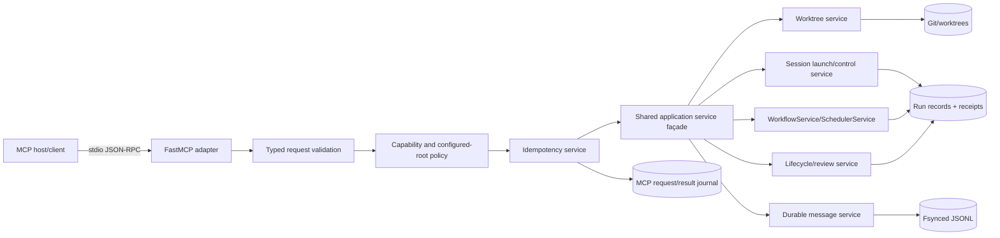
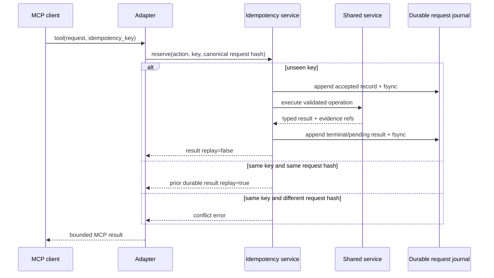

# MCP server implementation proposal and plan

**Target:** post-0.2.1 mutation surface
**Current implementation:** optional, local, read-only stdio server
**Backlog authority:** `MCP-003`, `MCP-004`, and `MCP-005` in `BACKLOG.md`

## Executive proposal

Extend the existing MCP adapter only as a transport façade over the same application services used by the CLI. Do not create MCP-specific launch, workflow, approval, receipt, path, or message semantics. The first implementation increment (`MCP-003`) should expose safe creation and non-destructive control tools over local stdio, with idempotency records and durable result identifiers. Destructive/review actions remain a separately gated increment (`MCP-004`). Streamable HTTP remains a decision only (`MCP-005`) and requires its own authorization ADR.

The target protocol remains MCP `2025-11-25` with the pinned optional Python SDK `mcp==1.28.1`. The SDK is not vendored; public APIs are the dependency boundary.

## Current state

The repository already provides:

- `agent-workflow-mcp` stdio entry point;
- `FastMCP` resources for bounded run status, messages, and receipts;
- `pack_validate` as a read-mostly validation tool;
- configured-root containment, traversal rejection, redaction, pagination, and bounded responses;
- reusable CLI/domain services for worktrees, sessions, messages, lifecycle, workflow scheduling, result binding, approvals, and receipts;
- immutable child and aggregate workflow evidence;
- no raw shell, tmux, arbitrary path, raw terminal capture, HTTP transport, or mutation shortcut.

## Non-negotiable invariants

1. JSONL journals and immutable receipts remain authoritative; MCP responses are projections.
2. MCP and CLI invoke shared service functions. There is one launch path and one scheduler.
3. Paths are logical identifiers or configured-root-relative paths, never arbitrary host paths.
4. Every mutating request has an idempotency key and a durable request/result record.
5. A returned `pending` steer is not proof of delivery or application.
6. Approval tools consume and create canonical lifecycle receipts; mutable status never grants approval.
7. No-go model and executor/class policy is enforced by the existing selection path.
8. Local stdio is single-user process trust. Any network transport requires authentication, audience validation, origin checks, rate limits, and an authorization policy.

## Target architecture



### Adapter layer

The MCP layer should contain only:

- protocol registration and annotations;
- conversion between MCP inputs and internal request dataclasses;
- bounded serialization and stable error mapping;
- cancellation/progress forwarding where the underlying operation supports it;
- actor identity injection (`mcp-stdio:<instance-id>`).

It must not open subprocesses, invoke tmux, mutate Git, write status, or reconstruct workflow state directly.

### Shared façade

Introduce a narrow `MutationService` or equivalent composition object that is also callable by the CLI. It should delegate to existing services and return typed result envelopes with:

- `request_id`;
- `idempotency_key`;
- `action`;
- durable result ID/path/digest;
- state (`accepted`, `pending`, `completed`, `rejected`, `failed`);
- replay indicator;
- bounded diagnostic details.

Do not refactor stable modules merely to make the MCP code aesthetically uniform. Add seams only where CLI logic currently owns behavior that a second front end legitimately needs.

## Proposed MCP-003 surface

### Tools

| Tool | Mutates | Required inputs | Durable result |
|---|---:|---|---|
| `pack_validate` | no | pack identifier/root | validation result digest |
| `worktree_create` | yes | repository ID, ticket ID, base revision, destination alias, idempotency key | worktree record and Git revision |
| `run_launch` | yes | session ID, worktree ID, prompt/pack ticket ID, class/executor/model options, idempotency key | run ID, command digest, provenance path |
| `workflow_validate` | no | snapshot or authorized template specification | normalized snapshot digest |
| `workflow_start` | yes | workflow run ID, snapshot digest, idempotency key | workflow run record and scheduled node IDs |
| `workflow_status` | no | workflow run ID | replayed workflow projection |
| `workflow_resume` | yes | workflow run ID, snapshot digest, idempotency key | replay/reconciliation result |
| `workflow_seal` | yes | workflow run ID, idempotency key | aggregate receipt digest |
| `workflow_verify` | no | workflow run ID | verification result |
| `run_progress` | yes | run ID, text, actor, idempotency key | message ID/sequence |
| `run_ack` | yes | run ID, source message ID, text, actor, idempotency key | acknowledgement message ID |
| `run_steer` | yes | run ID, text, actor, idempotency key | pending steer message ID |

`worktree_create`, `run_launch`, and workflow tools accept logical configured-root identifiers. Direct absolute-path arguments should not be exposed to general MCP clients.

### Resources

Retain and expand bounded resources:

- `agent-workflow://runs/{run_id}/status`
- `agent-workflow://runs/{run_id}/messages?after={sequence}&limit={limit}`
- `agent-workflow://runs/{run_id}/receipt`
- `agent-workflow://workflows/{workflow_id}/status`
- `agent-workflow://workflows/{workflow_id}/receipt`
- `agent-workflow://packs/{pack_id}/manifest`
- `agent-workflow://requests/{request_id}`

Resources return typed JSON, omit secrets and raw terminal output, cap collection sizes, and provide pagination cursors rather than unbounded arrays.

### Prompts

Prompts are optional convenience surfaces, not authority. Candidates:

- `prepare_delegation`: gather bounded fields for a run-launch request;
- `prepare_workflow`: select one of the three authorized templates and generate a draft canonical snapshot;
- `review_run_evidence`: guide a client through status, receipt, scope, and score resources without issuing acceptance.

Prompt output must never execute a tool implicitly or weaken confirmation requirements.

## Request and idempotency model



Recommended record envelope:

```json
{
  "schema": "agent-workflow/mcp-request-event/v1",
  "request_id": "uuid",
  "sequence": 1,
  "idempotency_key": "client-supplied-string",
  "action": "workflow_start",
  "request_sha256": "…",
  "actor": "mcp-stdio:instance-id",
  "state": "accepted",
  "created_at": "…",
  "result_refs": []
}
```

Use append-only events plus a reconstructable projection. Reserve keys before external effects. Replays return the recorded result. A crash after reservation but before completion is recovered by action-specific reconciliation; it is never treated as permission to repeat blindly.

## Error contract

Map internal errors to stable public categories while preserving a bounded operator message:

- `invalid_request`
- `not_found`
- `conflict`
- `policy_denied`
- `unsafe_path`
- `invalid_transition`
- `evidence_invalid`
- `capacity_exceeded`
- `dependency_unavailable`
- `internal_error`

Do not expose stack traces, command lines containing secrets, raw environment variables, or unrestricted filesystem paths. Include a request ID for local log correlation.

## Security and authorization

For stdio, the spawning host process is the security principal. Still enforce:

- configured repository/pack/worktree/state roots;
- path containment after symlink resolution;
- allowlisted operations and bounded text/collection sizes;
- no raw shell command or arbitrary executable arguments;
- no implicit no-go-model override;
- no destructive/review tools in MCP-003;
- actor, reason, revision, and policy checks in MCP-004;
- response redaction and explicit secret-field denylist;
- per-request timeouts and cancellation boundaries.

MCP guidance requires servers to validate tool inputs, implement access controls, rate-limit exposed operations, and sanitize outputs. Streamable HTTP additionally requires origin validation and authentication; authorization guidance rejects token passthrough and requires resource/audience validation. These requirements are why HTTP remains a separate decision.

See `docs/MCP_THREAT_MODEL.md`.

## MCP-004: destructive and review operations

Only after MCP-003 has completed conformance, replay, and security gates, add:

- `run_interrupt` and `run_terminate` (not force kill by default);
- `run_review`, `run_accept`, and `run_reject`;
- optional workflow approval actions that call the same lifecycle service.

Required controls:

- explicit feature flags per action class;
- client-side confirmation annotations plus server-side policy checks;
- non-empty actor/reason;
- exact accepted revision;
- immutable score/final-receipt validation;
- independent reviewer checks for high/critical tiers;
- idempotency and duplicate-transition tests;
- denial when evidence is stale, mutable, substituted, or belongs to another run.

## MCP-005: conditional Streamable HTTP

No HTTP code should be added until an ADR decides:

- deployment and tenant model;
- identity provider and OAuth metadata;
- resource indicators/audience validation;
- client registration policy;
- session persistence and horizontal scaling;
- CSRF/origin policy;
- TLS termination and trusted proxies;
- rate limits and abuse controls;
- audit retention and data classification;
- cross-host artifact access/signing.

Local stdio records should remain portable so the same shared services can later sit behind an authenticated transport.

## Testing strategy

### Unit and contract tests

- request schema bounds and unknown-field rejection;
- canonical request hashing and key conflicts;
- stable error mapping/redaction;
- root containment, symlink, traversal, and case-normalization behavior;
- tool annotations and declared capability list;
- resource pagination/cursors;
- replay of accepted/pending/terminal request events.

### Integration tests

- each MCP tool compared with the equivalent CLI/shared-service result;
- duplicate request replay before and after process restart;
- crash injection around reservation, external effect, and terminal event;
- workflow start/resume with dependency failures, approvals, retries, and bindings;
- steer remains pending until correlated acknowledgement;
- no-go model and pane-cap policy are enforced through the canonical launch path;
- final and workflow receipt verification after MCP-issued operations.

### Protocol/conformance tests

- official MCP Inspector against the pinned SDK/protocol matrix;
- initialize/capability negotiation;
- malformed JSON-RPC and invalid tool inputs;
- cancellation/progress behavior;
- large-response bounds;
- host matrix for representative clients;
- optional dependency absent: clear startup error, core CLI unaffected.

### Security tests

- traversal and symlink races;
- unauthorized roots and forged logical IDs;
- secret-shaped content redaction;
- tool prompt injection cannot bypass policy;
- request-ID/idempotency collision attempts;
- lifecycle receipt substitution and mutable status forgery;
- resource enumeration limits and denial-of-service bounds.

## Delivery phases

### Phase A — service extraction and request journal

- inventory CLI-only logic needed by tools;
- add minimal shared request dataclasses/result envelopes;
- implement durable MCP request event journal and replay projection;
- add canonical hashing and idempotency reservation;
- no new tools until recovery tests pass.

### Phase B — safe creation and workflow tools

- implement `worktree_create`, `run_launch`, workflow validate/start/status/resume/seal/verify;
- use configured logical roots and canonical services;
- verify CLI/MCP equivalence and receipt sealing.

### Phase C — message/control tools

- implement progress, acknowledgement, and steer;
- preserve pending/delivered/applied distinctions;
- add restart and duplicate-delivery tests.

### Phase D — conformance and adoption gate

- run Inspector and representative clients;
- publish capability/compatibility matrix;
- perform threat-model review and release audit;
- decide whether MCP-004 is authorized.

### Phase E — separately authorized destructive/review tools

- add feature-gated interrupt/terminate/review/accept/reject;
- repeat security, lifecycle, and host gates.

### Phase F — HTTP ADR only

- measure local adoption and identify an actual multi-process/multi-host need;
- approve or reject Streamable HTTP before implementation.

## Migration and compatibility

- Existing read-only resources and `pack_validate` remain compatible.
- New tools use versioned internal request schemas and additive MCP names.
- CLI output contracts remain unchanged unless the same shared result envelope is intentionally adopted and tested.
- Durable request records receive migrations through the existing contract migration policy; old records remain replayable.
- Removing the vendored SDK tree has no runtime compatibility impact because it was excluded from packaging and never imported.

## Observability and operations

Record structured local events for request accepted/replayed/conflict/completed/failed, action latency, bounded error category, and evidence reference. Do not log tool payloads wholesale. Expose a doctor capability that reports SDK availability, protocol target, enabled tool groups, configured roots, and request-journal health without exposing secrets.

## Exit criteria

MCP-003 is complete only when all safe tools use shared services, idempotency survives restart, CLI/MCP behavior matches, receipts verify, traversal/redaction/fuzz tests pass, Inspector passes, documentation/man pages are current, and no destructive or HTTP capability has slipped into scope.
