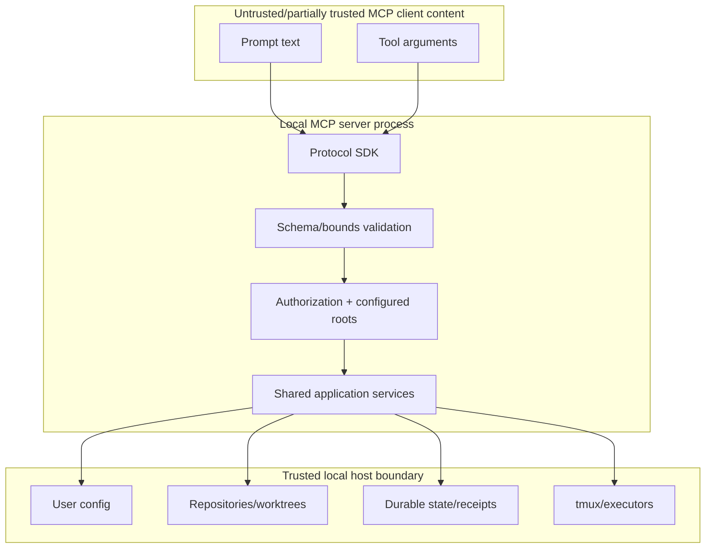

# MCP server threat model

## Assets

- repository and worktree contents;
- prompt packs and source baselines;
- executor/model/permission policy;
- tmux processes and child agents;
- durable message journals and cursors;
- run artifacts, provider evidence, scores, and receipts;
- lifecycle approvals and accepted revisions;
- local configuration and credentials present in the environment.

## Trust boundaries

For stdio, the process that launches the server is the authenticated principal. Tool content remains untrusted. A future network transport creates a new identity and tenant boundary and is not covered by stdio assumptions.

## Threats and mitigations

| Threat | Example | Required mitigation |
|---|---|---|
| Path traversal | `../../.ssh` or symlinked pack | configured roots, resolved containment, regular-file checks, no arbitrary path tools |
| Command injection | prompt asks tool to append shell flags | no raw command tool; structured executor selection through canonical launch policy |
| Prompt injection | repository text asks client to accept a run | prompts cannot execute tools; server revalidates every request and lifecycle condition |
| Duplicate external effect | client retries `run_launch` after timeout | reserve idempotency key before effect; same key/hash replays; conflict on different hash |
| Crash ambiguity | server dies after worktree created | durable accepted event and action-specific reconciliation before retry |
| Receipt forgery | mutate `status.json` to point at accepted receipt | reconstruct canonical read-only receipt chain and verify sealed artifact digests |
| Artifact substitution | replace child final receipt/result | regular non-symlink read-only receipts, SHA-256 verification, aggregate workflow receipt |
| Policy bypass | request no-go model or interactive mode | canonical class/executor/model/no-go enforcement; no adapter-local override |
| Secret exfiltration | status/error includes token or environment | allowlisted response fields, redaction, no raw environment or terminal output |
| Denial of service | huge message/resource request | strict byte/item/page limits, timeout, cancellation, rate limits for network transport |
| Confused deputy | one client references another root/run | logical IDs resolved within configured authorized roots and future tenant scope |
| Token passthrough | HTTP server forwards client token downstream | prohibited; validate token audience/resource and use separate downstream credentials |
| DNS rebinding/CSRF | malicious browser hits local HTTP server | no HTTP in current scope; future Streamable HTTP must validate Origin and authenticate |
| Lifecycle abuse | accept without independent review | existing tier, score, review-chain, actor, reason, revision, and immutable receipt checks |
| Unsafe cancellation | client cancellation leaves half-written record | append/fync accepted record first; atomic files; terminal/recovery event after reconciliation |

## Security test matrix

- encoded and mixed-separator traversal;
- symlink root, leaf, and time-of-check/time-of-use replacement;
- unknown logical IDs and cross-root aliases;
- oversized strings, arrays, pages, and malformed JSON-RPC;
- duplicate idempotency key with same/different canonical payload;
- crash injection at every mutation boundary;
- stale/mutable/substituted lifecycle and final receipts;
- forged snapshot and workflow event sequence;
- no-go model and permission-argument bypass attempts;
- secret-shaped values in status, errors, prompts, and receipts;
- cancellation before reservation, after reservation, after effect, and after terminal record.

## Residual risks

- A trusted local user who can modify the same state files can still destroy evidence; read-only modes and hashes detect but do not prevent privileged tampering.
- Executor CLIs and tmux are external processes. Their availability and version behavior require doctor checks and provenance.
- Stdio clients inherit the permissions of the server process. Least-privilege OS execution remains an operational responsibility.
- Multi-user/network deployment requires a new authorization model, not reuse of local path trust.
