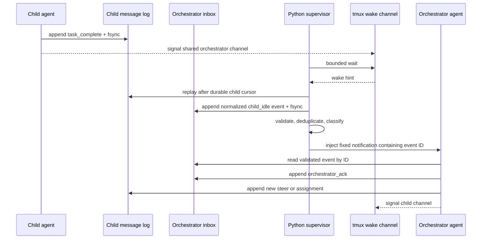
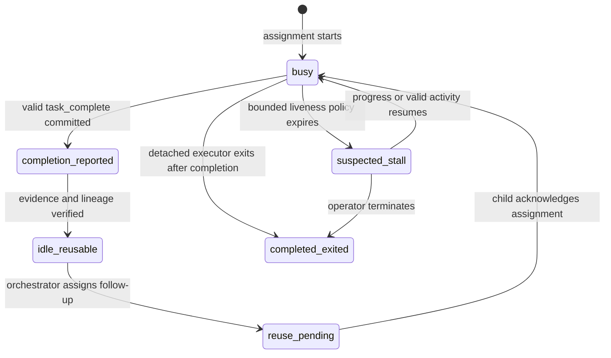
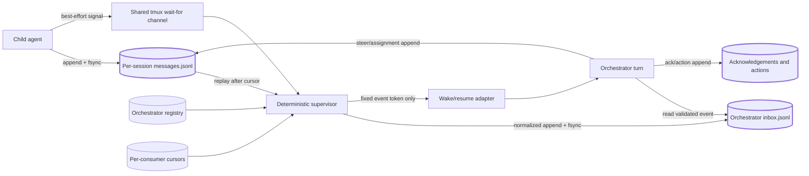

# Durable two-way messaging between child agents and the orchestrator

## Status and scope

This document is the complete design proposal for reliable two-way messaging between agents launched by `agent-workflow` and the orchestrator responsible for assigning and integrating their work.

The design is **planned work**, not a statement that the supervisor, aggregate inbox, or orchestrator-resume commands already exist. Canonical implementation status is maintained in [`BACKLOG.md`](BACKLOG.md), and detailed execution tickets live in [`prompt-packs/orchestrator-two-way-messaging`](../prompt-packs/orchestrator-two-way-messaging/).

The target is the current single-host, tmux-backed architecture. Durable append-only records remain the source of truth. Wake transports are accelerators only. Multi-host messaging is explicitly outside this implementation pack.

## Recommended design

Use a **deterministic Python supervisor between the agents and the orchestrator**, with:

1. **Durable append-only messages as the authority**
2. **A shared orchestrator inbox**
3. **`tmux wait-for` only as a wakeup hint**
4. **Explicit completion and acknowledgement events**
5. **A fixed, non-agent-generated notification injected into the orchestrator pane**

The orchestrator language model must not be responsible for continuously monitoring child panes. A persistent, foregroundable supervisor process performs deterministic replay, normalization, deduplication, delivery tracking, and wake/resume dispatch.

## What the repository already gets right

The current implementation already provides most of the required primitives:

- `src/agent_workflow/messages.py` writes ordered, locked, fsynced `messages.jsonl` records and replays them by sequence.
- `src/agent_workflow/agent_context.py` implements the explicit `busy → idle_reusable` transition and emits `task_complete`.
- `src/agent_workflow/sessions.py` implements parent-to-child steering, child-to-parent progress, acknowledgements, and bounded waiting.
- `src/agent_workflow/tmux.py` treats `tmux wait-for` as a best-effort hint rather than durable evidence.

That foundation should be extended rather than replaced.

The missing layer is a **multi-session orchestrator mailbox and deterministic supervisor loop**. Current waiting is centered on one agent session at a time and does not provide an aggregate, restart-reconstructable delivery surface for the orchestrator.

## Target architecture



The key rule is:

> **The signal causes a replay; it never proves that an event occurred.**

`tmux wait-for` can block a client until another command signals the same channel, which makes it suitable as a low-cost local wake mechanism. It is not a persistent queue, so the durable journal must remain authoritative. See the tmux `wait-for` command in the [tmux manual](https://man.openbsd.org/tmux#wait-for).

The source version of this diagram is [`orchestrator-two-way-messaging-sequence.mmd`](diagrams/orchestrator-two-way-messaging-sequence.mmd).

## Add one shared orchestrator inbox

Create a durable inbox below the configured state root, for example:

```text
~/.local/state/agent-workflow/orchestrators/<orchestrator-id>/
├── registry.json
├── inbox.jsonl
├── acknowledgements.jsonl
├── consumer-cursors/
│   └── <consumer-id>.json
├── supervisor.json
├── supervisor.lock
└── wakeup.sock        # optional future transport, not phase-one authority
```

Each normalized child-to-parent event should contain bounded, schema-validated metadata such as:

```json
{
  "schema": "agent-workflow/orchestrator-event/v1",
  "sequence": 42,
  "event_id": "7de3d01b-1dc7-43f8-a0d6-aeb81ec63b1f",
  "workflow_id": "workflow-17",
  "sender_session_id": "agent-parser",
  "recipient_id": "main-orchestrator",
  "kind": "agent_idle",
  "assignment_id": "f347f997-b58e-4e78-88a4-4cf4f7e38417",
  "source_message_id": "c912e1a7-195a-48fd-b0f7-f520bc2b699a",
  "source_sequence": 9,
  "state": "idle_reusable",
  "summary": "Parser implementation complete",
  "created_at": "2026-07-26T22:15:00Z",
  "source_digest": "sha256:0123456789abcdef..."
}
```

The child’s existing session log remains the source evidence for what the child reported. The orchestrator inbox is the durable **delivery record**, not a replacement authority for child lifecycle evidence.

To avoid requiring a child to atomically update two independent journals, use supervisor-owned fan-in:

1. The child writes and fsyncs `task_complete` to its own journal.
2. The child signals the shared orchestrator wake channel.
3. The supervisor replays every registered child after its durable per-child cursor.
4. The supervisor validates and normalizes the child record.
5. The supervisor appends the normalized event to `inbox.jsonl` and fsyncs it.
6. The supervisor advances the child-source cursor only after the inbox append is durable.

If the supervisor crashes after appending the inbox event but before advancing the source cursor, replay may attempt the same event again. Stable `source_message_id` plus `source_digest` makes that retry idempotent. Reuse of the same source ID with different bytes must fail closed.

## Use one shared wake channel

The current code derives a channel per run. Add a second channel derived from the orchestrator identity or workflow identity:

```text
agent-workflow/v1/orchestrator/<sha256-orchestrator-id>
```

Every child-to-parent commit signals:

- its session-specific channel; and
- the shared orchestrator channel.

The supervisor waits on the shared channel with a bounded timeout, then always replays all registered child logs. A periodic timeout is mandatory because wakeups may be missed or coalesced.

This avoids maintaining one blocking `tmux wait-for` subprocess per child.

Do not replace durable replay with inotify. Linux documents that an inotify event queue can overflow and lose events; filesystem notification can therefore be only another wake accelerator. See [`inotify(7)`](https://man7.org/linux/man-pages/man7/inotify.7.html).

## The supervisor must wake the orchestrator safely

Do **not** inject the child’s summary, progress text, prompt, diff, or other arbitrary child-generated content directly into the orchestrator pane.

That would create a direct prompt-injection path from every child into the orchestrator.

Inject only fixed application-owned text containing an opaque event identifier or cursor:

```text
[agent-workflow] Durable events are waiting.
Run: agent-workflow orchestrator inbox read --after 41
```

Or, preferably:

```text
[agent-workflow:event 7de3d01b-1dc7-43f8-a0d6-aeb81ec63b1f]
```

The orchestrator’s trusted instructions should require it to retrieve the validated event through the public CLI or a future authorized MCP resource rather than trusting terminal-injected payload text.

The supervisor should use one of these bounded adapters:

- an executor-native resume or steering API, where available;
- `tmux send-keys` to a verified live orchestrator pane;
- launching a new orchestrator turn when the prior process has exited.

This distinction matters: an exited language-model process cannot literally be “woken.” The deterministic supervisor must start or resume another turn through an adapter with a recorded invocation contract.

## Define idle explicitly

Do not infer idle from silence, terminal output, prompt appearance, CPU use, or elapsed time.

An agent is idle only when all required facts are true:

- it emitted a valid `task_complete` record;
- its assignment state transitioned from `busy` to `idle_reusable`;
- no later assignment is pending;
- the session identity and assignment lineage match immutable launch evidence;
- the completion event has not already been actioned by the orchestrator.

A reusable interactive agent may use the following assignment states:

```text
busy
completion_reported
idle_reusable
reuse_pending
busy
```

An executor that exits rather than waiting for reuse should end in a distinct state:

```text
completed_exited
```

A heartbeat or inactivity timeout can identify a possibly stalled agent, but it should produce `suspected_stall`, not `idle`.



The source version is [`orchestrator-supervisor-state.mmd`](diagrams/orchestrator-supervisor-state.mmd).

## Acknowledgement model

Distinguish three separate states:

- **Delivery acknowledgement:** the supervisor successfully surfaced the event to an orchestrator turn.
- **Application acknowledgement:** the orchestrator read and accepted responsibility for processing the event.
- **Action evidence:** the orchestrator made a durable scheduling or lifecycle decision linked to the event.

Recommended event kinds are:

```text
event_delivered
event_acknowledged
event_actioned
```

`event_actioned` should reference the resulting durable action:

```json
{
  "schema": "agent-workflow/orchestrator-event-action/v1",
  "event_id": "7de3d01b-1dc7-43f8-a0d6-aeb81ec63b1f",
  "action": "assignment_created",
  "result_ref": "assignment-f347f997-b58e-4e78-88a4-4cf4f7e38417",
  "actor_principal": "principal:orchestrator-main",
  "created_at": "2026-07-26T22:16:08Z"
}
```

This prevents an event from disappearing merely because text was injected into a pane.

Parent-to-child steering should retain the existing correlated acknowledgement model:

```text
steer -> child receives request -> child applies or rejects request -> correlated ack
```

A terminal log line or a live process is not delivery evidence.

## Supervisor loop

Conceptually:

```python
while running:
    wait_for_shared_wakeup(timeout=2.0)

    sessions = load_active_session_registry()

    for session in sessions:
        messages = replay_after_cursor(session)

        for message in messages:
            event = normalize_and_validate(message)
            append_orchestrator_event(event)
            advance_source_cursor_after_commit(session, message.sequence)

    pending = replay_unacknowledged_orchestrator_events()

    if pending:
        wake_or_resume_orchestrator(pending)
```

The cursor is a performance projection. If it is lost, corrupt, or behind the journal, the supervisor reconstructs delivery by replaying source logs and deduplicating on stable source IDs and digests.

A production loop must additionally:

- hold a single-supervisor lock or lease;
- enforce bounded batches and fairness across sessions;
- cap event sizes and inbox growth;
- record delivery attempts and adapter outcomes;
- back off on repeated adapter failure;
- remain foregroundable and observable;
- shut down cleanly without advancing an uncommitted cursor.

## Authority and data flow



The source version is [`orchestrator-inbox-authority.mmd`](diagrams/orchestrator-inbox-authority.mmd).

## Security requirements

The implementation must enforce all of the following:

- A child may send only on behalf of its own immutable session identity.
- `sender_session_id`, workflow identity, assignment identity, and principal context come from sealed or immutable launch evidence, not arbitrary CLI input alone.
- Message types, sizes, rates, and retained counts are bounded.
- Arbitrary child text is never interpolated into shell commands or passed directly to `tmux send-keys`.
- The supervisor uses argument arrays and the repository’s bounded process substrate.
- Inbox, acknowledgement, registry, cursor, and supervisor files reject symlinks, hard-link surprises where relevant, non-regular files, traversal, and writable substitution after sealing.
- Sequence allocation and cursor advancement occur under durable locks.
- Wake channel names contain hashes, not repository paths, usernames, prompts, ticket titles, or secrets.
- Duplicate source message IDs are idempotent only when their canonical bytes or digest match exactly.
- A child cannot acknowledge or action its own child-to-parent event as the orchestrator.
- Event contents exposed through CLI or future MCP surfaces follow the sensitive-content classification, redaction, and retention policy.
- The fixed wake notification contains no child-controlled text.
- Adapter retries are bounded and do not create duplicate orchestrator turns without idempotency evidence.
- Single-supervisor ownership is deterministic; stale lock recovery is explicit and auditable.

## Failure and restart behavior

The design must remain correct under these cases:

| Failure | Required result |
|---|---|
| Wake signal is lost | Periodic replay finds the durable child record. |
| Wake signal is duplicated | Inbox deduplication prevents duplicate semantic delivery. |
| Supervisor crashes before inbox append | Source cursor does not advance; replay retries. |
| Supervisor crashes after inbox append but before cursor advance | Stable source ID and digest make the repeated append idempotent. |
| Orchestrator pane is alive but model process is not waiting | Adapter starts or resumes a turn; it does not assume pane liveness equals model readiness. |
| Orchestrator reads but does not action an event | Event remains application-acknowledged but unactioned and is visible to policy. |
| Cursor file is missing or corrupt | Rebuild by replay; cursors are projections. |
| Child summary contains prompt injection | Only a fixed opaque event token is injected; content is fetched through validated tooling. |
| Two supervisors start | One acquires the lock/lease; the other exits or becomes a read-only observer. |
| Source ID is reused with different bytes | Fail closed and emit a security diagnostic. |

## What not to introduce yet

Do not add Redis, NATS, or another distributed broker for the present single-host tmux architecture.

The existing JSONL model is simple, replayable, inspectable, and already integrated with durable evidence. If measured message volume eventually makes JSONL replay or locking too expensive, SQLite WAL is a reasonable local migration target because it supports transactional state with concurrent readers and one writer. See the [SQLite WAL documentation](https://sqlite.org/wal.html).

A Unix-domain socket is a reasonable future replacement for the tmux wake adapter, especially if the supervisor needs to multiplex many connections efficiently. Python supports Unix sockets and selector-based I/O directly. The socket should still carry only a wake hint or event ID; the durable inbox remains authoritative. See the Python [`socket`](https://docs.python.org/3/library/socket.html) and [`selectors`](https://docs.python.org/3/library/selectors.html) documentation.

Do not add:

- a second workflow scheduler;
- a second lifecycle state machine;
- terminal scraping as authority;
- LLM-authored cursor or acknowledgement records;
- arbitrary shell hooks;
- multi-host delivery before a measured need and an approved architecture decision;
- an unbounded daemon with implicit startup or hidden host mutations.

## Recommended implementation order

1. Resolve the durable-control service objective in `DEC-001`.
2. Complete the prerequisite deterministic process, path, immutable-authority, sensitive-content, configuration-trust, and authenticated-principal hardening tasks.
3. Implement durable per-consumer cursors and idempotent dispositions (`BKL-001`).
4. Add the orchestrator identity registry, aggregate inbox schemas, and append-only store (`MSG-001`).
5. Add the foregroundable supervisor and shared wake channel (`MSG-002`).
6. Add executor-specific late steering and correlated delivery/application outcomes (`BKL-002`).
7. Add fixed-format orchestrator wake/resume adapters (`MSG-003`).
8. Add restart reconstruction and missed/coalesced-wakeup recovery (`MSG-005`).
9. Add delivery, application, and action acknowledgement semantics plus scheduler integration (`MSG-004`).
10. Run the dedicated messaging security hardening ticket (`MSG-006`).
11. Add installed-product and opt-in live compatibility journeys (`MSG-007`).
12. Run an independent phase gate (`MSG-GATE-01`).

The exact dependency graph is in [`orchestrator-two-way-messaging-dependencies.mmd`](diagrams/orchestrator-two-way-messaging-dependencies.mmd).

## Acceptance strategy

The default acceptance suite should use an installed wheel, real public executables, real temporary Git/filesystem state, real subprocesses, and a deterministic protocol-compatible executor fixture. It should prove complete journeys rather than private helper calls.

Required default journeys:

1. A child completes, the supervisor wakes from a hint, normalizes one event, and the orchestrator actions it.
2. The same journey succeeds when the wake signal is intentionally omitted.
3. Duplicate signals and supervisor restart do not duplicate the event or action.
4. A child finishes while the orchestrator process is absent; the adapter starts a new turn with a fixed event token.
5. A malicious child summary containing shell metacharacters and prompt-injection text never reaches `send-keys`, argv, shell, or the orchestrator notification.
6. A reusable interactive agent receives a new assignment and emits a correlated acknowledgement before returning to `busy`.
7. A detached executor consumes late steering or returns a durable rejected/unsupported result.
8. Corrupt cursors rebuild without event loss.
9. Conflicting duplicate source IDs fail closed.
10. Rate, size, retention, and redaction limits are enforced.

Opt-in live journeys should cover:

- real tmux wake and pane injection behavior;
- one supported Codex late-steering/resume adapter;
- one supported Claude late-steering/resume adapter;
- restart of the supervisor while several agents complete concurrently.

Low-level tests should be limited to compact parameterized matrices for journal replay, source-ID conflict, cursor recovery, path/symlink rejection, and adapter outcome normalization.

## Backlog and prompt-pack ownership

The implementation is owned by the [`orchestrator-two-way-messaging`](../prompt-packs/orchestrator-two-way-messaging/) prompt pack.

It owns:

- the existing, previously unowned `BKL-001` durable-cursor item;
- the existing, previously unowned `BKL-002` late-steering item;
- the new `MSG-001` through `MSG-007` implementation items.

It does **not** own or duplicate:

- `DEC-001`, which remains a maintainer decision prerequisite;
- any `HARD-*` security item;
- `MCP-003`, which remains owned by `mcp-server-next`;
- remote or multi-host architecture items.

The collision analysis is maintained in [`references/collision-and-ownership.md`](../prompt-packs/orchestrator-two-way-messaging/references/collision-and-ownership.md).

## Final recommendation

The right immediate architecture is:

> **Existing per-agent durable logs + one deterministic orchestrator supervisor + one durable aggregate inbox + one shared best-effort tmux wakeup channel.**

That provides reliable two-way messaging without turning tmux, terminal output, polling, prompt prose, or the agents themselves into orchestration authority.
