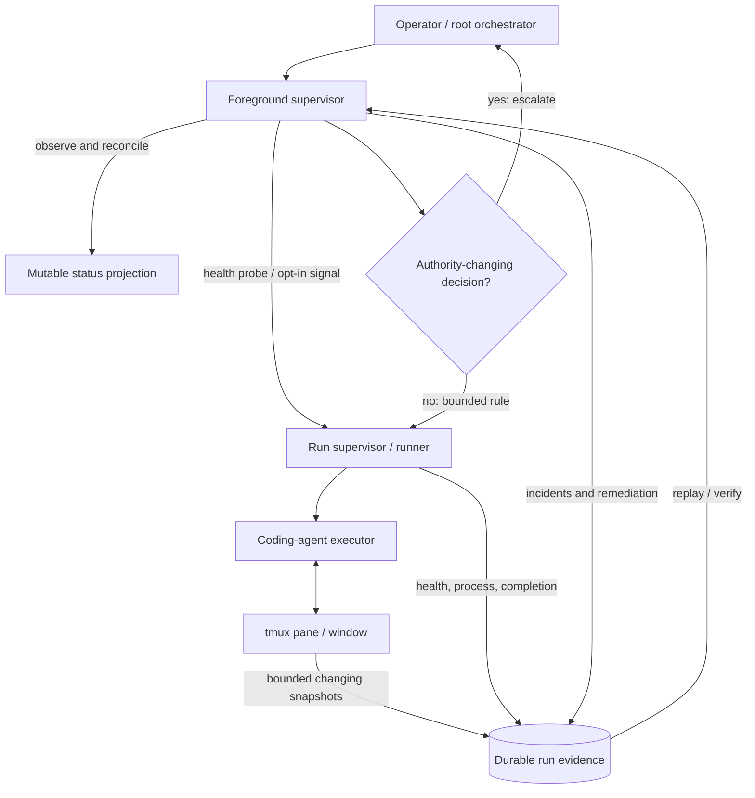
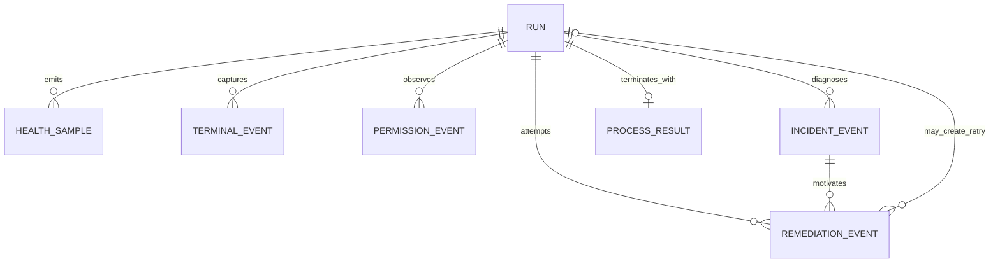

# Self-healing supervisor architecture

## Executive summary

`agent-workflow` now treats unattended reliability as a control-plane responsibility rather than expecting a person to watch every tmux pane. The implementation separates four questions that were previously conflated:

1. **Is the runner alive?**
2. **Is the executor process alive?**
3. **Has meaningful work progressed?**
4. **Is the run blocked on an authority decision?**

A foreground supervisor collects those signals, records typed incidents, applies only policy-authorized remediation, verifies the outcome, and preserves every attempt as durable evidence.

The system is intentionally **self-correcting, not self-authorizing**. It may repair projections, replay durable state, request progress, and—when explicitly enabled—interrupt or restart. It may not grant permissions, widen scope, change budgets, accept work, merge changes, or erase failed evidence.

<picture>
  <source media="(prefers-color-scheme: dark)" srcset="assets/self-healing-loop-dark.svg">
  <source media="(prefers-color-scheme: light)" srcset="assets/self-healing-loop-light.svg">
  
</picture>

## Problem statement

Before this change, a live heartbeat could keep a run classified as healthy even when the executor was visibly waiting at a permission prompt, deadlocked, looping, or idle. Interactive output was generally visible only in tmux and was not continuously captured as run evidence. Process exit records did not consistently expose output truncation, byte totals, or resource state. Observation could recommend an operator command, but no durable controller selected, bounded, and verified a recovery action.

That behavior was adequate for attended development. It was not sufficient for multi-team orchestration or unattended runs.

## Design principles

### Durable evidence is authoritative

The supervisor never treats a tmux pane, status projection, or in-memory counter as final authority. It writes append-only journals beneath the run directory and reconstructs decisions from those records.

### Liveness is not progress

The runner heartbeat is a supervisor-liveness signal. Semantic progress is derived independently from output, structured events, interactive terminal changes, messages, control acknowledgements, steering outcomes, and completion evidence.

### Remediation is deterministic

A versioned rule in application code maps a typed incident to an allowed action. The agent does not invent its own recovery policy.

### Automatic authority only narrows or restores

Safe automatic actions restore a known projection or request information. Interrupt and restart are explicit operator opt-ins. Permission grants, policy expansion, acceptance, merge, and destructive cleanup always require a human authority boundary.

### Every attempt is bounded

Rules have an attempt ceiling. A retry receives a new run identity and preserves `retry_of_run_id`. Repeated failure escalates rather than looping indefinitely.

### Unsupported evidence remains unavailable

Linux `/proc` metrics are collected when present. On unsupported hosts those fields remain `null`; the application never invents cross-platform equivalence.

## Runtime topology



The Mermaid source is also stored in [`diagrams/self-healing-supervisor-topology.mmd`](diagrams/self-healing-supervisor-topology.mmd).

## Evidence model

### `run-health-samples.jsonl`

Each bounded sample records:

- timestamp and session identity;
- runner and executor PIDs;
- process liveness and Linux process state;
- parent PID and process-start ticks;
- user and system CPU time;
- current and peak RSS when available;
- thread, child-process, and open-file-descriptor counts;
- disk read/write counters;
- host load, available memory, and run-filesystem free space;
- output, stderr, structured-event, and terminal-event byte counts;
- the last semantic-progress timestamp and source;
- stable tmux pane identity when available.

The journal is capped. When the cap is reached, sampling remains operational but additional rows are not persisted; the caller receives `stored: false`.

### `terminal-events.jsonl`

Interactive panes are captured on a bounded interval. The capture is:

- ANSI-normalized;
- NUL-cleaned;
- redacted using known launch-secret values;
- capped to the most recent bounded bytes;
- appended only when its digest changes.

This avoids writing an identical full-pane snapshot every cycle while retaining the human-visible state that often reveals permission prompts, deadlocks, repeated commands, or idle shells.

### `permission-events.jsonl`

Known terminal and stderr patterns produce typed states:

- `pending` — an authority decision appears to be required;
- `denied` — an operation was rejected by policy or the operating system;
- `cleared` — later terminal progress no longer contains the pending prompt.

The event intentionally leaves principal, resource target, and policy rule nullable until authenticated identity and governed sandbox evidence are implemented. Sensitive targets are not guessed from terminal text.

### `incident-events.jsonl`

The initial incident taxonomy includes:

- `process_alive_no_progress`;
- `process_missing`;
- `permission_wait`;
- `terminal_unavailable`;
- `terminal_capture_unavailable`;
- `resource_pressure`;
- `output_capture_exhausted`;
- terminal failure categories such as authentication, rate limit, network, dependency, disk, memory, contract, completion, and protocol errors.

An incident fingerprint deduplicates an unchanged condition while permitting a materially changed observation to produce a new event.

### `remediation-events.jsonl`

Each attempted correction binds:

- incident identity;
- versioned rule ID;
- action;
- outcome;
- reason;
- bounded details such as message ID, delivery outcome, or retry run ID.

The current rules are:

| Rule | Default | Behavior |
|---|---:|---|
| `SAFE-REPAIR-STATUS-v1` | enabled | Rebuild a missing or corrupt mutable status projection from immutable launch/lifecycle/sealed evidence. |
| `SAFE-PROBE-STALL-v1` | enabled | Send one durable progress probe when semantic progress exceeds the stall threshold. |
| `OPT-IN-INTERRUPT-STALL-v1` | disabled | Send bounded Ctrl-C only after the probe allowance is exhausted and explicit operator policy enables it. |
| `OPT-IN-RESTART-ORPHAN-v1` | disabled | Create a lineage-preserving retry for an orphaned interactive run when explicitly authorized. |

### `process-result.json`

The terminal process record captures:

- redacted argv and resolved executable identity;
- return code, exit code, and signal;
- timeout and cancellation state;
- stdout/stderr byte totals and truncation flags;
- spool paths when used;
- process duration and environment policy;
- runner and executor PIDs.

Plain-output capture exhaustion now becomes explicit terminal evidence rather than silently making a log appear idle.

## Semantic progress

Semantic progress is the newest modification among these durable channels:

- `output.log`;
- `executor-stderr.log`;
- `executor-events.jsonl`;
- `terminal-events.jsonl`;
- `messages.jsonl`;
- `control-intents.jsonl`;
- `steering-delivery.jsonl`;
- `completion.json`.

A heartbeat does not participate in semantic progress. This is the key change that allows a live process to be classified as `possibly_stalled`.

The status projection exposes:

```json
{
  "observed_state": "possibly_stalled",
  "seconds_since_semantic_progress": 712.4,
  "last_semantic_progress_source": "terminal_event",
  "permission_state": null,
  "latest_health": {
    "executor": {"alive": true},
    "host": {"disk_free_bytes": 12884901888}
  }
}
```

If the latest permission event is `pending`, the observed state is `blocked_permission`, not a generic stall.

## Supervisor lifecycle

```mermaid
sequenceDiagram
    participant S as Supervisor
    participant D as Durable evidence
    participant T as tmux
    participant R as Runner
    participant E as Executor
    participant H as Human principal

    S->>D: replay status, health, incidents, remediations
    S->>T: resolve stable pane and capture bounded snapshot
    T-->>S: pane state and terminal text
    S->>R: sample runner/executor process state
    R-->>S: liveness and resource facts
    S->>D: append health and terminal events
    S->>S: classify semantic progress and blocker
    alt healthy
        S->>D: no incident
    else live but no progress
        S->>D: append process_alive_no_progress incident
        S->>E: durable progress probe
        E-->>D: progress or acknowledgement
    else permission required
        S->>D: append permission_wait incident
        S->>H: escalate; do not auto-approve
    else opt-in recovery authorized
        S->>D: append remediation intent
        S->>R: interrupt or lineage-preserving restart
        S->>D: append verified outcome
    end
```

The source is in [`diagrams/self-healing-supervisor-sequence.mmd`](diagrams/self-healing-supervisor-sequence.mmd).

### Startup

A cycle first scans run directories for missing or corrupt `status.json` projections. If immutable launch authority exists, the status is reconstructed before normal observation.

### Collection

For each non-terminal run, the supervisor:

1. resolves the stable tmux pane;
2. captures changing interactive terminal state when configured;
3. inspects non-interactive output for permission evidence;
4. samples runner, executor, and host health;
5. computes the current observation.

### Diagnosis

The observation is mapped to a typed incident. The diagnosis is deliberately conservative. Ambiguous failures remain unclassified or escalate rather than selecting a risky action.

### Remediation

Safe projection repair and status probes can occur automatically. Interrupt and restart require explicit configuration or CLI flags. Permission prompts always escalate.

### Verification

A remediation outcome is recorded. Subsequent cycles verify whether semantic progress resumed, the process terminated, or a retry run was created. The supervisor never rewrites the prior incident or attempt.

## CLI and configuration

### One cycle

```bash
agent-workflow supervisor once --json
```

### Foreground loop

```bash
agent-workflow supervisor run --interval-seconds 10
```

### Limit to selected runs

```bash
agent-workflow supervisor run \
  --session team-a-worker-1 \
  --session team-b-worker-2
```

### Explicitly authorize bounded recovery

```bash
agent-workflow supervisor run \
  --interrupt-stalled \
  --restart-orphaned \
  --max-remediation-attempts 1
```

Configuration:

```toml
[supervisor]
interval_seconds = 10
capture_interactive = true
capture_lines = 200
probe_stalled = true
interrupt_stalled = false
restart_orphaned = false
max_remediation_attempts = 1
```

There is no hidden daemon or auto-start service in the current release. A future service wrapper must invoke this same foreground command and preserve its durable ownership rules.

## State model

```mermaid
stateDiagram-v2
    [*] --> Running
    Running --> BlockedPermission: permission event pending
    Running --> PossiblyStalled: semantic progress stale
    Running --> Orphaned: process/pane missing
    Running --> Completed: sealed terminal evidence

    BlockedPermission --> Running: human resolves; later progress clears event
    BlockedPermission --> Failed: denial or executor exit

    PossiblyStalled --> Running: progress probe produces durable progress
    PossiblyStalled --> InterruptionRequested: opt-in bounded interrupt
    PossiblyStalled --> Escalated: probe allowance exhausted

    Orphaned --> RetryRun: opt-in lineage-preserving restart
    Orphaned --> Escalated: restart not authorized or fails

    InterruptionRequested --> Failed
    RetryRun --> Running
    Completed --> [*]
    Failed --> [*]
    Escalated --> [*]
```



## Security and privacy

Interactive terminal capture is valuable because it preserves what a human would have seen. It is also sensitive. The current implementation applies known launch-secret redaction and strict byte caps, but comprehensive classification, retention, deletion, and export policy remains blocked on `HARD-006`.

The supervisor records actor labels for its own messages, but those labels are not authenticated principals. `HARD-007` must bind future permission, steering, remediation, review, and acceptance actions to verifiable identities.

The supervisor observes configured permission arguments but does not yet prove an effective filesystem/network/credential sandbox. `HARD-003` owns that enforcement.

## Performance and capacity

The current health sampler records raw process and host facts. It does not yet:

- enforce CPU or memory cgroups;
- compute comparable performance baselines;
- adapt root/team capacity automatically;
- preempt low-priority work under host pressure;
- attribute network usage portably;
- calculate critical-path time across a hierarchical workflow.

Those changes require `HARD-003`, `BKL-004`, and the hierarchical scheduler work. Until then, resource pressure is diagnostic evidence, not autonomous scheduling authority.

## Hierarchical integration

The same control loop is intended at two scopes:

```text
root supervisor
  ├── observes team-lead runs and global capacity
  ├── reconciles team windows and cross-team dependencies
  └── escalates authority-changing decisions

team-lead supervisor
  ├── observes worker runs in its own window
  ├── applies local bounded remediation
  └── escalates unresolved incidents to the root
```

The root and team lead must not create independent incident taxonomies or remediation formats. `HIER-005` through `HIER-008` should reuse the journals and rules defined here.

## Data relationships



The complete ERD source is in [`diagrams/self-healing-evidence-erd.mmd`](diagrams/self-healing-evidence-erd.mmd).

## Failure behavior

| Failure | Behavior |
|---|---|
| tmux unavailable | Record terminal-unavailable evidence; do not infer process failure from tmux alone. |
| pane moved or reindexed | Resolve stable pane identity through existing pane-binding logic. |
| pane capture fails | Record `terminal_capture_unavailable`; execution continues. |
| health journal cap reached | Continue execution; sample reports `stored: false`; final evidence exposes the bounded condition. |
| output capture truncates | Record byte/truncation facts and fail the terminal evidence path rather than claiming complete output. |
| status projection corrupt | Rebuild from immutable authority and journal the repair. |
| stalled run ignores probe | Escalate by default; interrupt only under explicit policy. |
| permission prompt detected | Record and escalate; never answer automatically. |
| restart fails | Preserve failed remediation evidence and stop at the attempt ceiling. |
| supervisor stops | No authority is lost; the next foreground invocation replays durable state. |

## Testing strategy

The implementation includes invariant coverage for:

- change-driven terminal capture;
- permission pending/cleared transitions;
- process liveness independent of semantic progress;
- bounded one-shot stall probes;
- existing observation compatibility.

Remaining acceptance work must add installed-product journeys for:

- real interactive tmux capture;
- permission prompt detection with supported executors;
- supervisor restart and replay;
- projection repair from a damaged installed run;
- opt-in interrupt and retry lineage;
- journal-cap and redaction behavior;
- Linux/Python/tmux compatibility matrix;
- two-team hierarchical incident escalation.

## Sequenced remaining work

The canonical backlog contains the authoritative order. In summary:

```text
Implemented foundations
  SUP-001 telemetry + semantic progress
  SUP-002 foreground supervisor + safe repair/probe

Governed safety lane
  HARD-006 → SUP-003 redaction/retention
  HARD-003 → SUP-004 enforced resource policy
  HARD-007 → SUP-005 authenticated remediation authority

Evidence lane
  REL-003 + SUP-003..005 → SUP-006 live installed compatibility
  BKL-004 + SUP-006 → SUP-008 performance baselines

Hierarchy lane
  HIER-005 + HIER-006 + SUP-006 → SUP-007 tiered supervision
  HIER-007 + SUP-007 → HIER-008 sealed two-team recovery proof
```

## Decision

This architecture is authorized by [`DEC-006`](DECISIONS/DEC-006-BOUNDED-SELF-HEALING.md). Any future remediation rule that expands authority, changes acceptance, or performs destructive cleanup requires a new explicit decision rather than being added as a convenience branch.
