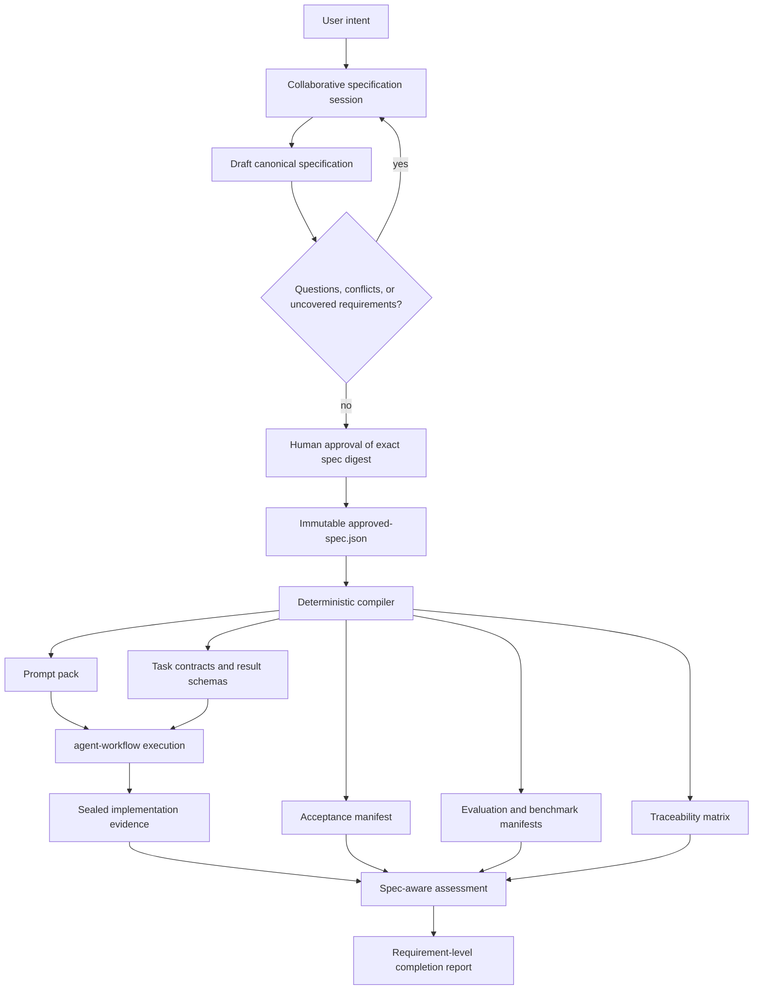
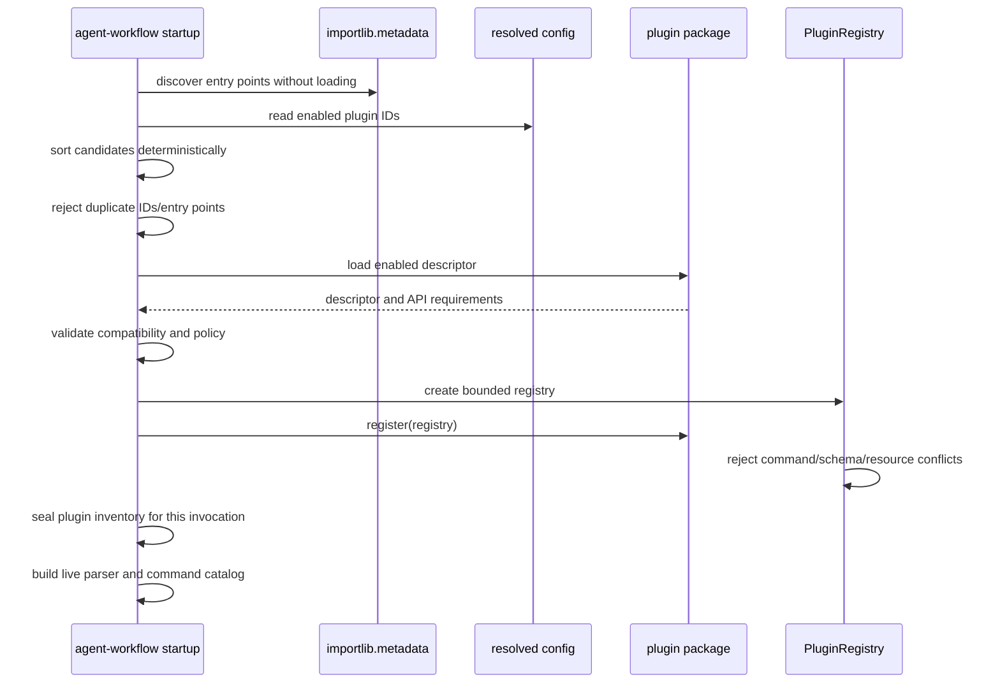
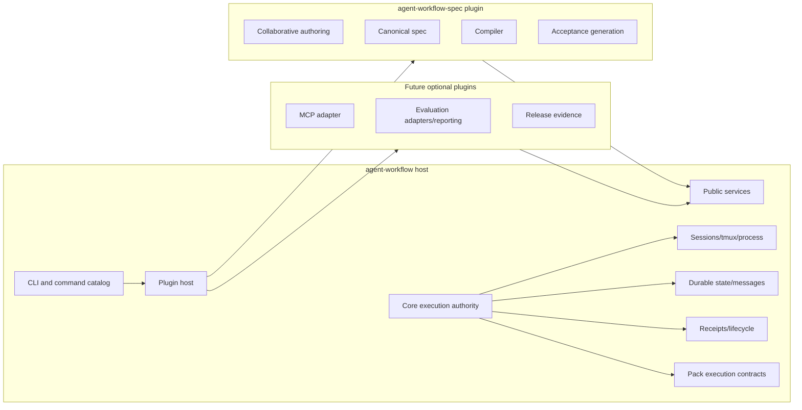

# Collaborative specification compiler and plugin-first decomposition design

**Status:** proposed architecture and implementation plan
**Baseline:** `agent-workflow` 0.2.5 plus the command-catalog and read-only MCP command-context work
**Primary sibling repository:** `agent-workflow-spec`
**Audience:** maintainers, implementation agents, reviewers, and future plugin authors

## Executive decision

`agent-workflow` should add a collaborative specification layer, but that layer should be developed in a separate sibling repository and consumed as a first-party plugin.

The durable design authority should become an approved, machine-readable implementation specification. Prompt packs, task contracts, acceptance manifests, evaluation plans, benchmark manifests, and human-readable prompts should be deterministic compiled outputs of that specification.

The recommended repository direction is:

```text
workspace/
├── agent-workflow/          # execution host and durable authority
├── agent-workflow-spec/     # collaborative specification and compiler plugin
└── target-projects/         # repositories being changed by delegated agents
```

Do **not** immediately rename or physically split the current `agent-workflow` distribution. First introduce a narrow, versioned plugin host in the current repository and use `agent-workflow-spec` as the proving plugin. Once the interface survives real use, additional surfaces such as evaluation adapters, MCP presentation, or release evidence can be considered for extraction.

LangGraph is appropriate as an **optional authoring-engine adapter** inside `agent-workflow-spec`; it should not become the authority for core agent execution, receipts, prompt-pack execution, or approval state. The authoritative state remains canonical JSON, append-only events, immutable approvals, compiler receipts, and sealed execution evidence.

## Why this change is warranted

The current application is still cohesive, but it is approaching the point where new high-level capabilities increase coupling faster than they increase the value of the core runtime.

At the 0.2.5 baseline, the source package contains approximately:

- 63 Python modules;
- 17,037 lines of Python under `src/agent_workflow`;
- 25 Python test files and about 3,557 test lines;
- session, tmux, process, workflow, prompt-pack, evaluation, release-evidence, command-catalog, and MCP concerns in one distribution.

The largest modules are already authority-heavy: `sessions.py`, `cli.py`, `runner.py`, `process.py`, `workflow.py`, the evaluation compiler/assessment modules, the scheduler, release evidence, and receipts. Adding a collaborative research, requirements, decision, authoring, compiler, and evaluation-generation system directly to the same package would create several risks:

1. **Dependency growth:** model SDKs, YAML support, graph runtimes, retrieval tools, and optional persistence would become entangled with the minimal tmux/session installation.
2. **Authority confusion:** conversational draft state could be mistaken for execution or approval authority.
3. **Release coupling:** changes to spec authoring would force releases of the execution runtime and vice versa.
4. **Test expansion:** model-facing collaboration and compiler behavior would add substantial test surface to an already broad installed-product suite.
5. **Framework lock-in:** placing LangGraph directly in core would make its checkpoint and graph semantics difficult to replace.
6. **Unclear product boundary:** the runtime that safely executes approved work and the system that helps humans decide what work should exist are related, but not the same product responsibility.

The separation should follow authority, not UI or module size:

```text
specification system decides and compiles what should be done
                         ↓
execution system safely performs and records the approved work
                         ↓
evaluation system assesses sealed evidence against the approved definition
```

## Product model

The intended lifecycle is:



Prompt packs remain important. Their role changes from **design authority** to **compiled execution bundle**.

## Repository boundaries

### `agent-workflow`: execution host and durable authority

The current repository should become progressively more explicit about its core responsibility, while preserving compatibility.

The execution host owns:

- trusted plugin discovery and compatibility checks;
- CLI and command-catalog composition;
- configuration and local capability checks;
- Git worktrees and source baselines;
- tmux pane/session ownership;
- bounded child process execution;
- executor adapters and provider event capture;
- durable run state and append-only control records;
- launch contracts, provenance, command cards, and immutable receipts;
- prompt-pack validation required for safe execution;
- task result-contract enforcement;
- lifecycle review, acceptance, rejection, and workflow authority;
- the stable public services that plugins may call;
- plugin inventory and provenance in generated evidence.

The host should not own:

- collaborative feature discovery;
- requirements drafting and revision;
- research-agent graphs;
- spec-specific model prompts;
- YAML authoring policy;
- automatic task decomposition policy;
- spec-to-pack compilation templates;
- LangGraph or any other spec-authoring runtime;
- project-specific requirements or acceptance semantics.

### `agent-workflow-spec`: sibling specification and compiler plugin

The sibling repository owns:

- canonical implementation-spec schemas;
- optional YAML ingestion and canonical JSON normalization;
- collaborative spec-session events and projections;
- research, synthesis, contradiction, feasibility, security, and acceptance-design stages;
- human question/answer and approval workflows;
- requirement, decision, acceptance, task, risk, and source traceability;
- deterministic compilation into existing prompt-pack contracts;
- acceptance-manifest and evaluation-plan generation;
- spec-aware completion assessment;
- standalone CLI operation;
- integration with `agent-workflow` through the public plugin API;
- an optional LangGraph adapter.

It should not own:

- tmux or process control;
- Git worktree mutation;
- session state or run receipts;
- lifecycle acceptance authority;
- arbitrary shell execution;
- core configuration or executor policy;
- the canonical implementation of prompt-pack validation at execution time.

### Future extraction candidates

After the first plugin proves the boundary, these current surfaces may become separately distributed first-party plugins:

| Candidate | Why it may move | Why it should not move yet |
|---|---|---|
| Evaluation adapters and benchmark reporting | Optional dependencies and independent release cadence | Evaluation is tightly bound to receipts and sealed evidence; define stable read services first. |
| MCP adapter | Optional SDK, presentation-layer concern | Mutation work is not complete and MCP must continue to use shared core services. |
| Release evidence | Distinct governance/supply-chain concern | Current release checks still validate the core distribution and should remain close until public release. |
| Workflow templates/routing advice | Higher-level orchestration policy | Scheduler, approvals, bindings, and workflow receipts currently share deep authority boundaries. |

The first split should be additive and low-risk. Do not extract all these areas at once.

## Keep the current package name initially

The existing `agent-workflow` distribution should remain the installable host during the first plugin phases. Renaming it immediately to `agent-workflow-core` would create unnecessary migration work in:

- console scripts;
- documentation and skills;
- prompt packs;
- installation scripts;
- config locations;
- MCP configuration;
- package metadata;
- user muscle memory;
- external automation.

Treat it as the logical core before renaming it physically. A future distribution rename can be evaluated only after:

1. the plugin API reaches a stable major version;
2. at least two first-party plugins use it successfully;
3. compatibility and migration aliases are designed;
4. the release and installer story is public-ready.

## Plugin mechanism

### Discovery

Use Python package metadata entry points rather than namespace-package scanning or package-name conventions.

Recommended group:

```toml
[project.entry-points."agent_workflow.plugins"]
spec = "agent_workflow_spec.plugin:get_plugin"
```

Python packaging entry points are specifically designed for installed distributions to advertise discoverable components. The host can load them using `importlib.metadata.entry_points(group="agent_workflow.plugins")`.

Do not make `agent_workflow` a namespace package. The packaging guidance warns that a broken namespace plugin can make the main package unimportable. Entry-point discovery also provides clearer distribution metadata and conflict handling.

### Trust model

An in-process Python plugin is trusted executable code. The plugin system is a modularity and release boundary, **not a sandbox**.

The host should therefore:

- discover installed candidates without importing them;
- show candidates through `agent-workflow plugins list`;
- load only explicitly enabled plugin IDs;
- support an allowlist in configuration;
- reject duplicate plugin IDs, command groups, schema IDs, resource IDs, or hook registrations;
- reject incompatible API versions before registration;
- record the loaded distribution name, version, entry-point value, and descriptor digest;
- allow `--no-plugins` for recovery and diagnostics;
- never infer authorization from an installed plugin or command catalog entry.

Recommended configuration:

```toml
[plugins]
enabled = ["spec"]
strict = true
```

`strict = true` means startup fails if an enabled plugin is missing or incompatible. Discovery of an unrelated installed candidate does not activate it.

### Plugin descriptor

The host should define a small public protocol in a stable module such as `agent_workflow.plugin_api`.

Illustrative contract:

```python
@dataclass(frozen=True)
class PluginDescriptor:
    plugin_id: str
    display_name: str
    plugin_version: str
    api_version: str
    requires_core: str
    capabilities: tuple[str, ...]

class AgentWorkflowPlugin(Protocol):
    descriptor: PluginDescriptor

    def register(self, registry: PluginRegistry) -> None:
        ...
```

The descriptor is data. Loading it must not perform source mutation, network access, subprocess execution, or model calls.

### Initial registration surface

Keep plugin API v1 narrow:

```text
PluginRegistry
├── register_cli_group(...)
├── register_schema_bundle(...)
├── register_asset_bundle(...)
├── register_read_service(...)
└── register_diagnostic(...)
```

Do not expose unrestricted access to internal argparse objects, session internals, tmux objects, filesystem roots, or receipt writers.

#### CLI groups

Plugins should own a top-level command namespace, such as:

```text
agent-workflow spec ...
```

The host owns collision checks, global options, command-catalog generation, help rendering, and dispatch. A plugin may define commands only within its registered namespace.

The parser-derived command catalog must include plugin commands with provenance:

```json
{
  "path": ["spec", "validate"],
  "provider": {
    "kind": "plugin",
    "plugin_id": "spec",
    "plugin_version": "0.1.0"
  }
}
```

This preserves the recently added direct-command execution behavior for orchestrators and launched agents.

#### Schemas and assets

A plugin may publish schemas and templates through package resources. The host must:

- register schema IDs before use;
- reject duplicates;
- avoid copying plugin files into core source directories;
- resolve assets through `importlib.resources` or an equivalent stable package-resource API;
- include schema/template digests in compiler receipts.

#### Read services

Plugins should consume narrow public services rather than import internal modules. Early services may include:

- verified run receipt lookup;
- bounded sealed artifact reads;
- prompt-pack validation;
- deterministic archive generation;
- lifecycle receipt summaries;
- command-catalog and plugin inventory reads.

Mutation services should be added only when their authorization, idempotency, and receipt behavior are explicit.

### Do not add Pluggy initially

Pluggy provides a mature 1:N hook manager and is useful when many plugins implement the same hook. The first version does not require that complexity.

Start with:

- standard entry-point discovery;
- one explicit plugin descriptor;
- one deterministic registry;
- a small set of typed registration methods.

Reconsider Pluggy only after multiple plugins need ordered, multi-implementation hooks. This avoids adding another dependency and callback model before the extension points are understood.

## Plugin lifecycle and failure behavior



Failure rules:

- An incompatible **enabled** plugin fails startup with a typed diagnostic.
- An incompatible but disabled candidate appears in `plugins list` but is not imported.
- A plugin exception during registration is reported without a raw traceback by default; verbose diagnostics may expose it locally.
- A plugin cannot partially register. Registration is staged and atomically committed only after validation.
- Core commands remain usable with `--no-plugins` unless the invoked artifact explicitly requires a plugin.
- A compiled artifact that names a required plugin ID/version fails closed when the plugin is absent or incompatible.

## Sibling repository design: `agent-workflow-spec`

### Distribution and package names

Recommended names:

```text
Git repository:       agent-workflow-spec
Python distribution:  agent-workflow-spec
Python package:       agent_workflow_spec
Standalone command:   agent-workflow-spec
Plugin command group: agent-workflow spec
Plugin ID:             spec
```

The standalone command is important. It lets the spec system be developed, tested, and used independently while the host plugin integration remains thin.

### Proposed repository layout

```text
agent-workflow-spec/
├── pyproject.toml
├── README.md
├── LICENSE
├── CHANGELOG.md
├── docs/
│   ├── ARCHITECTURE.md
│   ├── SPEC_FORMAT.md
│   ├── COMPILER.md
│   ├── COLLABORATION.md
│   └── INTEGRATION.md
├── schemas/
│   ├── implementation-spec-v1.schema.json
│   ├── spec-event-v1.schema.json
│   ├── spec-approval-receipt-v1.schema.json
│   ├── compiler-receipt-v1.schema.json
│   ├── acceptance-manifest-v1.schema.json
│   └── traceability-report-v1.schema.json
├── templates/
│   ├── SPEC.md.j2
│   ├── ticket-prompt.md.j2
│   └── acceptance-report.md.j2
├── src/agent_workflow_spec/
│   ├── __init__.py
│   ├── cli.py
│   ├── plugin.py
│   ├── config.py
│   ├── errors.py
│   ├── canonical.py
│   ├── schemas.py
│   ├── events.py
│   ├── approvals.py
│   ├── traceability.py
│   ├── rendering.py
│   ├── collaboration/
│   │   ├── service.py
│   │   ├── stages.py
│   │   ├── questions.py
│   │   ├── revisions.py
│   │   └── native_engine.py
│   ├── compiler/
│   │   ├── service.py
│   │   ├── prompt_pack.py
│   │   ├── task_contracts.py
│   │   ├── acceptance.py
│   │   ├── evaluation.py
│   │   └── receipts.py
│   ├── assessment/
│   │   ├── coverage.py
│   │   └── sealed_runs.py
│   └── adapters/
│       └── langgraph.py
├── examples/
│   └── command-catalog-feature/
└── tests/
    ├── acceptance/
    ├── invariants/
    └── fixtures/
```

### Proposed `pyproject.toml` shape

```toml
[project]
name = "agent-workflow-spec"
version = "0.1.0"
requires-python = ">=3.11"
dependencies = [
  "agent-workflow>=0.3,<0.4",
  "jsonschema>=4.18,<5",
]

[project.optional-dependencies]
yaml = ["PyYAML>=6,<7"]
langgraph = ["langgraph>=1,<2"]
dev = ["pytest>=8,<10", "build>=1.2,<2"]

[project.scripts]
agent-workflow-spec = "agent_workflow_spec.cli:main"

[project.entry-points."agent_workflow.plugins"]
spec = "agent_workflow_spec.plugin:get_plugin"
```

Pinning policy should be decided during implementation using the repository's normal release policy. LangGraph remains optional and must not enter the core dependency graph.

## Canonical specification model

### Authority files

A feature specification workspace should contain:

```text
feature-spec/
├── spec.yaml                    # optional editable source
├── spec.json                    # optional editable JSON source
├── sources/                     # bounded research references and digests
├── decisions/                   # optional generated human views
├── .spec/
│   ├── events.jsonl             # append-only collaboration authority
│   ├── state.json               # rebuildable projection
│   └── locks/
├── approved-spec.json           # canonical, immutable approved authority
├── approval-receipt.json        # commits to exact canonical bytes
└── generated/
    ├── SPEC.md
    ├── prompt-pack/
    ├── acceptance-manifest.json
    ├── evaluation-plan.json
    ├── benchmark-manifest.json
    ├── traceability.json
    ├── compiler-receipt.json
    └── MANIFEST.json
```

The editable YAML or JSON file is not the final authority. Approval normalizes the document to canonical JSON, validates it, computes its digest, installs `approved-spec.json` read-only, and writes an approval receipt.

### YAML policy

YAML is an authoring convenience, not a distinct semantic format.

Requirements:

- parse only with safe loading;
- reject custom tags and executable constructors;
- normalize mappings, arrays, numbers, strings, booleans, and nulls into JSON-compatible values;
- reject duplicate mapping keys;
- reject non-finite numbers and ambiguous timestamps;
- canonicalize to UTF-8 JSON with sorted keys and deterministic separators before hashing;
- never hash raw YAML bytes as the semantic spec identity.

### Implementation spec structure

The schema should contain stable identities and explicit traceability:

```yaml
schema: agent-workflow-spec/implementation-spec/v1
spec_id: command-catalog
version: 1
status: approved

problem:
  statement: Agents repeatedly probe CLI help because no stable command contract is supplied.
  evidence: []

goals:
  - id: GOAL-001
    statement: Agents execute known commands directly from a sealed command catalog.

non_goals:
  - id: NONGOAL-001
    statement: Do not dynamically expose every CLI command as an MCP tool.

requirements:
  - id: REQ-001
    priority: P0
    statement: Generate the catalog from the installed parser.
    rationale: Prevent manual command-reference drift.
    verification: installed-product

constraints:
  - id: CON-001
    statement: Existing launch-contract v1 receipts remain readable.

decisions:
  - id: DEC-001
    status: accepted
    selected: launch-contract-v2
    rationale: Additive compatibility.

acceptance:
  - id: AC-001
    requirement_ids: [REQ-001]
    mode: installed-product
    journey: Launch a child and verify direct command execution without help probing.
    oracle: acceptance-manifest
    adversarial_cases: [tampered-catalog, missing-card]

tasks:
  - id: TASK-001
    requirement_ids: [REQ-001]
    acceptance_ids: [AC-001]
    dependencies: []
    writable_scope: []
    result_contract: contracts/TASK-001-result.schema.json

risks: []
open_questions: []
sources: []
approvals: []
```

### Required entity IDs

Use stable IDs for:

- goals: `GOAL-*`;
- non-goals: `NONGOAL-*`;
- requirements: `REQ-*`;
- constraints: `CON-*`;
- decisions: `DEC-*`;
- acceptance criteria: `AC-*`;
- tasks: project/backlog IDs where available;
- risks: `RISK-*`;
- open questions: `Q-*`;
- sources: `SRC-*`.

IDs are immutable after approval. A revision may deprecate an item but may not silently reuse its ID for different meaning.

## Collaborative authoring model

### Workflow stages

```text
1. Capture intent and boundaries
2. Inspect current source and existing decisions
3. Research unresolved technical or product questions
4. Draft goals and explicit non-goals
5. Normalize requirements and constraints
6. Propose alternatives and architectural decisions
7. Detect contradictions, ambiguity, and missing prerequisites
8. Pause for human decisions
9. Design end-to-end acceptance journeys and adversarial cases
10. Decompose work with bounded ownership and dependencies
11. Review security, feasibility, operability, and migration
12. Check requirement/task/evaluation traceability
13. Render human-readable review document
14. Request approval of exact canonical digest
15. Compile deterministic execution and evaluation artifacts
```

### Event authority

Every collaboration change should be an append-only event:

```json
{
  "schema": "agent-workflow-spec/spec-event/v1",
  "sequence": 17,
  "event_id": "...",
  "session_id": "...",
  "actor": {"kind": "human", "id": "maintainer"},
  "action": "decision-accepted",
  "base_spec_sha256": "...",
  "proposal_sha256": "...",
  "result_spec_sha256": "...",
  "payload": {"decision_id": "DEC-004"},
  "recorded_at": "..."
}
```

The mutable `state.json` is a projection rebuilt from events. A model or subagent proposes a typed patch; it does not overwrite an approved spec.

### Human interrupts

The authoring engine must stop when:

- two requirements conflict;
- a decision changes architecture or cost materially;
- an acceptance oracle is subjective or missing;
- scope cannot be bounded;
- sources disagree on a load-bearing fact;
- a high-risk constraint lacks explicit acceptance;
- a requirement cannot be mapped to implementation and evidence;
- approval would invalidate a previously accepted baseline.

The interrupt payload should be JSON-serializable and contain the question, options, recommendation, consequences, and affected IDs.

## LangGraph placement

LangGraph is a reasonable optional adapter because it provides stateful graphs, persistence/checkpointers, and human-in-the-loop interrupts. Those capabilities map naturally to research, review, revision, and approval pauses.

However:

- a LangGraph checkpoint is runtime state, not specification authority;
- the graph must emit the same append-only spec events as the native engine;
- approved spec and compiler receipts must be independent of LangGraph;
- the graph must be replaceable without changing schemas or compiled artifacts;
- the core `agent-workflow` package must not depend on LangGraph;
- a user who does not install the `langgraph` extra must still be able to validate, render, approve, compile, and assess a spec.

Recommended engine interface:

```python
class CollaborationEngine(Protocol):
    def start(self, request: StartRequest) -> SessionState: ...
    def advance(self, session_id: str) -> SessionState: ...
    def resume(self, session_id: str, answer: HumanAnswer) -> SessionState: ...
```

Implement:

1. `NativeCollaborationEngine` first: explicit deterministic stage machine plus delegated research calls;
2. `LangGraphCollaborationEngine` second: optional adapter implementing the same interface.

This provides a real comparison rather than assuming LangGraph is necessary.

## Deterministic compiler

### Compiler inputs

The compiler accepts only:

- immutable `approved-spec.json`;
- matching approval receipt;
- explicit compiler configuration;
- versioned templates;
- target prompt-pack schema version;
- target evaluation schema versions;
- optional bounded source/reference files with digests.

The compiler does not call a model, search the web, inspect mutable external pages, or ask questions. Collaborative/agentic work ends before compilation.

### Compiler outputs

```text
approved spec
├── generated SPEC.md
├── pack.yaml
├── phase task-manifest.yaml files
├── ticket prompt Markdown
├── machine task-contract JSON
├── result-contract JSON Schemas
├── acceptance-manifest.json
├── evaluation-plan.json
├── benchmark-manifest.json
├── traceability.json
├── MANIFEST.json
└── compiler-receipt.json
```

The prompt-pack format remains hybrid:

- YAML/JSON for identities, dependencies, ownership, scopes, result contracts, and acceptance links;
- Markdown for rationale, nuanced instructions, examples, tradeoffs, and agent-readable context.

Do not replace every prompt with raw JSON. Models and humans still benefit from clear prose. The machine contract bounds the prose.

### Compiler receipt

The receipt commits to:

- approved spec digest;
- approval receipt digest;
- compiler distribution and version;
- plugin API and core versions;
- template bundle digest;
- schema bundle digests;
- compiler settings;
- exact output inventory and digests;
- generation timestamp as metadata, not content identity;
- warnings and unresolved exclusions;
- deterministic build result.

Two compilations with identical semantic inputs should produce identical output bytes except for explicitly excluded non-authoritative metadata. Prefer omitting volatile metadata from generated artifacts entirely.

## Prompt-pack integration

### Generated task pair

Each implementation task should produce:

```text
tickets/TASK-ID.md
contracts/TASK-ID.task-contract.json
```

The machine contract contains:

```json
{
  "schema": "agent-workflow-spec/task-contract/v1",
  "task_id": "TASK-001",
  "requirement_ids": ["REQ-001"],
  "acceptance_ids": ["AC-001"],
  "dependencies": [],
  "writable_paths": ["src/agent_workflow/command_catalog.py"],
  "non_targets": ["Do not create MCP tools from catalog entries."],
  "result_contract": "contracts/TASK-001-result.schema.json"
}
```

The Markdown prompt explains why the change exists, architecture, expected behavior, edge cases, and completion instructions.

`agent-workflow launch` should eventually bind both prompt and task-contract digests into launch evidence.

### Compatibility with existing packs

The spec compiler should generate the existing pack layout and pass the existing `agent-workflow pack validate` command. Do not introduce a parallel execution pack format in the first release.

Add optional fields only through a versioned pack schema or compatible extension fields. Existing hand-authored packs remain valid.

## Acceptance and evaluation generation

### Acceptance manifest

The compiler should generate declarative end-to-end journeys where the oracle is deterministic:

```json
{
  "schema": "agent-workflow-spec/acceptance-manifest/v1",
  "cases": [
    {
      "id": "AC-001",
      "requirement_ids": ["REQ-001"],
      "mode": "installed-product",
      "steps": [
        {
          "run": ["agent-workflow", "commands", "--json"],
          "expect": {"exit_code": 0}
        }
      ],
      "assertions": [
        {"kind": "json-schema", "schema": "agent-workflow/command-catalog/v1"},
        {"kind": "json-pointer", "pointer": "/commands", "operator": "non-empty"}
      ]
    }
  ]
}
```

A generic runner can execute these manifests. Generate Python tests only for sensitive seams that cannot be expressed truthfully through the manifest.

### Evaluation artifacts

From the same approved acceptance criteria, compile:

- evaluation plan;
- benchmark manifest when a comparative cohort is requested;
- scoring dimensions;
- required sealed artifacts;
- missing-evidence behavior;
- reference identities;
- traceability from score to requirement.

The assessment should answer at requirement granularity:

```text
REQ-001
├── assigned tasks: TASK-001
├── implementation runs: run-123
├── sealed completion: verified
├── acceptance: AC-001 passed
├── adversarial evidence: passed
├── lifecycle disposition: accepted
└── status: complete
```

### No false automation

Do not automatically generate executable assertions from subjective prose. Classify each acceptance criterion:

- `automatic`: deterministic generic oracle;
- `review`: human or independent-agent judgment with rubric;
- `benchmark`: matched cohort evidence;
- `external`: requires unavailable environment or authority;
- `deferred`: approved but not part of this implementation gate.

Missing or unavailable evidence remains explicit. It does not become zero, failure, or success unless the approved policy says so.

## CLI design

### Standalone commands

```bash
agent-workflow-spec init ./feature-spec
agent-workflow-spec validate ./feature-spec/spec.yaml
agent-workflow-spec render ./feature-spec/spec.yaml
agent-workflow-spec collaborate ./feature-spec
agent-workflow-spec questions ./feature-spec
agent-workflow-spec approve ./feature-spec --actor maintainer
agent-workflow-spec compile ./feature-spec --output ./generated
agent-workflow-spec trace ./feature-spec
agent-workflow-spec assess ./feature-spec --runs ./exported-runs
```

### Plugin commands

When the plugin is installed and enabled:

```text
agent-workflow spec init ./feature-spec
agent-workflow spec validate ./feature-spec/spec.yaml
agent-workflow spec collaborate ./feature-spec
agent-workflow spec approve ./feature-spec --actor maintainer
agent-workflow spec compile ./feature-spec --output ./generated
agent-workflow spec assess ./feature-spec --runs ./exported-runs
```

Both entry points call the same application services. The plugin wrapper contains no alternate compiler or approval logic.

### Plugin diagnostics

Core additions:

```text
agent-workflow plugins list --json
agent-workflow plugins show spec --json
agent-workflow plugins doctor
```

The command catalog and MCP capability manifest should identify plugin-provided commands/resources without treating them as authorized lifecycle tools.

## MCP integration

Do not make MCP support a prerequisite for the spec MVP.

Initial behavior:

- core MCP capability output reports enabled plugins and plugin-provided command namespaces;
- no dynamic MCP tool generation from plugin commands;
- the spec plugin may later expose bounded read-only spec resources through an explicit MCP registration interface;
- mutating spec operations require typed requests, idempotency, explicit root policy, and durable spec events;
- future MCP launch tools continue to call core launch services and bind compiled spec/pack identities where applicable.

A separate `agent-workflow-spec-mcp` entry point is preferable to broadening core MCP before its mutation phase is complete.

## Core decomposition roadmap

### Target logical layers



### What remains core in the medium term

Keep these together until explicit public service seams exist:

- sessions, tmux, runner, process, executors;
- worktrees and source baselines;
- durable events/messages/state;
- receipts and lifecycle;
- workflow scheduler and workflow receipts;
- prompt-pack validation required by launch;
- result-contract validation;
- plugin host and command catalog.

### What can become optional sooner

- collaborative spec authoring and compilation;
- model/research integrations used only for spec creation;
- YAML support;
- LangGraph;
- specialized evaluation adapters;
- presentation/report exporters;
- non-core MCP resource families.

## Implementation roadmap

### Phase 0 — approve contracts and repository split

**Deliverables**

- approve this architecture or record revisions;
- choose sibling repository name and ownership;
- choose plugin API package/module naming;
- define core API compatibility policy;
- create `agent-workflow-spec` repository with license and CI;
- add architecture ADRs in both repositories.

**Exit evidence**

- exact approved design digest;
- repository created with protected default branch;
- no code dependency from core to spec repository.

**Estimated effort:** 1–2 engineering days.

### Phase 1 — minimal plugin host in `agent-workflow`

**Deliverables**

- `agent_workflow.plugin_api` public contract;
- entry-point discovery without eager import;
- explicit enable/disable policy;
- deterministic conflict handling;
- atomic registration;
- plugin CLI namespaces;
- schema and asset registration;
- plugin inventory in diagnostics and command catalog;
- `plugins list/show/doctor`;
- plugin identity in relevant provenance.

**Test strategy**

- one installed-product journey installs a tiny fixture plugin, discovers it, invokes one command, verifies command-catalog provenance, then proves disabled and incompatible cases fail correctly;
- one compact invariant covers duplicate registration and deterministic ordering.

**Estimated effort:** 5–8 engineering days.

### Phase 2 — sibling repository bootstrap and standalone spec core

**Deliverables**

- package and console script;
- schemas for spec, events, approvals, and compiler receipts;
- JSON validation and canonicalization;
- optional safe YAML adapter;
- `init`, `validate`, `render`, and `approve`;
- append-only event ledger and rebuildable state;
- generated `SPEC.md`.

**Test strategy**

- one installed-product journey from draft YAML/JSON to immutable approved spec and verified receipt;
- compact canonicalization/tamper invariant.

**Estimated effort:** 6–10 engineering days.

### Phase 3 — deterministic prompt-pack compiler

**Deliverables**

- compile approved spec into the current pack format;
- generated task contracts, ticket prompts, result schemas, and references;
- compiler receipt and deterministic manifest;
- requirement/task/acceptance traceability;
- compiled pack passes core validation and archive generation;
- plugin command parity with standalone CLI.

**Test strategy**

- one installed-product journey approves a spec, compiles a pack, validates it with installed `agent-workflow`, archives it, and confirms repeat compilation is byte-identical;
- one compact missing-traceability failure test.

**Estimated effort:** 8–12 engineering days.

### Phase 4 — acceptance/evaluation compiler and assessment

**Deliverables**

- acceptance-manifest schema and generic runner;
- evaluation-plan and benchmark-manifest generation;
- requirement-level evidence mapping;
- sealed-run assessment against exact spec/compiler identities;
- human-review rubric handling;
- unavailable-evidence reporting.

**Test strategy**

- one end-to-end feature journey from approved spec through compiled pack, fake/controlled implementation run, sealed evidence, and requirement-level assessment;
- compact tamper and identity-drift cases.

**Estimated effort:** 8–15 engineering days.

### Phase 5 — collaborative authoring engine

**Deliverables**

- intent capture;
- source/research adapters;
- proposal and structured-diff handling;
- contradiction and missing-coverage detection;
- human questions and resume;
- security/feasibility/review stages;
- parallel research/review lanes where safe;
- approval handoff.

Implement the native engine first.

**Estimated effort:** 7–12 engineering days.

### Phase 6 — optional LangGraph adapter

**Deliverables**

- optional dependency extra;
- graph state implementing the common engine interface;
- durable checkpointer adapter;
- interrupt/resume behavior;
- conversion of every accepted change into authoritative spec events;
- recovery test proving a session resumes without changing approved artifacts;
- documentation of checkpoint-versus-authority boundaries.

**Estimated effort:** 5–10 engineering days.

### Phase 7 — evaluate further extraction

Only after production-like use of the plugin host:

- measure core import/startup cost and dependency burden;
- review public service stability;
- decide whether evaluation, MCP, or release evidence should move;
- avoid simultaneous extraction of more than one authority-heavy subsystem;
- keep compatibility shims for at least one minor release line.

## Backlog proposal

The canonical backlog should track these items without generating an implementation pack yet:

| ID | Priority | State | Summary |
|---|---|---|---|
| PLUG-001 | P1 | needs-decision | Add the minimal trusted first-party plugin host, discovery policy, public registry, command-catalog provenance, and installed-product plugin journey. |
| SPEC-001 | P1 | blocked on PLUG-001 | Bootstrap `agent-workflow-spec` with canonical spec/event/approval contracts and standalone validation/render/approval. |
| SPEC-002 | P1 | blocked on SPEC-001 | Compile approved specs into existing prompt packs, machine task contracts, result schemas, traceability, and deterministic compiler receipts. |
| SPEC-003 | P1 | blocked on SPEC-002 | Generate declarative end-to-end acceptance and evaluation artifacts and assess sealed runs at requirement granularity. |
| SPEC-004 | P2 | blocked on SPEC-001 | Add collaborative authoring, questions, structured revisions, research/review lanes, and human approval pauses using a native engine. |
| SPEC-005 | P2 | blocked on SPEC-004 | Add an optional LangGraph collaboration adapter without changing canonical spec/event authority. |
| ARC-004 | P2 | blocked on PLUG-001 evidence | Evaluate extracting one existing optional subsystem after the first plugin API has stable real-world evidence. |

## Acceptance criteria for the architecture program

The modularization effort is successful only when all of the following are true:

1. Core installation can launch and manage agents without installing the spec plugin, YAML, LangGraph, or model SDKs.
2. Installing/enabling `agent-workflow-spec` adds `agent-workflow spec` commands to the live parser and command catalog without modifying core source.
3. The standalone and plugin CLIs invoke identical spec services.
4. Plugin discovery is deterministic, explicit, version-checked, and fail-closed for enabled incompatible plugins.
5. A draft spec can be normalized, validated, reviewed, and approved into immutable canonical JSON with a receipt.
6. The compiler generates a valid current-format prompt pack and evaluation artifacts from the approved spec.
7. Recompiling identical inputs is byte-deterministic.
8. Every P0/P1 requirement maps to at least one task and acceptance criterion before compilation succeeds.
9. End-to-end assessment reports requirement-level completion from sealed evidence and rejects spec, compiler, source, pack, or receipt identity drift.
10. LangGraph, when installed, can be removed or replaced without invalidating approved specs, compiler receipts, prompt packs, or execution evidence.
11. Plugin code cannot override core commands, schemas, lifecycle authority, or authorization policy.
12. Tests remain acceptance-first: one or two installed journeys per phase plus compact security/determinism invariants, not generated command-by-command unit matrices.

## Risks and mitigations

### Premature fragmentation

**Risk:** multiple repositories create versioning and maintenance overhead before interfaces are stable.

**Mitigation:** build one plugin host and one first-party plugin first; defer other extraction.

### In-process plugin trust

**Risk:** plugins can execute arbitrary Python with the user's privileges.

**Mitigation:** explicit enablement, first-party trust policy, provenance, recovery mode, and no claim of sandboxing. Consider an out-of-process protocol only for third-party plugins later.

### Circular dependencies

**Risk:** the spec plugin depends on core while core begins importing spec concepts.

**Mitigation:** core knows only the generic plugin API and existing prompt-pack/evaluation contracts. It never imports `agent_workflow_spec`. The plugin adapts to core services.

### Schema proliferation

**Risk:** many generated formats become hard to maintain.

**Mitigation:** use a small set of versioned authority schemas, derive views from them, and centralize schema IDs and compatibility rules.

### Prompt quality regression

**Risk:** machine-generated prompts become terse or mechanical.

**Mitigation:** retain generated Markdown prompts with rationale and examples, bound by machine task contracts. Evaluate prompt quality end to end rather than preferring JSON by default.

### Auto-generated test clutter

**Risk:** every requirement produces a bespoke test file.

**Mitigation:** compile declarative acceptance manifests and execute them through a generic runner. Add code tests only for sensitive seams and non-declarative oracles.

### LangGraph lock-in

**Risk:** checkpoint state becomes the only representation of collaborative work.

**Mitigation:** common engine interface, authoritative spec events, canonical approved JSON, and native engine first.

### Version skew

**Risk:** a plugin compiled against one core version registers incompatible commands or services.

**Mitigation:** explicit plugin API major, core version range, descriptor validation, installed-product compatibility CI, and refusal to load incompatible enabled plugins.

### Duplicate orchestration authority

**Risk:** LangGraph and agent-workflow both appear to own task execution.

**Mitigation:** LangGraph may orchestrate spec-authoring stages only. Agent execution, workflow scheduling, lifecycle receipts, and implementation approval remain core authority.

## Explicit non-goals

This design does not authorize:

- an immediate rename to `agent-workflow-core`;
- splitting every current module into a plugin;
- dynamic loading of arbitrary untrusted source directories;
- automatic exposure of all plugin commands as MCP tools;
- replacing durable JSONL/receipt authority with LangGraph checkpoints;
- replacing all Markdown prompts with JSON/YAML;
- generating arbitrary Python tests from prose;
- allowing plugins to bypass core launch, worktree, process, receipt, or lifecycle services;
- remote plugin execution or a plugin marketplace;
- multi-host orchestration.

## Recommended immediate next action

The next implementation should be a dedicated design/contract task, not the full spec product:

1. approve or revise this document;
2. create `PLUG-001` as a small core prompt pack;
3. define `agent_workflow.plugin_api` and one fixture-plugin installed journey;
4. create the sibling `agent-workflow-spec` repository only after the plugin contract is approved;
5. implement `SPEC-001` standalone before collaborative model orchestration;
6. compile one existing feature design as a dogfood example;
7. add LangGraph only after the canonical contracts and native workflow are proven.

This sequence creates the desired long-term architecture without destabilizing the execution engine that already works.

## External design references

- Python Packaging User Guide, “Creating and discovering plugins”: https://packaging.python.org/en/latest/guides/creating-and-discovering-plugins/
- Python Packaging entry-points specification: https://packaging.python.org/en/latest/specifications/entry-points/
- Python `importlib.metadata` entry-point API: https://docs.python.org/3/library/importlib.metadata.html
- Pluggy API reference: https://pluggy.readthedocs.io/en/latest/api_reference.html
- LangGraph overview: https://docs.langchain.com/oss/python/langgraph/overview
- LangGraph persistence: https://docs.langchain.com/oss/python/langgraph/persistence
- LangGraph interrupts: https://docs.langchain.com/oss/python/langgraph/interrupts
