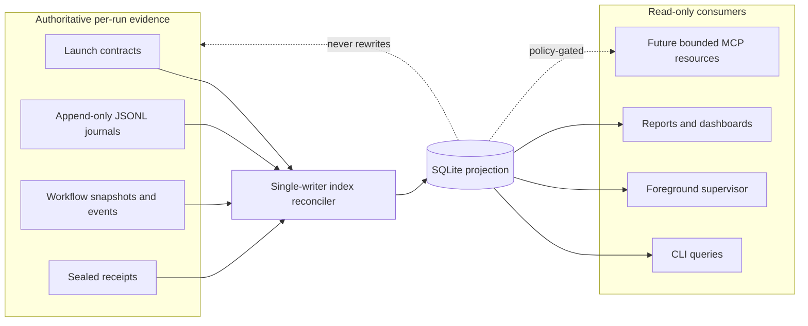
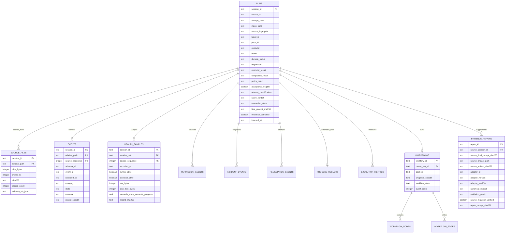
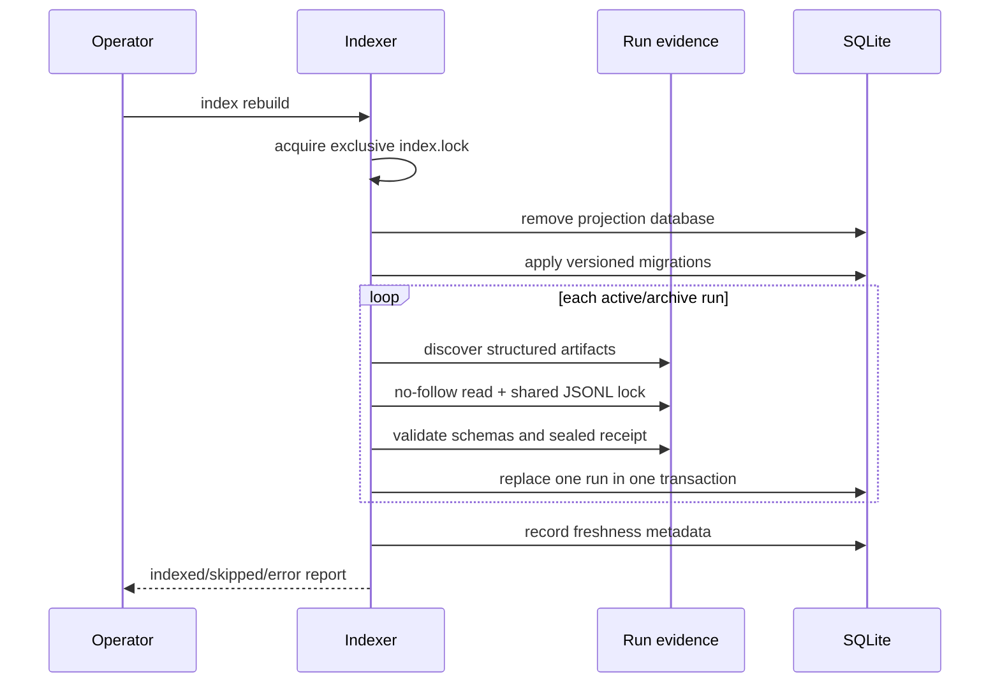

# SQLite evidence index architecture

## Purpose

The SQLite evidence index turns independently durable run evidence into a fast, host-wide query surface without changing which artifacts are authoritative. It is designed for operational status, unattended diagnosis, workflow and hierarchy views, incident and permission analysis, performance history, and future reporting.

The governing decision is [DEC-007](DECISIONS/DEC-007-REBUILDABLE-SQLITE-PROJECTION.md).

## System context



The dashed edge emphasizes that SQLite can point back to source evidence but cannot mutate or replace it.

## Storage topology

```text
$XDG_STATE_HOME/agent-workflow/
├── runs/<session-id>/              active authoritative evidence
├── archive/<session-id>/           archived authoritative evidence
├── evidence-repairs/<repair-id>/    append-only supplemental interpretations
└── index/
    ├── agent-workflow.sqlite3       disposable query projection
    ├── agent-workflow.sqlite3-wal   SQLite WAL, when active
    ├── agent-workflow.sqlite3-shm   SQLite shared-memory file, when active
    └── index.lock                   exclusive indexer-writer lock
```

The index directory is owner-only. The database is owner-readable/writable. No database file is placed in a target repository or delegated worktree.

## Data model



The generic `events` table provides provenance and common filtering for every structured journal. Typed tables duplicate only normalized fields required for reliable analysis. Raw payloads remain in the per-run source files.

## Indexed sources

The initial indexer discovers structured `.json` and `.jsonl` artifacts within each run directory. Known `agent-workflow/*` records are schema-validated. Important sources include:

| Source | Projection |
|---|---|
| `launch-contract.json` | Run identity, executor/model, worktree, source revision, pack/ticket, retry lineage |
| `status.json` / `final-status.json` | Durable execution and review projection |
| `run-provenance.json` | Timing, workflow binding, executor and source provenance |
| `final-receipt.json` | Verified final receipt digest and evidence-complete flag |
| `events.jsonl` | Generic lifecycle events |
| `workflow-*.json[l]` | Workflow, nodes, dependencies, bindings, current states |
| `run-health-samples.jsonl` | Process, resource, host, and semantic-progress samples |
| `permission-events.jsonl` | Operation/resource/state categories and evidence digests |
| `incident-events.jsonl` | Category, severity, state, fingerprint, bounded summary |
| `remediation-events.jsonl` | Rule, action, outcome, incident linkage, and reason digest; free-form reason text remains in source |
| `process-result.json` | Exit, signal, timeout, byte/truncation, duration facts |
| `execution-metrics.json` | Provider-neutral timing, usage, retry, steering, separately aggregated provider-billed cost, and local-estimate cost |
| `ledger-row.json` / `scores/score-set.json` | Typed attempt classification, separate executor/completion/policy/acceptance results, evaluation state, and deterministic score verdict |
| `evidence-repairs/<repair-id>/` | Exact source-receipt/artifact binding, deterministic adapter identity, canonical supplemental digest, mutation check, and repair receipt |

Output logs, terminal bodies, prompts, completion prose, and arbitrary provider payload bodies are intentionally not indexed.

Schema version 2 adds typed attempt outcomes. Valid sealed attempts remain queryable even when completion is missing or invalid, budget policy fails, execution is interrupted, or deterministic scoring is non-pass. Schema version 3 adds verified supplemental evidence-repair linkage. Repair rows are projections of separate append-only records and never override the source run's acceptance fields. Those rows are historical evidence, not acceptance authority.

## Rebuild and incremental synchronization

### Full rebuild



### Incremental synchronization

A deterministic per-run fingerprint covers structured source paths, sizes, modification/change times, file identity, and mode metadata. An unchanged current run is skipped. A changed run is fully replaced transactionally. This favors simple correctness over a premature byte-offset checkpoint protocol.

A future scale optimization may retain per-journal offsets, but it must detect truncation, identity changes, sequence gaps, and digest mismatches and fall back to a full per-run rebuild.

## Corruption behavior

The indexer is fail-isolated by run:

- one corrupt run does not roll back healthy run projections;
- the bad run is replaced by an `index_state=error` row;
- details are recorded in `index_errors`;
- an obsolete, non-authoritative legacy run is classified as
  `historical_artifact`, preserved in place, and excluded from current
  evidence; `index verify --full` reports it as quarantined rather than valid;
- the original evidence is never silently repaired;
- a later successful sync replaces the error projection;
- `index verify --full` detects source changes after indexing.

The supervisor reports index errors but continues health collection and safe remediation.

## Query surfaces

```bash
agent-workflow index status
agent-workflow index sync
agent-workflow index rebuild
agent-workflow index verify --full [--review SESSION]

agent-workflow index query runs --state running
agent-workflow index query incidents --category process_alive_no_progress
agent-workflow index query permissions --state pending
agent-workflow index query performance --executor codex --model gpt-5.6-luna
agent-workflow index query workflows
agent-workflow index query workflow-nodes --state recoverable
agent-workflow index query errors
```

All queries use curated fixed SQL. JSON output is wrapped in an `agent-workflow/index-query/v1` envelope that reports projection freshness and error counts alongside the rows. Human-readable output prints the same freshness summary before the table. Run and typed event rows expose bounded source provenance such as source directory, relative path, record sequence, record digest, receipt digest, storage class, and index timestamp. The public CLI does not expose arbitrary SQL, database mutation, raw payload columns, or paths outside the configured state root.

## Supervisor integration

The foreground supervisor synchronizes the index after every cycle by default. Fingerprinting makes unchanged cycles inexpensive. Disable this behavior explicitly when diagnosing the index itself:

```bash
agent-workflow supervisor once --no-sync-index
```

Index results and errors appear in `index_sync` within the supervisor report and do not suppress run-health or incident evidence.

## Migrations

Migrations are ordered and monotonic. `agent_workflow.index_schema` owns the application ID, supported schema version, migration SQL, and database-header validation; `agent_workflow.index_store` remains the compatibility facade for initialization, rebuild, reconciliation, verification, and queries. The database records both `PRAGMA user_version` and a `schema_migrations` row. The application:

- upgrades older supported projections;
- refuses a database newer than the running binary;
- never migrates or rewrites source run evidence;
- permits complete deletion/rebuild instead of requiring an in-place repair;
- keeps read-only queries separate from the one writer path.

## Security and privacy

Threats include symlink substitution, hostile database replacement, partial journal reads, raw-content aggregation, stale results, SQL injection, and a database being mistaken for authority.

Controls include:

- trusted XDG state root enforcement;
- no-follow opens and regular-file checks;
- shared journal locks and one exclusive writer lock;
- fixed parameterized query templates;
- source and record SHA-256 provenance;
- bounded file and summary sizes;
- exclusion of raw terminal/message/log/prompt content and free-form remediation reasons;
- visible freshness and error state;
- read-only connections for queries and verification;
- full rebuild as the supported recovery path.

Remaining retention and field-level export rules stay owned by `HARD-006`, `SUP-003`, and `IDX-006`.

## Performance strategy

SQLite is an operational index, not yet a benchmark warehouse. The current schema supports run and cohort summaries while keeping the implementation local and dependency-free. Provider-billed and locally estimated cost are never coalesced into one average; each retains a separate sample count, average, and currency. Mixed-currency groups return both a null currency and a null average rather than an invalid combined claim.

Future analytical flow:

```text
JSON/JSONL authority → SQLite operational projection → policy-governed Parquet export → DuckDB/offline analysis
```

PostgreSQL remains inappropriate until a real multi-host shared control plane is approved under `DEC-003`.

## Acceptance and limitations

Implemented acceptance covers rebuild, incremental freshness detection, sync, corruption isolation, source verification, workflow materialization, typed source-path/record provenance, raw-terminal exclusion, CLI help, and supervisor integration.

Still backlog-gated:

- final telemetry retention/export policy;
- comparable real-executor cohort exports;
- measured scale thresholds and byte-offset optimization;
- bounded MCP resources over curated views;
- multi-host query/control storage.
