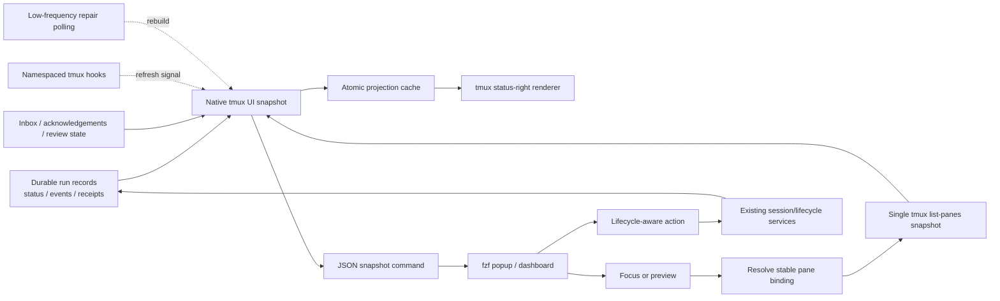

# tmux-agent-status Integration Analysis for agent-workflow

**Source reviewed:** `tmux-agent-status-main.zip`  
**Target reviewed:** `agent-workflow` 0.3.0 source archive  
**Scope:** tmux window/pane formatting, navigation, status presentation, and session management  
**Result:** selective native adaptation is recommended; wholesale plugin integration is not.

## Executive decision

The imported repository contains several strong tmux user-experience ideas that would materially improve `agent-workflow`:

- a searchable popup for navigating sessions, windows, and panes;
- a compact status-line summary;
- a persistent dashboard/sidebar concept;
- an attention-oriented inbox for completed, waiting, or problematic agents;
- pane previews based on `tmux capture-pane`;
- event-triggered refreshes backed by a small cache;
- keyboard actions for focus, wait, park, reset, and close.

However, its implementation should **not** be installed or embedded as-is. It maintains a second, weaker lifecycle model in shell-owned status files, discovers agents heuristically from process trees, modifies global tmux configuration, directly kills tmux resources, and inserts sidebars into every session. Those choices conflict with `agent-workflow`'s existing durable run records, explicit lifecycle services, stable `%pane_id` bindings, evidence preservation, and managed interactive grid.

The right design is to treat the imported project as UX prior art and implement an `agent-workflow`-native tmux presentation layer. `agent-workflow` must remain the sole authority for run identity, lifecycle state, worktree/branch metadata, message state, and destructive actions.

## Repository assessment

### What the imported project does well

The archive is a substantial tmux plugin rather than a small status script:

- approximately 5,700 lines in its main `scripts/` and `hooks/` shell implementation;
- 42 shell regression tests;
- all shell and `.tmux` files pass `bash -n` static syntax validation;
- a custom ANSI sidebar, an `fzf` switcher, preview rendering, status-line caching, hooks, notifications, and wait/park behavior.

Its strongest design ideas are:

1. **One-screen operational awareness.** The sidebar groups agents into an inbox and active session hierarchy instead of requiring repeated `tmux list-*` commands.
2. **Fast keyboard navigation.** The popup supports hierarchical and flat views, preview, selection, and contextual actions.
3. **Attention rather than inventory.** Completed or waiting sessions are surfaced ahead of ordinary running sessions.
4. **Cheap status-line reads.** A collector writes a compact cache so the tmux status line does not run all discovery logic on every render.
5. **Event plus polling refresh.** tmux hooks signal the collector after pane/window/client events, while a polling fallback repairs missed signals.
6. **Useful popup geometry workaround.** The popup wrapper relaunches `display-popup` when switching between preview and no-preview layouts because tmux cannot resize an already-open popup.
7. **Behavioral test coverage.** Tests cover action scope, confirmation, rendering, hook lifecycles, wait expiry, multipane behavior, and cache output.

### What should not be imported

#### Parallel status authority

The plugin stores statuses such as `working`, `done`, `wait`, and `parked` in files under its cache directory. Hooks and process discovery write those files directly.

`agent-workflow` already has a richer status contract:

- durable status: `prepared`, `launched`, `running`, `interruption_requested`, `completed`, `failed`, `interrupted`, and `killed`;
- observed states including `possibly_stalled`, `orphaned`, and `terminal_unavailable`;
- review dispositions including `reviewed`, `accepted`, and `rejected`;
- explicit run IDs, assignment IDs, prompt-pack lineage, branch/worktree metadata, logs, receipts, and stable tmux pane identity.

Adding the plugin's status files would create competing truth sources and ambiguous transition semantics.

#### Heuristic process discovery

The plugin detects Claude, Codex, and Devin using hook files and process ancestry. `agent-workflow` does not need to infer ownership: it launches runs and records their bindings. Heuristic discovery should at most be an optional view for unmanaged external panes, never part of authoritative run state.

#### Direct destructive tmux operations

The plugin directly invokes `kill-pane`, `kill-window`, and `kill-session`, and some reset paths use broad `pkill -f` commands. In `agent-workflow`, termination must pass through existing lifecycle services so state, evidence, logs, receipts, and final dispositions remain coherent.

#### Global tmux mutation

On load, the plugin can:

- set global `status-interval` to one second;
- append to global `status-right`;
- register many global hooks;
- bind multiple keys;
- start a collector daemon;
- create a sidebar in every current and future tmux session.

That is too invasive for a workflow tool. Integration should be opt-in, namespaced, uninstallable, and limited to `agent-workflow`-managed sessions or an explicit dashboard.

#### Sidebar insertion into managed grids

The plugin creates a 42-column left split, optionally beneath a detected file-manager pane. This conflicts directly with `agent-workflow`'s interactive layout logic.

The target currently marks panes with `@agent-workflow-role=orchestrator` or `agent`. Its pane-count and split logic exclude the orchestrator but do not know about a `ui` role. An injected sidebar could therefore:

- be counted as an agent pane;
- consume configured capacity;
- alter left/top coordinates used for column placement;
- reorder or compress agent panes;
- make layout behavior dependent on whether the sidebar is open.

A persistent UI must use a dedicated dashboard window or add a first-class `ui` pane role and update every capacity/layout calculation accordingly.

#### Remote scripts

The archive contains environment-specific SSH host names and commands using `StrictHostKeyChecking=no`. These are not reusable integration assets and should be excluded entirely.

#### Maintenance and portability burden

The core UI is implemented as several thousand lines of Bash, including a roughly 1,200-line raw ANSI event loop. It requires Bash 4 behavior and depends on tmux and `fzf`; parts also use `jq`. A native Python model with thin shell/tmux launchers would be easier to test and keep aligned with `agent-workflow` schemas.

## Adopt, adapt, avoid

| Imported capability | Decision | Native `agent-workflow` form |
|---|---|---|
| `fzf` popup switcher | **Adopt** | Generate rows from an authoritative Python snapshot; select/focus by run ID and stable `%pane_id`. |
| Captured pane preview | **Adopt** | Resolve the current binding, then call existing capture logic; label stale/unavailable panes explicitly. |
| Current-pane highlighting | **Adopt** | Match tmux's current `%pane_id` against the run snapshot. |
| Flat “agents” view | **Adopt** | Provide an attention-sorted view independent of tmux hierarchy. |
| Hierarchical session/window/pane tree | **Adapt** | Show workflow/pack/ticket/run hierarchy first; tmux location is secondary metadata. |
| Status-line counts | **Adopt** | Read a tiny, atomically generated non-authoritative projection cache. |
| Event-triggered refresh | **Adapt** | Namespaced tmux hooks signal a native snapshot refresh; polling is a repair mechanism only. |
| Persistent sidebar | **Defer/adapt** | Prefer a dedicated dashboard window. Never auto-insert into every managed work window. |
| Wait/park | **Adapt** | Implement as UI snooze/attention annotations, not lifecycle states, unless formal schemas and semantics are added. |
| Close/reset actions | **Replace** | Invoke `agent-workflow interrupt`, `terminate`, `kill`, `restart`, archive, and review services. |
| Agent detection from processes | **Avoid** | Use explicit launch/binding data. Optional unmanaged-pane discovery must be clearly segregated. |
| Shell-owned status files | **Avoid** | Use durable `agent-workflow` status and observed-state derivation. |
| Automatic global sidebar creation | **Avoid** | Opt-in configuration scoped to managed sessions/dashboard. |
| Remote SSH monitor scripts | **Avoid** | Design multi-host support through the orchestration architecture, not host-specific shell polling. |
| Deployment/worktree scripts | **Avoid** | Existing launch and worktree services remain authoritative. |

## Recommended architecture



### Authority rules

1. Durable `agent-workflow` state remains authoritative.
2. Live tmux data is observational and is joined by stable pane ID and run metadata.
3. The UI snapshot is a derived model.
4. The cache is disposable and reconstructable.
5. No UI action directly edits durable files.
6. No destructive UI action directly kills a pane before the lifecycle service records the intent and outcome.
7. A destroyed or ambiguous pane must never be silently rebound.

### Proposed UI snapshot

A single snapshot operation should combine:

- one scan of managed run status;
- one `tmux list-panes -a` invocation with stable pane ID, session/window, geometry, title, command, current/dead flags, and `@agent-workflow-*` options;
- orchestrator inbox and acknowledgement state;
- review disposition and archive eligibility;
- optional recent output preview metadata.

Suggested row fields:

```text
run_id
assignment_id
pack_id / ticket_id
agent / executor / model
branch / worktree
status                  # durable
observed_state          # live-derived
review_disposition
attention_reason
attention_rank
tmux_pane_id
tmux_session
tmux_window
tmux_alive
tmux_current
preview_available
safe_actions[]
updated_at
```

### Attention ordering

A useful default ordering is:

1. message, clarification, acknowledgement, or review input required;
2. failed, orphaned, or terminal unavailable;
3. possibly stalled;
4. completed but not reviewed/accepted;
5. running;
6. accepted and archiveable;
7. historical terminal runs.

This is more valuable than duplicating tmux's session ordering because it directs the orchestrator to the next required decision.

## Proposed commands and files

The exact names can follow existing CLI conventions, but a coherent shape would be:

```text
agent-workflow tmux snapshot [--json]
agent-workflow tmux popup
agent-workflow tmux status-line
agent-workflow tmux focus RUN_ID
agent-workflow tmux preview RUN_ID
agent-workflow tmux next
agent-workflow tmux install
agent-workflow tmux uninstall
```

Suggested implementation files:

```text
src/agent_workflow/tmux_ui.py
src/agent_workflow/tmux_snapshot.py
src/agent_workflow/tmux_actions.py
src/agent_workflow/assets/tmux/agent-workflow.tmux
src/agent_workflow/assets/tmux/popup.sh
src/agent_workflow/assets/tmux/status-line.sh
tests/unit/test_tmux_snapshot.py
tests/unit/test_tmux_ui_actions.py
tests/acceptance/test_tmux_popup_journey.py
docs/TMUX_UI.md
```

The shell assets should remain very thin. Python should own snapshot construction, ranking, validation, action authorization, and cache writes.

## Window and pane formatting recommendation

### Default: popup

The first release should use a popup because it does not perturb managed pane geometry. Recommended behavior:

- compact list-only layout by default;
- optional right-side captured-output preview;
- workflow/pack/ticket/run labels, with tmux location shown as secondary context;
- filter across run ID, ticket, agent, branch, worktree, and status;
- visible action help in the footer;
- focus, preview, interrupt, terminate, restart, acknowledge, review, and archive actions;
- confirmation for destructive actions;
- clean fallback when `display-popup` or `fzf` is unavailable.

### Optional: dedicated dashboard window

A persistent overview is valuable, but it should initially be its own tmux window named something like `aw-dashboard`, not a left split inside every work window. This avoids changing agent pane count or layout.

The dashboard can contain:

- attention inbox at top;
- active workflow tree below;
- selected-run metadata and preview on the right when space permits;
- a compact keybar;
- automatic selection of the current run where applicable.

### Deferred: embedded sidebar

An embedded sidebar should be implemented only after:

- introducing `@agent-workflow-role=ui`;
- changing pane counts to include only live `agent` roles;
- excluding `ui` panes from column/layout calculations;
- testing sidebar open/close during concurrent launches;
- defining minimum terminal widths and graceful collapse;
- ensuring orchestrator and run panes retain deterministic identities and placement.

It should be opt-in per session or window and never auto-created globally.

## Status line design

The imported cache-first idea is sound. The status renderer should perform no expensive discovery. A refresh worker or explicit command should atomically write a tiny projection such as:

```json
{
  "running": 5,
  "attention": 2,
  "stalled": 1,
  "failed": 0,
  "completed_pending_review": 1,
  "updated_at": "..."
}
```

The tmux status command reads only this file and emits compact text. The cache should live under an XDG runtime/cache location, be explicitly non-authoritative, include a freshness timestamp, and degrade to a neutral stale indicator rather than presenting old counts as current.

Do not force a global one-second `status-interval`. Provide a recommended snippet and allow existing tmux settings to remain intact.

## Refresh strategy

Use a hybrid strategy without reproducing the imported 250 ms perpetual polling loop:

- refresh immediately after `agent-workflow` lifecycle/message/review operations;
- append namespaced tmux hooks for pane/window/client selection and exit events;
- coalesce bursts through a lock or debounce interval;
- use a low-frequency repair pass only when a dashboard/status integration is active;
- keep the durable state replayable so losing a wakeup only delays presentation and never loses state.

This aligns with the existing architecture: wakeups accelerate observation, while records remain authoritative.

## Integration hazards to test

1. Opening or closing UI never changes agent capacity.
2. Grid placement remains deterministic with a dashboard active.
3. Layout churn does not change run-to-pane identity.
4. A dead pane is not rebound to a new pane occupying the same position.
5. A stale cache is visibly stale and safely rebuilt.
6. A malformed run record cannot inject terminal control sequences into the UI.
7. Preview output is safely escaped/truncated.
8. Destructive actions require confirmation and route through lifecycle services.
9. A failed lifecycle action does not optimistically remove the row.
10. Multiple tmux clients receive refreshes without spawning duplicate collectors.
11. No hook, keybinding, option, or daemon remains after uninstall.
12. `fzf`/popup absence has a documented fallback.
13. Dashboard behavior is tested at narrow and wide terminal sizes.
14. Inbox ordering is deterministic when timestamps tie.
15. All UI projections can be deleted and rebuilt from authoritative records.

The existing fake-tmux fixture should be extended to model `list-windows`, `display-popup`, `switch-client`, `select-window`, pane options, and status configuration. Live opt-in tests should also cover supported tmux versions.

## Phased implementation

### Phase 1 — high-value, low-risk

- Define the native snapshot model and attention ranking.
- Add one-call tmux inventory joined to managed runs by stable IDs.
- Implement an `fzf` popup with focus and preview.
- Add a cache-backed status-line renderer.
- Add dependency checks and non-popup fallback behavior.
- Add unit and fake-tmux acceptance tests.
- Document a manual, opt-in tmux configuration snippet.

**Recommendation:** implement this phase first. It captures most of the imported project's value without touching managed layouts.

### Phase 2 — operational actions and refresh

- Add acknowledge/review/archive and lifecycle-aware action bindings.
- Add namespaced hook-triggered cache refresh.
- Add debounce/lock and stale-cache semantics.
- Add install/uninstall commands for generated tmux configuration.
- Add “next attention item” navigation.

### Phase 3 — persistent dashboard

- Add a dedicated dashboard window.
- Add responsive hierarchy, preview, and detail panes.
- Add optional notification integration.
- Add UI-only snooze/park annotations with expiry and provenance.

### Phase 4 — optional embedded sidebar

- Add first-class `ui` role and layout exclusions.
- Implement sidebar geometry rules and capacity invariants.
- Make sidebar creation explicitly scoped and opt-in.

### Not part of this integration

- host-specific remote SSH monitoring;
- direct process discovery as managed-run authority;
- direct status-file manipulation;
- direct tmux kill/reset actions;
- duplicate worktree/session deployment logic;
- automatic global sidebar insertion.

## Licensing finding

The uploaded archive's README states “MIT,” but the archive contains no `LICENSE`, `COPYING`, or `NOTICE` file. This prevents confidently copying implementation text under a complete license grant from the supplied artifact alone.

Proceed safely by:

1. implementing the architectural and UX ideas independently;
2. avoiding copied shell source for now;
3. recording the repository and commit used as design prior art;
4. obtaining or confirming the actual MIT license text and copyright notice before intentionally porting code.

The same review should be applied to `agent-workflow`'s own pending public-release licensing decision before distributing an integrated derivative.

## Validation completed and limitations

Completed:

- extracted and inspected both source trees;
- reviewed tmux plugin bootstrap, sidebar, switcher, collector, status line, hooks, actions, tests, and demo media;
- reviewed `agent-workflow` tmux identity/layout code, session observation, lifecycle actions, CLI organization, schemas, and tmux identity tests;
- ran Bash static syntax validation successfully across the imported shell/tmux files;
- counted and categorized the imported regression tests;
- checked both archives for license files.

Not completed in this environment:

- live tmux execution tests, because tmux was unavailable in the analysis container;
- interactive `fzf` behavior testing;
- performance measurements under dozens or hundreds of simultaneous runs.

Those limitations do not change the architectural recommendation, but they should be closed before adopting detailed rendering or refresh behavior.

## Final recommendation

Integrate the **interaction model**, not the plugin:

- build a native authoritative snapshot;
- ship popup navigation and preview first;
- add a cache-backed status line;
- route every action through existing services;
- introduce a dedicated dashboard window before considering an embedded sidebar;
- preserve stable pane identity and make all UI state reconstructable;
- do not copy code until licensing is resolved.

This gives `agent-workflow` a polished tmux control surface without weakening the reliability, evidence, and lifecycle work already present in version 0.3.0.
