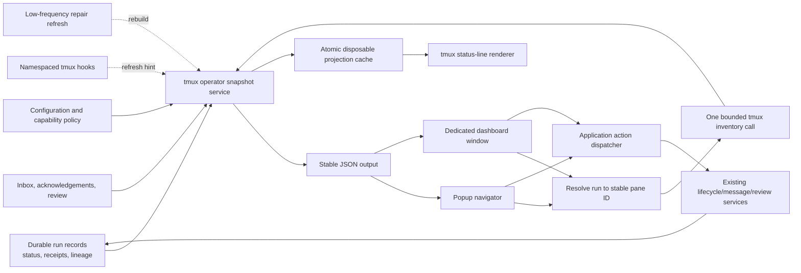

# tmux Operator Experience Integration Recommendation

**Target:** `agent-workflow` 0.3.0  
**Prior-art source:** `tmux-agent-status-main.zip`  
**Prepared:** 2026-07-31  
**Decision:** independently implement selected UX patterns inside `agent-workflow`; do not embed or vendor the imported plugin.

## 1. Executive recommendation

`tmux-agent-status` demonstrates a useful operator model: organize active agents by attention, provide a searchable popup with live pane preview, keep the status line cheap through a projection cache, and optionally expose a persistent dashboard. Those concepts fit `agent-workflow` well.

The implementation must nevertheless be native to `agent-workflow`. The imported project infers agents from processes, writes its own status files, mutates global tmux configuration, and directly kills tmux resources. Those choices conflict with the target repository's durable run records, explicit lifecycle services, message and review evidence, stable `%pane_id` bindings, and evidence-preserving termination paths.

The recommended product shape is:

1. an authoritative, read-only tmux operator snapshot generated in Python;
2. a compact, cache-backed status-line renderer;
3. an opt-in `fzf` popup for attention-sorted navigation and safe preview;
4. lifecycle-aware actions routed through existing application services;
5. an optional dedicated `aw-dashboard` window;
6. a separately authorized, later embedded-sidebar experiment only after introducing a first-class UI pane role and proving layout safety.

The popup is the default experience because it adds substantial usability without changing the managed pane grid. The dedicated dashboard is the preferred persistent view. A left-hand sidebar inside managed work windows is intentionally deferred.

## 2. Source and provenance boundaries

The planning artifacts were prepared from:

| Artifact | SHA-256 |
|---|---|
| `agent-workflow-0.3.0-e9e5b95-source.tar.gz` | `40dd48d51608a2f557313aca3bd70b377e32209cd65238ec94c3ad930af32bb0` |
| `tmux-agent-status-main.zip` | `c9e272fa1cfcb90b99798ca4b2c82e72b7c9cb54c985a3ceb7e2a059502d42f7` |
| original integration analysis | `28802c7ddf81e18c0bf90581396c984884a6e44085ccdc0d59426a130f06615d` |

The imported archive's README describes MIT licensing, but the archive did not contain the license text. Therefore:

- use it as architectural and UX prior art;
- independently implement behavior against `agent-workflow` contracts;
- do not copy shell source, test fixtures, comments, or distinctive implementation text until the actual license and attribution requirements are confirmed;
- record any later copied material explicitly in a provenance/NOTICE update.

This recommendation does not depend on copying imported code.

## 3. Goals and non-goals

### Goals

- Make the next operator-required action visible without inspecting every pane.
- Navigate from a workflow, ticket, run, message, or failure to the correct stable tmux pane.
- Preview bounded recent output safely.
- Show compact current counts in the tmux status line without expensive work on every redraw.
- Preserve `agent-workflow` as the sole authority for run identity and lifecycle changes.
- Keep integration opt-in, namespaced, reversible, and compatible with existing tmux configuration.
- Add installed-product and opt-in real-tmux evidence for every user-facing path.

### Non-goals

- Replacing the lifecycle, scheduler, inbox, workflow, or worktree subsystems.
- Discovering or managing arbitrary external agent processes heuristically.
- Introducing a second status database or shell-owned lifecycle files.
- Automatically creating panes or mutating every tmux session.
- Directly issuing destructive tmux commands from UI scripts.
- Adding remote-host polling or SSH shortcuts.
- Implementing multi-host orchestration.
- Making the optional embedded sidebar part of the core acceptance gate.

## 4. Architecture decision



### Authority rules

1. Durable run, event, receipt, message, acknowledgement, and review records are authoritative.
2. tmux inventory is observational. It may prove that a bound pane is live, dead, current, or unavailable; it may not invent a new binding.
3. Stable `%pane_id` plus `@agent-workflow-run-id`/role metadata is the join boundary.
4. The operator snapshot is derived and may be rebuilt at any time.
5. The status-line cache is disposable, freshness-marked, atomically replaced, and never accepted as lifecycle evidence.
6. Focus and preview may use tmux directly after binding resolution because they are non-destructive observations/navigation.
7. Interrupt, terminate, kill, restart, archive, acknowledgement, and review actions must call application services or CLI commands that preserve evidence.
8. The UI must not optimistically remove or relabel a run before the authoritative action succeeds.
9. Unmanaged panes, if ever shown, must be clearly segregated and never eligible for managed actions.

## 5. Proposed command surface

The implementation ticket must confirm existing CLI naming conventions before finalizing names. The intended public shape is:

```text
agent-workflow tmux snapshot [--json] [--include-terminal]
agent-workflow tmux popup [--view attention|runs|tmux]
agent-workflow tmux status-line
agent-workflow tmux focus RUN_ID
agent-workflow tmux preview RUN_ID [--lines N]
agent-workflow tmux next
agent-workflow tmux dashboard [--reuse]
agent-workflow tmux install [--scope user|session] [--print-only]
agent-workflow tmux uninstall [--scope user|session]
```

Destructive or state-changing actions should either be subcommands of an existing lifecycle namespace or explicit popup actions that invoke existing commands. Do not create a parallel lifecycle API under `tmux`.

## 6. Operator snapshot contract

### Snapshot-level fields

```json
{
  "schema": "agent-workflow/tmux-operator-snapshot/v1",
  "generated_at": "2026-07-31T00:00:00Z",
  "source_state_digest": "sha256:...",
  "tmux_available": true,
  "tmux_server_reachable": true,
  "cache_fresh_until": "2026-07-31T00:00:05Z",
  "counts": {},
  "rows": []
}
```

### Row fields

Each row should contain bounded values sufficient for rendering and actions:

```text
run_id
session_id
assignment_id
pack_id
ticket_id
workflow_id / workflow_node_id when present
agent_name
agent_class
executor
model
branch
worktree
status                  # durable lifecycle status
observed_state          # derived live observation
review_disposition
message_state
attention_reason
attention_rank
updated_at
tmux_mode
tmux_pane_id
tmux_session
tmux_window_id
tmux_window_name
tmux_alive
tmux_current
preview_available
safe_actions[]
```

### Attention ordering

Use deterministic ranking, with ties broken by oldest required-attention timestamp and then stable run ID:

1. explicit clarification, steering acknowledgement, or human review required;
2. failed, orphaned, pane dead, or terminal unavailable;
3. possibly stalled or communication-silent;
4. completed but not reviewed/accepted;
5. running with recent progress;
6. accepted and archive-eligible;
7. historical terminal runs.

The snapshot should expose both a machine rank and a stable reason code. Rendering code must not reimplement business ranking.

### Safety and boundedness

- Strip or escape terminal control characters from all labels.
- Limit each rendered string by field-specific maximum length.
- Never include full prompts, secrets, arbitrary environment variables, or unbounded logs.
- Preview is fetched only for the selected row, is line/byte bounded, and is rendered as untrusted text.
- One snapshot build should use one consolidated `tmux list-panes -a` query rather than one command per run.
- A tmux timeout/unavailable result must produce a valid degraded snapshot rather than blocking status commands indefinitely.

## 7. Presentation design

### 7.1 Popup: default interface

The popup is the first shipping interface.

Recommended list columns:

```text
ATTN  STATUS      TICKET       AGENT       AGE    LOCATION        SUMMARY
!     needs-input MSG-003      codex-2     4m     dev:2.%19       acknowledgement required
×     failed      PROC-004     claude-1    7m     unavailable     executor exited 1
~     stalled     SPEC-001     codex-3     12m    dev:3.%24       no log/event growth
✓     completed   TUI-001      codex-1     2m     dev:1.%17       pending review
·     running     HARD-003     claude-2    30s    dev:4.%27       active
```

Behavior:

- start in attention view;
- support a flat run list and a workflow/ticket hierarchy;
- filter on ticket, run ID, agent, executor, model, branch, worktree, status, and reason;
- highlight the row bound to the current pane;
- show a bounded right-side preview when terminal width permits;
- expose a footer with focus, preview, next, interrupt, terminate, restart, acknowledge/review, dashboard, and help keys;
- require confirmation for destructive actions;
- preserve selection after non-terminal actions or failed operations;
- degrade to a plain numbered selector or print-only list if `fzf` is absent;
- fail clearly when tmux popup support is unavailable.

### 7.2 Status line

The status renderer must perform no database scan and no tmux inventory. It reads one small projection file and emits compact text such as:

```text
aw 5 running | 2 attention | 1 stalled
```

Requirements:

- atomic cache replacement;
- freshness timestamp and stale indicator;
- configurable compact/verbose format;
- no forced global one-second interval;
- no silent overwrite of the user's `status-right`;
- `install --print-only` returns a snippet the operator can inspect;
- uninstall removes only namespaced options/hooks created by the tool.

### 7.3 Dedicated dashboard window

The persistent interface should initially be a separate tmux window named `aw-dashboard`.

Suggested responsive layout:

```text
┌ Attention / inbox ───────────────────────────────┬ Selected run ───────────┐
│ ! MSG-003 acknowledgement required              │ ticket / pack / status  │
│ × PROC-004 failed                               │ branch / worktree        │
│ ~ SPEC-001 possibly stalled                     │ lifecycle/action history│
├ Active workflows and runs ──────────────────────┤                         │
│ pack                                             ├ Recent output ──────────┤
│  ├ ticket  run  agent  state                    │ bounded capture          │
│  └ ticket  run  agent  state                    │                         │
└ Keys: enter focus  p preview  x actions  q close ┴─────────────────────────┘
```

The dashboard must not count as an agent pane, change work-window geometry, or become a lifecycle authority.

### 7.4 Embedded sidebar: optional later work

An embedded sidebar requires a separate maintainer decision after the core gate. Before implementation:

- introduce `@agent-workflow-role=ui`;
- count capacity from live `agent` roles only;
- exclude UI panes from column and split calculations;
- define minimum terminal dimensions and collapse behavior;
- prove concurrent launches while opening/closing the sidebar;
- prove the orchestrator and every run retain stable pane identity;
- make the feature opt-in per session/window;
- never auto-create it globally.

## 8. Refresh and hook strategy

Use event hints plus repair, not an aggressive perpetual poller:

1. refresh immediately after application lifecycle, message, acknowledgement, and review commits;
2. optionally append namespaced tmux hooks for pane/window/client selection and pane exit;
3. coalesce bursts through a lock and a short debounce;
4. refresh lazily when popup/dashboard opens;
5. run a low-frequency repair only while integration is enabled;
6. treat missed hooks as delayed presentation, not lost state;
7. terminate the refresh worker cleanly and leave no orphan process.

Every hook must preserve existing tmux hook arrays. Installation must be idempotent and uninstall must remove only matching namespaced entries.

## 9. Action routing

### Safe direct tmux operations

- select/focus a resolved stable pane;
- display popup/window;
- bounded capture of the resolved pane;
- read pane/window/session metadata.

### Application-routed operations

- interrupt;
- terminate;
- kill;
- restart;
- archive;
- acknowledge/apply/reject message;
- review/accept/reject completion;
- any future scheduler or workflow mutation.

The action dispatcher should recompute or revalidate the selected row immediately before mutation. A stale popup row must not authorize an action against a different run.

## 10. Configuration

Recommended configuration shape, subject to the repository's existing TOML/config schema conventions:

```toml
[tmux_ui]
enabled = false
popup_key = "C-g"
default_view = "attention"
preview_lines = 120
preview_max_bytes = 65536
cache_ttl_seconds = 5
repair_interval_seconds = 30
dashboard_window_name = "aw-dashboard"
allow_destructive_actions = true
confirm_destructive_actions = true
show_unmanaged_panes = false
sidebar_enabled = false
```

Defaults must remain conservative. Installing the package must not mutate tmux. Explicit installation or configuration enables integration.

## 11. Testing and evidence strategy

### Unit/invariant tests

- deterministic attention ranking and tie-breaking;
- status/observed-state mapping;
- one tmux inventory scan per snapshot;
- stable pane ID join and no location-based rebinding;
- control-character stripping and truncation;
- cache freshness/stale behavior and atomic writes;
- safe action computation;
- idempotent namespaced hook/snippet generation;
- UI role excluded from agent capacity/layout calculations.

### Installed-product journeys

- build/install the wheel in a clean environment;
- create fake durable run state and a fake tmux command surface;
- run snapshot JSON and validate contract fields;
- render status line from a fresh cache and from a stale cache;
- open popup through a deterministic selector stub and focus the expected `%pane_id`;
- preview a selected run with bounded escaped output;
- invoke an action and prove it passed through the lifecycle service with evidence;
- create/reuse/close the dedicated dashboard without changing agent capacity;
- install and uninstall hooks/snippets idempotently.

### Opt-in live tmux journey

On a supported host with real tmux and `fzf`:

- launch at least two managed panes;
- alter layout and pane indexes;
- confirm focus/preview still target the original stable pane IDs;
- open/close popup and dashboard;
- kill one pane and prove it reports unavailable rather than rebinding;
- exercise one confirmed lifecycle action;
- verify no global options/hooks outside the namespace changed;
- record exact versions, commands, exit codes, and cleanup.

### Security/adversarial cases

- malicious pane titles and ticket names containing ANSI/OSC sequences;
- malformed cache, partial write, symlink, and no-follow path handling;
- stale row selected after run restart or pane loss;
- command injection characters in IDs and labels;
- oversized preview and binary output;
- popup launched outside tmux;
- unavailable tmux server;
- concurrent refresh and lifecycle mutation;
- inherited conflicting keybinding/status-line configuration;
- user cancels destructive confirmation.

## 12. Ordered execution plan

The canonical backlog entries are in `docs/BACKLOG.md`; the expanded dependency ledger is in `docs/TMUX_OPERATOR_EXPERIENCE_BACKLOG_SEQUENCE.md`.

### External prerequisite

`PROC-006` must be accepted with live-host and sealed evidence. The new UI consumes stable pane identity and must not become the place where that contract is repaired.

### Phase 0 — authoritative read model

1. **TMUXUI-001 — operator snapshot contract and service.** Establish the sole derived model, attention ranking, consolidated tmux scan, JSON CLI, safety bounds, and focused tests.

### Phase 1 — parallel non-destructive interfaces

After TMUXUI-001, execute in separate worktrees:

2. **TMUXUI-002 — projection cache and status-line renderer.**  
3. **TMUXUI-003 — popup navigator, focus, and safe preview.**  
4. **TMUXUI-004 — opt-in tmux assets, capability checks, install/uninstall.**

These tickets have separate writable surfaces and may run concurrently. Integration is serialized after independent review.

### Phase 2 — actions and persistent experience

After the relevant Phase 1 dependencies, execute in parallel:

5. **TMUXUI-005 — lifecycle-aware actions and next-attention navigation.**  
6. **TMUXUI-006 — dedicated dashboard window.**  
7. **TMUXUI-007 — event-hint refresh, debounce, and repair worker.**

### Phase 3 — installed acceptance and independent gate

8. **TMUXUI-009 — installed-product, opt-in live-tmux, security, docs, and uninstall evidence.**  
9. **TMUXUI-GATE-001 — independent core review.** This review owns no backlog item and may not implement missing scope.

### Phase 4 — optional sidebar decision

10. **TMUXUI-008 — first-class UI pane role and optional embedded sidebar.** This remains `needs-decision` until the core gate is accepted and the maintainer explicitly authorizes the feature.

11. **TMUXUI-GATE-002 — independent sidebar/layout review.**

## 13. File-level implementation map

Expected files may change after source discovery, but the intended ownership is:

```text
src/agent_workflow/tmux_operator.py       snapshot model, ranking, sanitization
src/agent_workflow/tmux_ui.py             presentation orchestration
src/agent_workflow/tmux_actions.py        revalidation and service routing
src/agent_workflow/tmux.py                bounded inventory/focus/capture primitives
src/agent_workflow/cli.py                 public command wiring
src/agent_workflow/config.py              opt-in configuration
src/agent_workflow/assets/tmux-ui/*        thin tmux/shell assets
schemas/tmux-operator-snapshot.schema.json optional public schema if repository policy requires it
tests/invariants/test_tmux_operator_snapshot.py
tests/acceptance/test_tmux_operator_journey.py
tests/live/test_tmux_operator_live.py      opt-in only
docs/TMUX_OPERATOR_EXPERIENCE.md
docs/COMMAND_REFERENCE.md
docs/OPERATIONS.md
docs/INSTALLATION.md
docs/TESTING.md
README.md                                  concise feature link only after acceptance
```

Python should own data collection, ranking, validation, cache writes, and action dispatch. Shell assets should be thin launch/render wrappers.

## 14. Collision and sequencing analysis

| Existing work | Interaction | Required handling |
|---|---|---|
| `PROC-006` pane identity | Hard prerequisite | Consume accepted stable `%pane_id`; do not duplicate migration/rebinding logic. |
| `PROC-003` observability | Supplies stalled/silent state | Reuse one derived observation service; do not invent UI-only health rules. |
| `MSG-001`/two-way messaging | Supplies attention/inbox signals | Join through shared services. Core snapshot may degrade when messaging features are incomplete. |
| `HARD-007` authenticated principals | Affects future review mutations | Do not weaken current auth model; route through existing services and preserve later upgrade path. |
| `REL-003` compatibility matrix | Broader release evidence | Add an opt-in live journey now; do not claim platform-wide support until REL-003 completes. |
| MCP mutation phase | Potential future UI consumer | Keep snapshot/action services transport-neutral and CLI-independent. |
| Plugin architecture | Future extraction option | Implement core services with clear interfaces, but do not extract this feature into a plugin now. |

## 15. Acceptance decision

Adopt the popup, preview, attention ordering, cache-backed status line, event-hint refresh, and persistent dashboard concepts. Implement them cleanly against current `agent-workflow` state and lifecycle services.

Do not import the plugin wholesale. Do not introduce shell-owned status. Do not auto-mutate global tmux. Do not insert a sidebar into managed windows until the separate optional phase proves first-class UI role semantics and layout safety.
