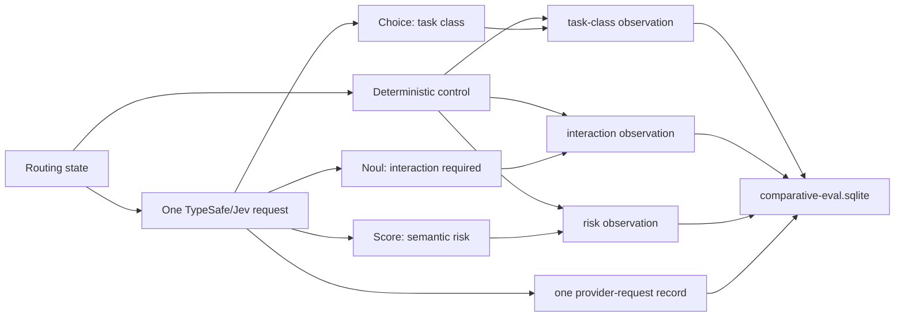

# TypeSafe comparative evaluation

This is an opt-in evidence projection. Agent-Workflow remains authoritative; the candidate is never applied to routing, execution, completion, review, or acceptance in `comparative` mode.

## Lossless decision evidence

One routing decision set makes one batched TypeSafe/Jev request for the three live seams:

Each decision observation retains the raw semantic answer, probability/confidence/distribution, host policy candidate, applied result, fallback evidence, and shared request ID. The provider request is stored once so latency, token usage, retries, and cost are not multiplied by the number of decision seams.

The canonical receipt-to-comparative projection lives in `agent_workflow.comparative_eval_runtime.routing_comparison_records()`. Normal scheduler capture and benchmark studies use the same conversion.

## Privacy and authority

Normal-usage capture stores hashes and bounded metadata, never raw task text or secrets. The TypeSafe audit log may retain redacted private request/response evidence for debugging, but public comparative artifacts should be derived from neutral observations and sanitized summaries rather than raw HTTP bodies.

Static studies must use a frozen corpus and a separate independent oracle. Oracle labels must not be supplied to deterministic routing or TypeSafe state.

## Interpretation

Agreement between deterministic control and the semantic candidate is not correctness. Correctness requires an independent oracle. The three seams are evaluated separately because Choice classification, Noul probability, and ordered Score evidence answer different questions.

Shadow outcomes remain descriptive and do not establish downstream causality.
