# agent-workflow repository chart pack

**Release:** 0.7.4
**Purpose:** current-state architecture, data/evidence model, execution flows, security boundaries, and planned MCP evolution.

Mermaid sources for the highest-value diagrams are also stored as individual `.mmd` files in this directory.

## 1. System context

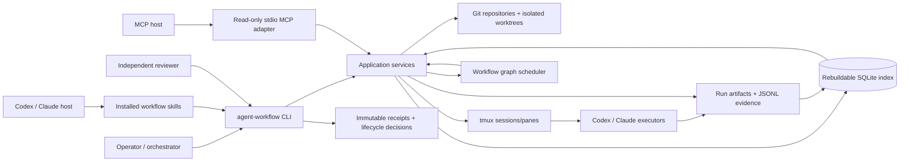

## 2. Package/component map

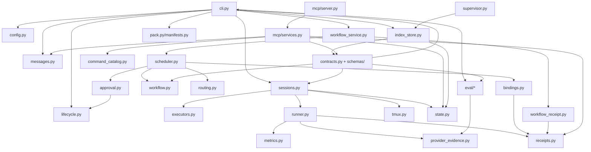

## 3. Authority hierarchy

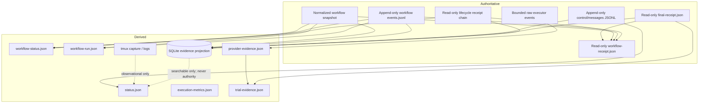

## 4. Session run artifact tree

```mermaid
flowchart TB
  Run[run/&lt;session-id&gt;]
  Run --> Prompt[prompt.md / launch-prompt.md]
  Run --> Catalog[command-catalog.json / command-card.md]
  Run --> Launch[launch-contract.json]
  Run --> Command[command.json]
  Run --> Baseline[source-baseline.json]
  Run --> Provenance[run-provenance.json]
  Run --> Events[executor-events.jsonl]
  Run --> Logs[output.log / executor-stderr.log]
  Run --> Completion[completion.md + completion.json]
  Run --> Collections[collections/*]
  Run --> Result[result.json + task-result collection]
  Run --> Controls[control-events.jsonl / assignments.jsonl]
  Run --> Metrics[execution-metrics.json]
  Run --> Provider[provider-evidence.json]
  Run --> Status[status.json + final-status.json]
  Run --> Patch[patch.diff]
  Run --> Final[final-receipt.json]
  Run --> Scores[scores/*]
  Run --> Lifecycle[receipts/000001-reviewed.json ...]
  Final -->|hashes| Prompt
  Final -->|hashes| Command
  Final -->|hashes| Provenance
  Final -->|hashes| Events
  Final -->|hashes| Completion
  Final -->|hashes| Provider
```

## 4A. Searchable evidence projection

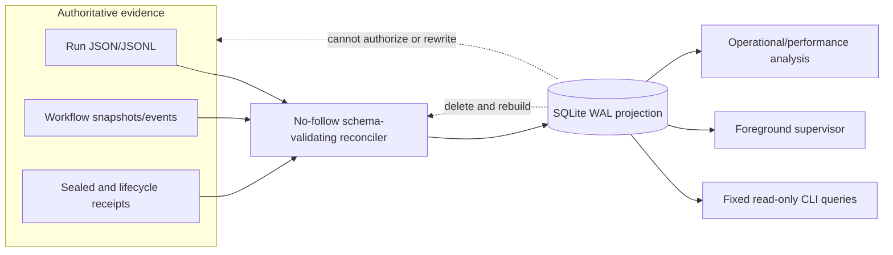

Every row is derived and traceable to source path, sequence where applicable, schema identity, and digest. Raw prompts, terminal/message bodies, credentials, and large logs remain outside SQLite.

## 5. Delegated run lifecycle

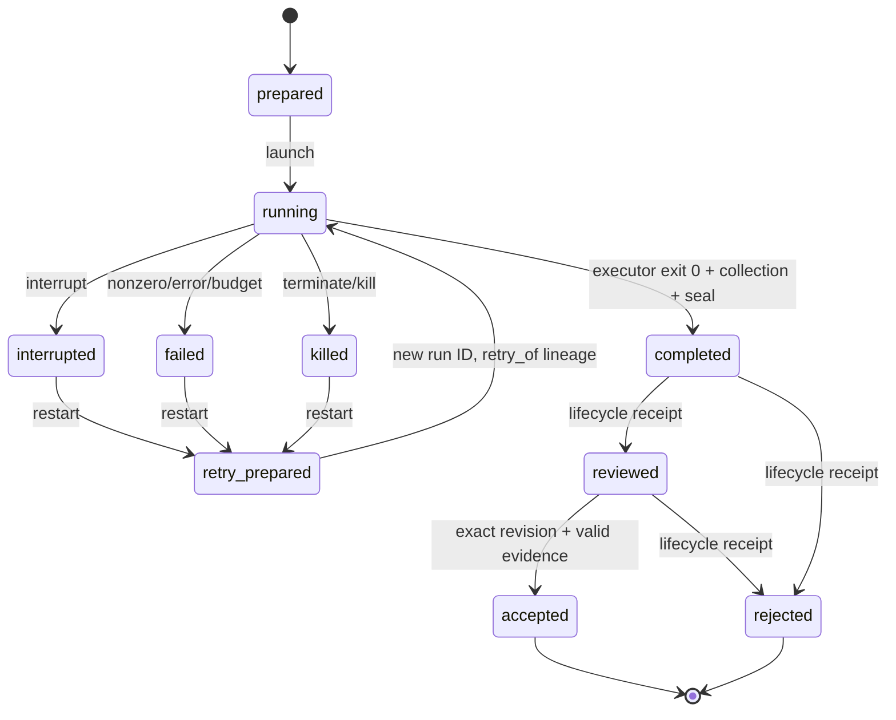

## 6. Executor/runner evidence flow

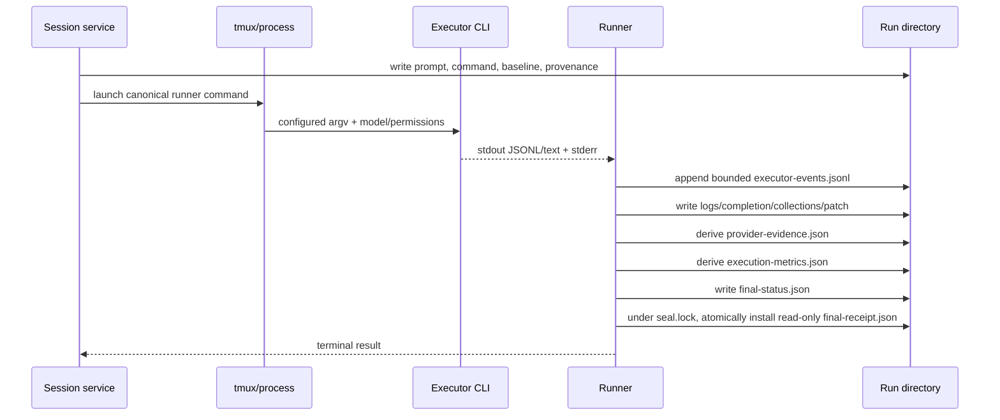

## 7. Durable control/message flow

```mermaid
sequenceDiagram
  participant P as Parent/orchestrator
  participant J as fsynced message JSONL
  participant W as tmux wait-for hint
  participant C as Child/adapter
  P->>J: append steer(message_id) + fsync
  P->>W: best-effort wakeup
  C->>J: replay after cursor
  C->>J: append progress/ack(correlation_id) + fsync
  C->>W: best-effort wakeup
  P->>J: replay after cursor
  Note over P,C: Lost/coalesced wakeups do not lose records; journals are authoritative.
```

## 8. Workflow scheduler and replay

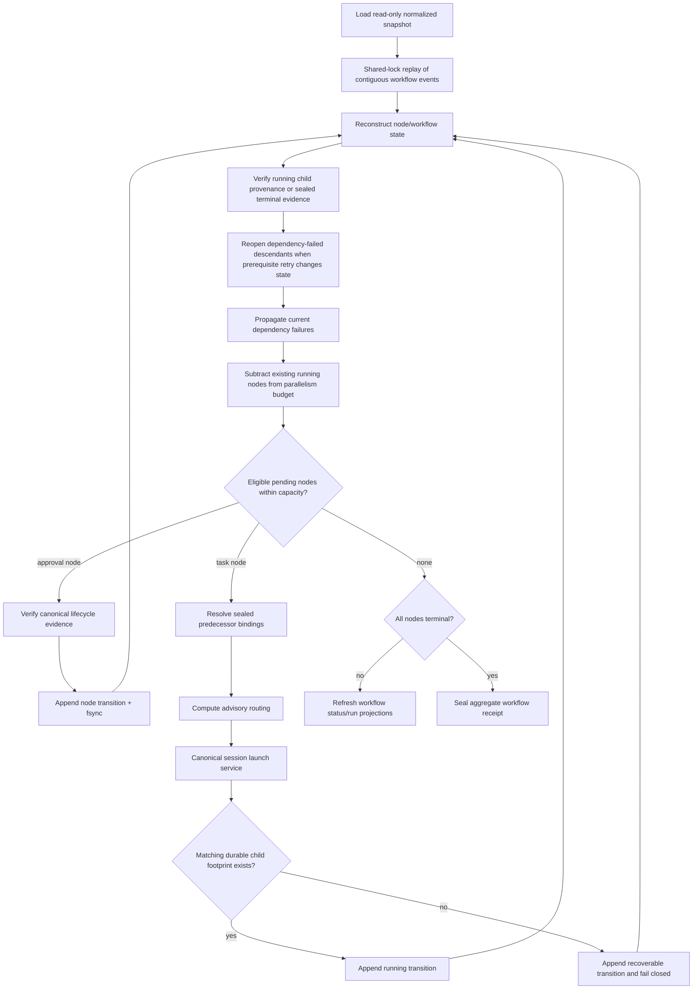

## 9. Approval gate

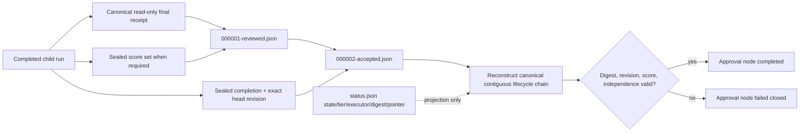

## 10. Result binding

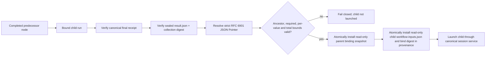

## 11. Workflow aggregate receipt

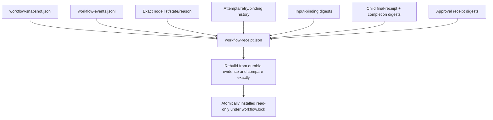

## 12. Authorized graph templates

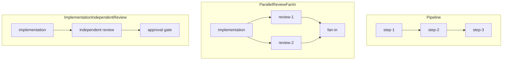

## 13. Deterministic routing advice

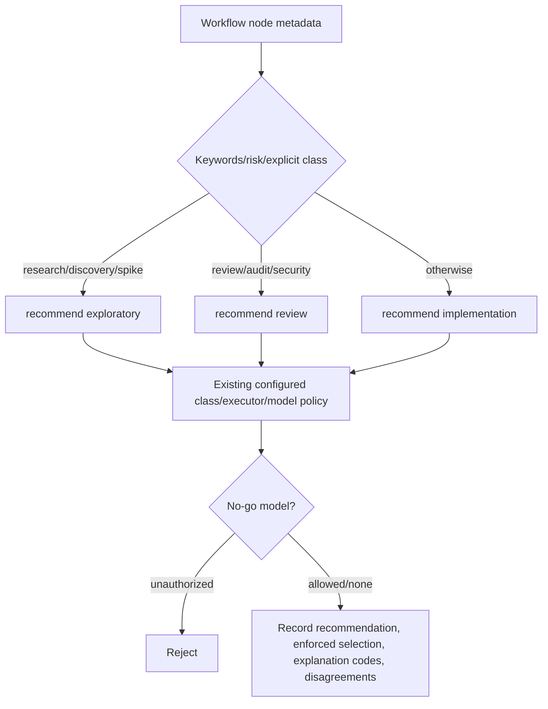

## 14. Provider usage normalization

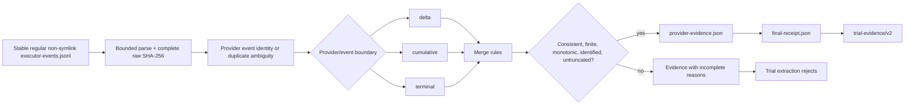

## 15. Evaluation/cohort flow

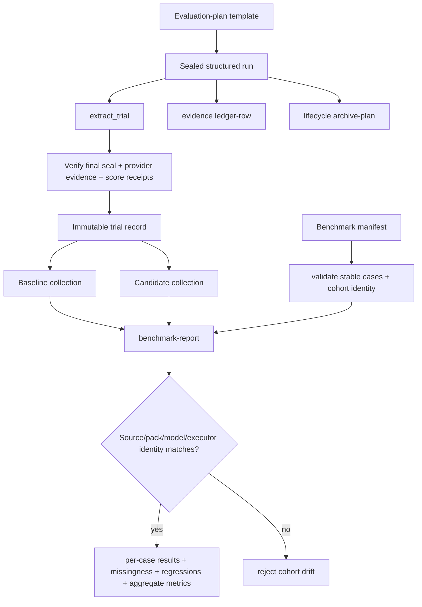

## 16. Prompt-pack execution model

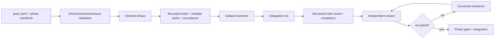

## 17. tmux topology and capacity

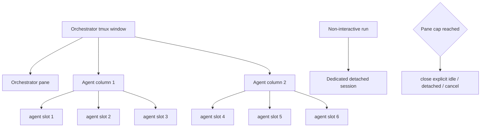

## 18. CLI dispatch

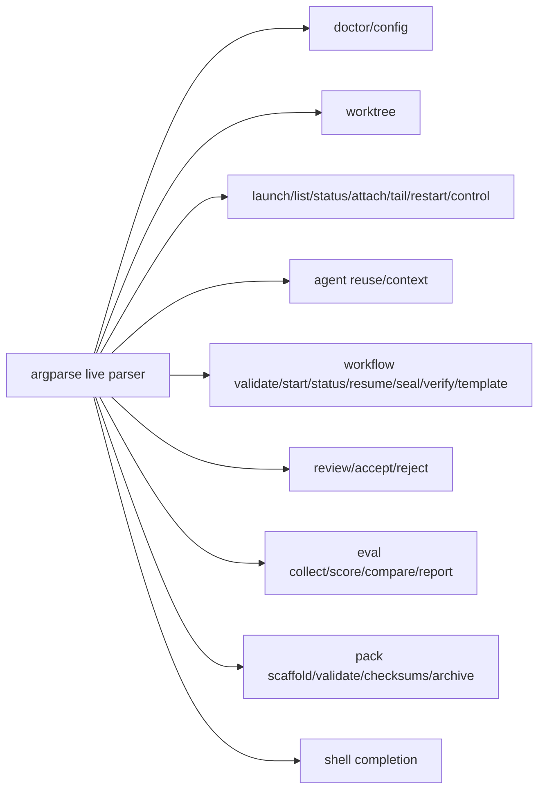

## 19. Release/install flow

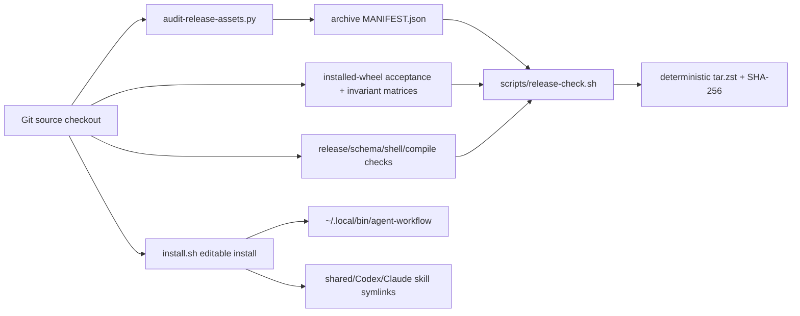

## 20. Current and target MCP boundary

```mermaid
flowchart TB
  Host[MCP host]
  Host --> Stdio[Local stdio FastMCP]
  Stdio --> Current[Current: bounded read-only resources + pack_validate]
  Current --> Catalog[Parser-derived capabilities + role catalogs]
  Current --> Context[Verified run command context + cards]
  Catalog --> Shared[Existing shared read/catalog services]
  Context --> Shared
  Future[MCP-003 planned safe mutations] --> Idem[Durable idempotency journal]
  Idem --> SharedMut[Existing worktree/session/workflow/message services]
  SharedMut --> LaunchV2[Shared launch service preserves command artifacts + launch-contract v2]
  Destructive[MCP-004 review/control] -. separately gated .-> SharedMut
  HTTP[MCP-005 Streamable HTTP] -. ADR required .-> Auth[OAuth/audience/origin/rate-limit boundary]
  Auth -. after decision .-> SharedMut
```

## 21. Evidence-oriented ERD

```mermaid
erDiagram
  PROMPT_PACK ||--o{ PHASE : contains
  PHASE ||--o{ TICKET : contains
  TICKET ||--o{ SESSION_RUN : executes_as
  SESSION_RUN o|--o| SESSION_RUN : retries
  SESSION_RUN ||--|| RUN_PROVENANCE : records
  SESSION_RUN ||--o{ EXECUTOR_EVENT : emits
  SESSION_RUN ||--o{ CONTROL_MESSAGE : exchanges
  SESSION_RUN ||--|| COMPLETION : produces
  SESSION_RUN ||--o| TASK_RESULT : produces
  SESSION_RUN ||--o| PROVIDER_EVIDENCE : normalizes
  SESSION_RUN ||--|| FINAL_RECEIPT : seals
  FINAL_RECEIPT ||--o{ LIFECYCLE_RECEIPT : reviewed_by
  WORKFLOW ||--|| WORKFLOW_SNAPSHOT : defined_by
  WORKFLOW ||--o{ WORKFLOW_NODE : contains
  WORKFLOW ||--o{ WORKFLOW_EVENT : records
  WORKFLOW_NODE o|--o| SESSION_RUN : binds
  WORKFLOW_NODE o{--o{ INPUT_BINDING : consumes
  WORKFLOW_NODE o|--o| LIFECYCLE_RECEIPT : gated_by
  WORKFLOW ||--o| WORKFLOW_RECEIPT : seals
  FINAL_RECEIPT ||--o{ TRIAL_EVIDENCE : supports
  PROVIDER_EVIDENCE ||--o{ TRIAL_EVIDENCE : supports
  TRIAL_EVIDENCE }o--|| COHORT : grouped_in
  COHORT }o--o{ COMPARISON : compared_by

  SESSION_RUN {
    string session_id PK
    string retry_of FK
    string status
    string worktree
  }
  WORKFLOW {
    string workflow_id PK
    string snapshot_sha256
    string state
  }
  WORKFLOW_NODE {
    string node_id PK
    string kind
    string state
    int attempt
  }
  FINAL_RECEIPT {
    string sha256 PK
    string session_id FK
    datetime sealed_at
  }
  WORKFLOW_RECEIPT {
    string sha256 PK
    string workflow_id FK
    string workflow_state
  }
```

## 22. Security trust boundaries

```mermaid
flowchart TB
  UserInput[Prompts/config/tool inputs] --> Validation[Schema + bounds + ID validation]
  Validation --> Policy[Configured roots + class/model/no-go policy]
  Policy --> Services[Application services]
  Services --> GitBoundary[Git/worktree boundary]
  Services --> ProcessBoundary[tmux/executor boundary]
  Services --> StateBoundary[Durable state boundary]
  ProcessBoundary --> Raw[Untrusted executor output]
  Raw --> Collector[Bounded collectors]
  Collector --> Seals[Immutable digests/receipts]
  StateBoundary --> Seals
  Seals --> Review[Independent review/acceptance]
```

## 23. Acceptance-first test architecture

```mermaid
flowchart TB
  Source[Clean source copy] --> Wheel[Build wheel]
  Wheel --> Venv[Install isolated virtualenv]
  Venv --> CLI[Invoke installed executables]
  CLI --> Journeys[Acceptance journeys]
  Journeys --> Git[Real Git/worktrees]
  Journeys --> Proc[External tmux/executor shims]
  Journeys --> State[Durable state and receipts]
  Invariants[Compact invariant matrices] --> Security[Path/seal/symlink rules]
  Invariants --> Replay[Message/workflow replay]
  Invariants --> Accounting[Provider/cohort accounting]
  Future[Strict xfail future journeys] --> Backlog[Approved backlog outcomes]
  Live[Opt-in live compatibility] --> RealHost[Real tmux/providers/MCP host]
  Release[Release checks] --> Distribution[schemas/help/shell/manifest]
```

## 24. Public release path

```mermaid
flowchart LR
  Core[Core CLI/workflow/evidence] --> Acceptance[Acceptance-first suite]
  Acceptance --> CI[Supported Python CI]
  CI --> Host[Clean-host live compatibility]
  Host --> Governance[License + security contact + ownership]
  Governance --> Metadata[Package/repository metadata]
  Metadata --> RC[Signed reproducible release candidate]
  RC --> Public[Supported public release]
  MCPMutation[MCP mutation] -. not a prerequisite .-> Public
  MultiHost[Multi-host orchestration] -. not a prerequisite .-> Public
```

## 25. Determinism hardening dependencies

```mermaid
flowchart LR
  H1[HARD-001 bounded process]
  H2[HARD-002 artifact/path integrity]
  H4[HARD-004 immutable launch authority]
  H5[HARD-005 MCP read boundary]
  H8[HARD-008 config/executor trust]
  H3[HARD-003 preventative sandbox]
  H6[HARD-006 classification/retention]
  H7[HARD-007 authenticated principals]
  H9[HARD-009 generated drift gate]
  H10[HARD-010 supply chain]
  R3[REL-003 compatibility]
  R4[REL-004 public-preview gate]
  MCP[MCP-003 mutation]

  H1 --> H4
  H2 --> H4
  H2 --> H5
  H1 --> H8
  H1 --> H3
  H2 --> H3
  H8 --> H3
  H1 --> H6
  H5 --> H6
  H4 --> H7
  H3 --> H9
  H4 --> H9
  H5 --> H9
  H6 --> H9
  H7 --> H9
  H8 --> H9
  H8 --> R3
  H4 --> MCP
  H5 --> MCP
  H7 --> MCP
  H3 --> R4
  H4 --> R4
  H5 --> R4
  H6 --> R4
  H7 --> R4
  H8 --> R4
  H9 --> R4
  H10 --> R4
  R3 --> R4
```

## 26. Parallel hardening pack execution

```mermaid
flowchart TB
  subgraph Foundations
    F1[HARD-001]:::parallel
    F2[HARD-002]:::parallel
    F1 --> F4[HARD-004]:::parallel
    F2 --> F4
    F2 --> F5[HARD-005]:::parallel
    F4 --> FG[FOUND-GATE-01]
    F5 --> FG
  end
  subgraph Isolation
    I8[HARD-008]
    I8 --> I3[HARD-003]:::parallel
    I8 --> I6[HARD-006]:::parallel
    I3 --> IG[ISO-GATE-01]
    I6 --> IG
  end
  subgraph PublicBeta
    P7[HARD-007]:::parallel
    P9[HARD-009]:::parallel
    P10[HARD-010]:::parallel
    P3[REL-003]:::parallel
    P7 --> P4[REL-004]
    P9 --> P4
    P10 --> P4
    P3 --> P4
  end
  FG --> I8
  IG --> P7
  IG --> P9
  IG --> P10
  IG --> P3
  classDef parallel stroke-width:2px;
```

Each parallel node runs in a separate worktree and durable session. Gate nodes integrate diffs, rerun shared acceptance journeys, and apply both `phase-gate-review` and `release-drift-auditor`.

## Diagram maintenance rule

Update this chart pack whenever a release changes a durable authority, package boundary, workflow state, public CLI family, MCP capability, evidence schema, or release/install flow. Historical plans may retain old diagrams only when clearly labeled as historical.

## Planned two-way orchestrator messaging

These diagrams describe approved planned work, not current executable behavior. Canonical status is in [`BACKLOG.md`](../BACKLOG.md).

### Aggregate fan-in and wake sequence

```mermaid
sequenceDiagram
    participant C as Child agent
    participant CL as Child journal
    participant S as Supervisor
    participant I as Orchestrator inbox
    participant W as Shared wake hint
    participant O as Orchestrator
    C->>CL: append task_complete + fsync
    C-->>W: best-effort signal
    S->>W: bounded wait
    S->>CL: replay after durable cursor
    S->>I: append normalized event + fsync
    S->>O: fixed opaque event token
    O->>I: read, acknowledge, action
```

Source: [`orchestrator-two-way-messaging-sequence.md`](orchestrator-two-way-messaging-sequence.md).

### Authority flow

```mermaid
flowchart LR
    J[(Per-session journals)] --> S[Deterministic supervisor]
    W[tmux wake hint] --> S
    S --> I[(Aggregate inbox)]
    I --> O[Orchestrator turn]
    O --> A[(Acknowledgements/actions)]
    O --> J
```

Source: [`orchestrator-inbox-authority.mmd`](orchestrator-inbox-authority.mmd). The full design, failure model, security controls, and dependency graph are in [Durable two-way messaging](../ORCHESTRATOR_TWO_WAY_MESSAGING_DESIGN.md).
