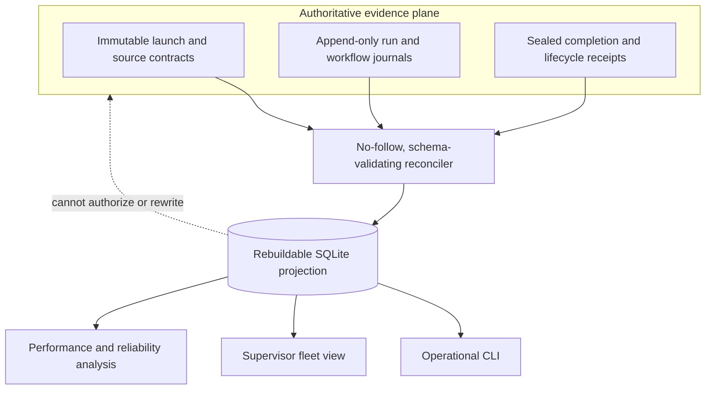
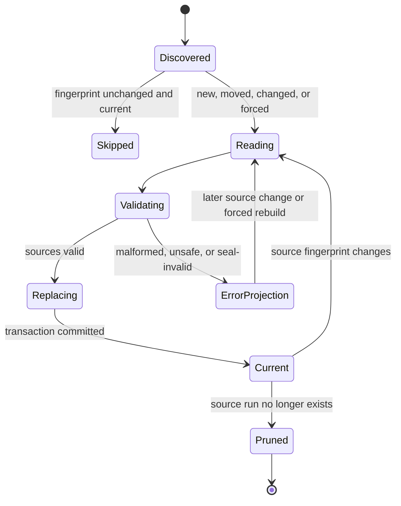
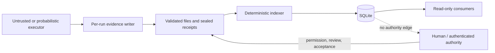

# SQLite evidence index diagrams

These diagrams accompany [SQLite evidence index architecture](../SQLITE_EVIDENCE_INDEX_ARCHITECTURE.md).

## Authority and projection flow

## Run reconciliation state machine

## Trust boundary

