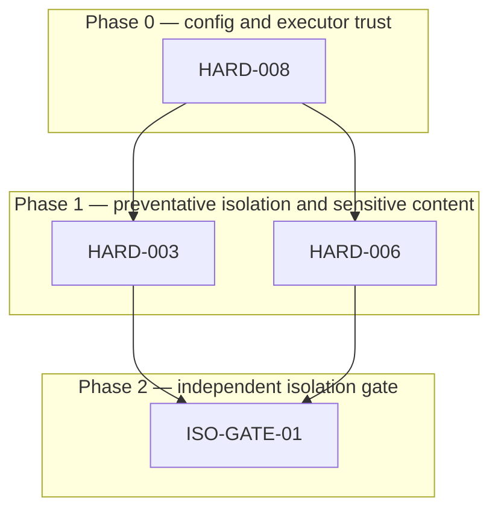

# Execution graph

```mermaid
flowchart TB
  subgraph P0[Phase 0 — config and executor trust]
    HARD_008[HARD-008]
  end
  subgraph P1[Phase 1 — preventative isolation and sensitive content]
    HARD_003[HARD-003]
    HARD_006[HARD-006]
  end
  subgraph P2[Phase 2 — independent isolation gate]
    ISO_GATE_01[ISO-GATE-01]
  end
  HARD_008 --> HARD_003
  HARD_008 --> HARD_006
  HARD_003 --> ISO_GATE_01
  HARD_006 --> ISO_GATE_01
```

Tickets without a dependency edge may run concurrently in separate worktrees. Gate tasks run only after all incoming dependencies are accepted and integrated.
