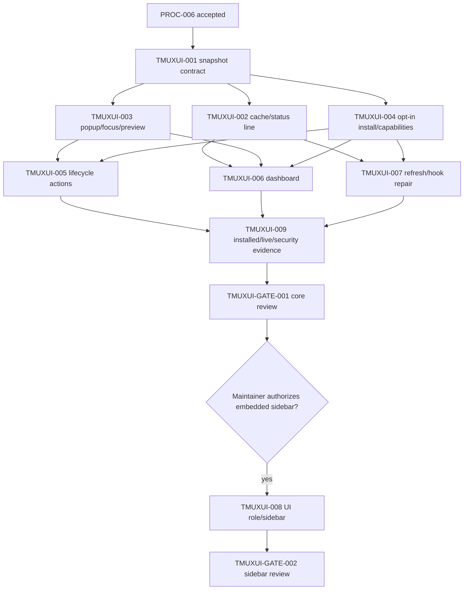

# tmux Operator Experience Backlog and Execution Sequence

This document expands the canonical rows in [`docs/BACKLOG.md`](../../../docs/BACKLOG.md). It is not a second status register. States and ownership must be updated in `BACKLOG.md`; this file defines dependencies, parallel lanes, acceptance evidence, and integration order for the `tmux-operator-experience` prompt pack.

## Dependency graph

## Ordered backlog

| Order | ID | Priority | Risk | Initial state | Dependencies | Parallel lane | Exit evidence |
|---:|---|---|---|---|---|---|---|
| 0 | PROC-006 | P0 | Critical | in-review | existing corrective integration and live/sealed acceptance | prerequisite | Stable pane survives layout/index churn; genuine loss reports unavailable without rebinding. |
| 1 | TMUXUI-001 | P1 | High | blocked | PROC-006 accepted | foundation | Validated bounded snapshot, deterministic attention ranking, one tmux scan, degraded no-tmux output, focused tests. |
| 2A | TMUXUI-002 | P1 | Medium | blocked | TMUXUI-001 | Phase 1 parallel | Atomic non-authoritative cache, fresh/stale renderer, no expensive status-line command, tests. |
| 2B | TMUXUI-003 | P1 | High | blocked | TMUXUI-001 | Phase 1 parallel | Popup/selector, stable-pane focus, safe bounded preview, no layout mutation, installed journey. |
| 2C | TMUXUI-004 | P1 | Medium | blocked | TMUXUI-001 | Phase 1 parallel | Capability report, opt-in namespaced snippets/hooks, idempotent install/uninstall, preserved user config. |
| 3A | TMUXUI-005 | P1 | High | blocked | TMUXUI-003, TMUXUI-004 | Phase 2 parallel | Stale-row revalidation; confirmed interrupt/terminate/kill/restart routed through lifecycle services; next-attention navigation. |
| 3B | TMUXUI-006 | P1 | Medium | blocked | TMUXUI-002, TMUXUI-003, TMUXUI-004 | Phase 2 parallel | Reusable `aw-dashboard` window, responsive rendering, zero effect on agent capacity/layout, cleanup evidence. |
| 3C | TMUXUI-007 | P1 | High | blocked | TMUXUI-002, TMUXUI-004 | Phase 2 parallel | Namespaced non-clobbering hooks, coalesced refresh, bounded repair, no orphan worker, missed wakeup recovery. |
| 4 | TMUXUI-009 | P1 | High | blocked | TMUXUI-005, TMUXUI-006, TMUXUI-007 | integration/evidence | Clean wheel install, fake-tmux journey, opt-in real-tmux journey, security matrix, docs/help/man-page/uninstall evidence. |
| 5 | TMUXUI-GATE-001 | gate | Critical | blocked | TMUXUI-009 | independent review | Integrated diff, sealed handoffs, release audit, pack validation, installed journeys, explicit accept/reject decision. |
| 6 | TMUXUI-008 | P2 | Medium | needs-decision | TMUXUI-GATE-001 accepted and explicit maintainer authorization | optional | First-class `ui` role, sidebar opt-in, deterministic layout/capacity under concurrency, complete removal. |
| 7 | TMUXUI-GATE-002 | gate | High | blocked | TMUXUI-008 | independent review | Live layout stress, identity retention, uninstall, and no global tmux drift. |

## Detailed backlog items

### TMUXUI-001 — authoritative operator snapshot

**Objective:** Create one bounded, transport-neutral read model that joins durable run state, observations, messages/review state, and one tmux pane inventory.

**Required work:**

- define a versioned snapshot and row contract;
- implement deterministic attention reason codes and ranking;
- read durable state through existing services rather than raw ad hoc scans where services exist;
- execute one bounded `tmux list-panes -a` format call;
- join by stable pane ID and run metadata;
- return truthful degraded results when tmux is missing/unreachable;
- sanitize and truncate untrusted labels;
- expose machine JSON and a compact human view;
- document authority boundaries.

**Acceptance:** No location/index rebinding; no second status authority; one tmux scan; deterministic output; malicious label cases; no-tmux and dead-pane cases; focused unit/invariant and installed-product tests.

### TMUXUI-002 — projection cache and status line

**Objective:** Produce a cheap, freshness-aware status-line projection.

**Required work:** atomically write a small cache from snapshot counts; enforce safe XDG paths and no-follow behavior; render fresh/stale/unavailable states; provide compact/verbose formats; never scan durable state or tmux in the renderer.

**Acceptance:** Partial/malformed/symlink cache cases, concurrent readers, stale TTL, deterministic output, no forced one-second global interval.

### TMUXUI-003 — popup navigator, focus, and preview

**Objective:** Provide the high-value non-destructive operator interface without changing pane layout.

**Required work:** attention/run/hierarchy views; `fzf` path plus deterministic fallback; current-pane highlighting; stable pane focus; bounded capture preview; width-aware geometry; selection persistence; explicit unavailable states.

**Acceptance:** Popup does not create/kill/split managed panes; layout/index churn retains focus target; preview escapes controls and respects byte/line limits; absent `fzf`/popup support degrades cleanly.

### TMUXUI-004 — opt-in integration and capability policy

**Objective:** Make tmux integration explicit, reversible, and non-clobbering.

**Required work:** capability detection for tmux version/popup/fzf; print-only configuration; namespaced key bindings/options/hooks; user/session scopes where supported; idempotent install/uninstall; preserve prior arrays/status format; package thin assets correctly.

**Acceptance:** Installing the Python package changes no tmux configuration; repeated install/uninstall is safe; unrelated config remains byte/semantically intact; unsupported features report actionable guidance.

### TMUXUI-005 — lifecycle-aware actions and next attention

**Objective:** Add operator actions without bypassing evidence-preserving services.

**Required work:** recompute/revalidate selected run; calculate allowed actions from current state; require confirmation for destructive actions; route to existing interrupt/terminate/kill/restart/archive/message/review services as authorized by current architecture; surface exact outcome and retain row on failure; implement deterministic next-attention focus.

**Acceptance:** No UI script directly kills panes for managed lifecycle changes; stale selection cannot target replacement run; cancellations create no mutation; failures are not optimistically hidden; receipts/events prove route.

### TMUXUI-006 — dedicated dashboard window

**Objective:** Add a persistent view without modifying managed work-window geometry.

**Required work:** create or reuse an `aw-dashboard` window; render inbox/tree/detail/preview responsively; refresh selection safely; close cleanly; mark it as UI metadata; exclude it from managed agent inventory/capacity.

**Acceptance:** Opening/closing/reusing dashboard leaves agent pane count, columns, orchestrator pane, and run bindings unchanged; narrow terminals degrade; duplicate windows are not created.

### TMUXUI-007 — event hints and repair refresh

**Objective:** Keep projections responsive without making wakeups authoritative or polling aggressively.

**Required work:** refresh after application commits; namespaced tmux hooks; debounce/coalescing; lock discipline; lazy popup/dashboard refresh; low-frequency repair only when enabled; clean worker lifecycle.

**Acceptance:** Existing hook arrays remain; burst events coalesce; missed hook repairs; cache loss rebuilds; concurrent action/refresh remains coherent; no orphan daemon or busy loop.

### TMUXUI-009 — acceptance, security, documentation, and release integration

**Objective:** Close the feature as an installed product rather than a source-only UI.

**Required work:** clean wheel build/install; deterministic fake-tmux journey; opt-in real tmux/fzf journey; security matrix; package-data validation; command/help/man-page/config/installation/operations/testing documentation; uninstall and cleanup; release drift audit and pack validation.

**Acceptance:** Exact commands and exit codes; versions and host assumptions; sealed handoffs; no unsupported compatibility claims; README stays concise and links to authoritative docs.

### TMUXUI-008 — optional embedded sidebar and UI pane role

**Objective:** Only after explicit authorization, support an embedded sidebar without corrupting layout accounting.

**Required work:** first-class `@agent-workflow-role=ui`; role-aware capacity and layout queries; per-window/session opt-in; minimum width policy; deterministic open/close under concurrent launches; complete removal; no global autocreation.

**Acceptance:** Stress journey proves stable run bindings, correct capacity, deterministic columns, no orchestrator displacement, no residual pane/options/hooks, and graceful narrow-terminal refusal/collapse.

## Integration order and branch discipline

- Every implementation ticket uses its own worktree and named session.
- Phase 1 tickets may execute concurrently only after TMUXUI-001 is integrated and reviewed.
- Phase 2 tickets may execute concurrently according to manifest edges.
- Merge in numeric order inside each phase unless a documented conflict-free integration plan says otherwise.
- After each merge, rerun the snapshot contract tests and existing pane-identity journeys.
- The core gate must be independent from implementers.
- TMUXUI-008 cannot begin merely because its prompt exists; `needs-decision` requires explicit maintainer authorization recorded in the backlog/decision history.

## Scope protection

Reject implementation that:

- imports the prior-art plugin wholesale;
- creates shell-owned run statuses;
- uses process heuristics as managed identity;
- binds actions to `session:window.pane_index`;
- globally overwrites tmux hooks, status, or keybindings;
- inserts a sidebar before the core gate and explicit decision;
- bypasses lifecycle/message/review services;
- treats cache or wakeups as durable authority;
- claims real-host compatibility without recorded live evidence.
